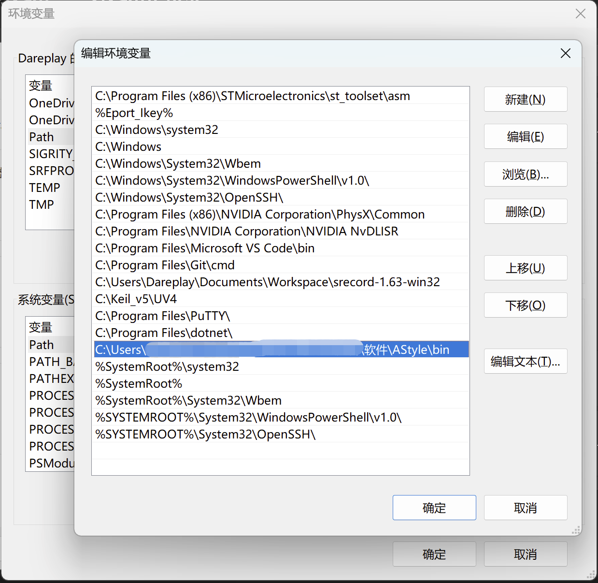
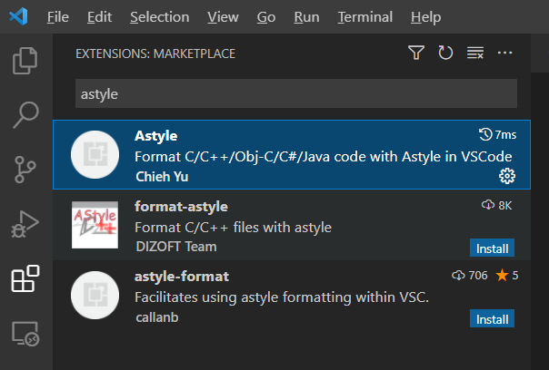

# 使用VSCode格式化代码

## 安装Astyle到电脑

1. Astyle下载链接：[https://astyle.sourceforge.net/](https://astyle.sourceforge.net/)
2. 版本使用3.4.10
3. 将Astyle添加到系统环境变量



## VSCode安装Astyle插件

### 在VSCode的扩展中搜索Astyle并安装



### 在VSCode设置文件（setting.json）中添加如下配置

```
"[c]": {
    "editor.defaultFormatter": "chiehyu.vscode-astyle"
},

"[cpp]": {
    "editor.defaultFormatter": "chiehyu.vscode-astyle"
},

"astyle.cmd_options": [
    // 使用kr风格
    "--style=kr",
    // 将tab转为4个空格
    "--convert-tabs",
    // 缩进4个空格
    "--indent=spaces=4",
    "--min-conditional-indent=0",
    // 对于控制流程如果是当行的加入花括号
    "--add-braces",
    // 缩进case标签
    "--indent-switches",
    // 缩进标签
    "--indent-labels",
    // 缩进一行的注释
    "--indent-col1-comments",
    // 缩进命名空间
    "--indent-namespaces",
    // 控制关键字 后添加空格
    "--pad-header",
    // 操作符号添加空格
    "--pad-oper",
    // 对于一行的代码保持不换行
    "--keep-one-line-blocks",
    // 块之间添加空行
    "--break-blocks",
    // 括号内的参数和括号不添加空格
    "--unpad-paren",
    // 指针符号贴近变量名
    "--align-pointer=name",
    // 引用符号贴近变量名
    "--align-reference=name",
    // 删除多余行
    "--delete-empty-lines",
    "--squeeze-lines=1",
],
```

### 使用快捷键 Shift-Alt-F 格式化代码

点击Shift-Alt-F组合快捷键即可格式化当前打开的c/c++文件。

新建或修改的代码确保格式化后再提交上传代码仓库。