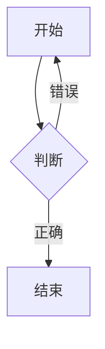

# Markdown

  一种纯文本格式的文档，作用与Word类似但更简洁，功能没Word全面；适合做一些简单的说明性，解释性的文档

### MarkText

  一款开源的Markdown编辑器，支持表格和各种Markdown语法的渲染（需要制作大型表格的时候比较方便）

  [MarkText](https://www.marktext.cc/ "访问MarkText")

#### 方便Markdown渲染的vscode插件

  ` Markdown Preview Enhanced `
  这个插件可以对markdown语法进行渲染方便查看文档效果，快捷键 ` Ctrl + shift + v `


## 使用方法

* 标题属性
  
  + 格式：` # + 空格 + 标题名 `
  + 说明：修改 # 的个数可以修改标题的等级共可分为1-6级


* 列表属性
  
  + 格式：` * + 空格 + 名字 `
  + 说明：这种格式是无序列表的标准，此格式中 * 可被 - 或 + 替代这三个符号是同级别（可以混合使用）
  + 拓展1：若要在这一级的列表下创建低一级的列表可在第二行使用一个 制表符（Tab）或 两个空格 再按照列表的格式进行创建
  + 扩展2：有序列表的格式     ` 序号 + 点 （.） + 空格 + 名字 `


* 字体属性
  
  + 斜体格式：` * + 文字 + * ` 或 ` _ + 文字 + _ ` 
  + 粗体格式：` ** + 文字 + ** ` 或 ` __ + 文字 + __ `
  + 粗斜体格式：` *** + 文字 + *** ` 或 ` ___ + 文字 + ___ `


* 链接属性
  
  + 格式：` [链接名称](连接地址 + 空格 + "属性") `
  + 说明：该格式在经过渲染之后会以 链接名称 的样子呈现，属性的作用是当鼠标置于 链接名称 的位置时会出现提示该提示就是属性，属性可要可不要


* 图片属性
  
  + 格式：` ! + [图片描述](图片URL) `


* 分割线属性
  
  + 格式：` *** ` 或 ` ___ ` 或 ` * * * ` 或 ` _ _ _ ` 


* 删除线属性
  
  + 格式：` ~~ + 要删除文字 + ~~ `


* 下划线属性
  
  + 格式：` <u> + 文本 + </u> `


* 表格属性
  
  + 表头格式：` | + 表头1 + | + 表头2 + | `
  + 分割表头与其他行的格式：` | + ---- + | + ----- + | `
  + 内容格式：` | + 内容 + | + 内容 + |  `
  + 说明：` | ` 作用是分隔每一列， ` --- ` 作用是分隔表头与表格内容数量随意


* 特殊符号
  
  + 格式：` \ + 符号 `


* 任务列表语法
  
  + 格式：` - + 空格 + [空格] + 空格 + 内容 ` 与 ` - + 空格 + [x] + 空格 + 内容 `


* 书写公式
  
  + 格式：` $$ + 换行 + 公式 + 换行 + $$ ` 或 ` $ + 公式 + $ `
  + 说明：带换行的生成一个块在块内生成公式，不带换行的在行内生成公式


* 代码语法（块属性）
  
  + 格式： *\`  + 内容 +  \`*  或  *\` + 换行 + 内容 + 换行 + \`* 
  + 说明：不带换行的是在同行生成一个块； 带换行的是生成一个整行的块 内容在块中； `个数不受限制但一般都是三个同时要保证两边个数一致；markdown的主张是将代码写入块中
  + 推荐：让在同一行出现块就使用一个 \` ，不同行使用三个 \`


* 流程图
  
+ 基本格式：


+ 说明：
1. flowchart LR 用来指定流程图的方向
   
| TB/TD | BT   | LR   | RL   | HZ   | VT   |
| ----- | ---- | ---- | ---- | ---- | ---- |
| 从上到下  | 从下到上 | 从左到右 | 从右到左 | 水平方向 | 垂直方向 |

2. -->是连接线 ， - 的个数会影响线的长度，最少两个 -

3. 形状
   
| [ 文本 ] | ( 文本 ) | (( 文本 )) | { 文本 } | [/ 文本 /] |
| ------ | ------ | -------- | ------ | -------- |
| 矩形     | 圆角矩形   | 圆形       | 菱形     | 平行四边形    |

4. 一个节点指向多个节点实例



解释：每一个节点前边的数字可以看作是该节点的标志，可以通过这个标志修改该节点
连接线上添加描述文字的格式：-- 文本 -->    文本左边一定要是两个 -

## 可内嵌语言

#### HTML标签

```
<div>
   文本 <b>element</b>.
</div>
```

#### CSS

```
<style>
    h1 {
        color: blue;
    }
</style>

<h1>文本</h1>
```

#### JS脚本

```
<script>
    function sayHello() {
        alert('Hello from JavaScript');
    }
</script>

<button οnclick="sayHello()">Click me</button>
```

某些Markdown解析器后者能够解析Markdown的网站不能内嵌别的语言，不是很建议使用内嵌

Markdown不支持字体颜色的修改，若真需要则使用内嵌；内嵌还可实现一些音视频，超链接，外部文件的引用等等
