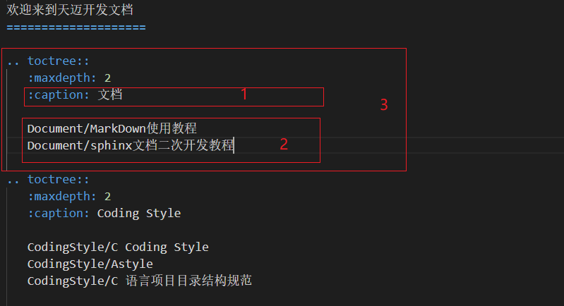

# sphinx文档

原文存放在github的

[天迈开发文档](https://github.com/Timyerc/development "文档在github上的位置")

本文只做在此基础上的二次开发教程，不适用第一次sphinx文档的创建，但会包含开发sphinx文档所使用到的工具

## 前期准备

+ 下载Python3（3.0以上）
    [Python](https://www.python.org/downloads/ "python下载地址")

+ 安装sphinx

    在Windows PowerShell下执行以下指令之一：
    ```
    py -3 -m pip install sphinx
    #国内用户推荐使用清华源安装，使用-i指定源
    py -3 -m pip install -i https://pypi.tuna.tsinghua.edu.cn/simple sphinx
    ```

+ 相应扩展安装
    以下安装指令建议在Windows PowerShell下执行
    ```
    pip install myst-parser
    pip install sphinx_rtd_theme

    ```
## 使用方法

+ 修改操作：将自己新加的文档放到工程的相应文件下，或者直接在原本存在的文档下做更改
+ 检查相应规则：对于新加的文档需要修改.rst文件的内容，直接在原本存在的文档下做更改的需要去.rst文件下查看是否存在这个文件的目录
+ 规则示例说明：



解释：3框住的是一个固定格式，1框住的是大标题，2框住的是大标题下放置的归于该类的不同项的文档的地址
    一个固定格式只能有一个大标题，可包含多个属于该类大标题的文档地址

## 编译文档

在Windows PowerShell下执行以下指令
```
make html
```
成功编译后最后一行会出现

```
The HTML pages are in _build\html.
```

成功编译之后前往下述目录查看效果

```
development\docs\_build\html\index.html
```