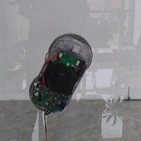
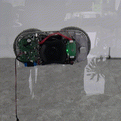
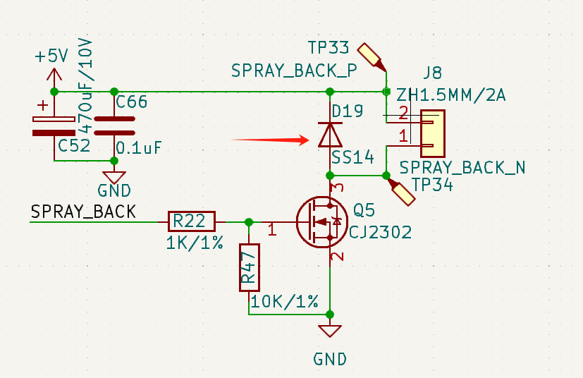

# 常见问题

## 圆形
|序号|问题|可能的原因|
|:---|:---|:---|
|1|雾化片喷水有时多有时少|雾化片堵住；接触不良；|
|2|撞边掉落|撞边漏气；|
|3|无法关机|死机(可能是过浓的清洁液导致);|
|4|无法开机|主板无程序或程序不对；电池接触不良；|
|5|灯不亮|灯坏了；灯焊接方向不对；|
|6|没有语音|语音芯片未烧录语音词条；喇叭接触不良或不响|
|7|机器爬不上去|摩擦力太小，喷点水在擦布上|
|8|带灯按键板与主板灯亮的灯不一致|检查带灯按键板和主板型号是否配套|
***

### 机器姿态异常判断

**现象1：机器频繁换向**

可能原因：陀螺仪异常，加速度数据正常，陀螺仪数据一直为0的情况下和此现象一致

排查方法：增加陀螺仪一直为0判断并报警提示，升级程序看是否有对应报警。

解决方法：属于硬件故障，需返厂维修。

**现象2：机器高频振动**

可能原因：机器如果在竖直工作状态下误检测为水平模式，会出现高频抖动情况

排查方法：1、重新供电启动看是否能恢复；2、校准加速度看是否能恢复。

解决方法：升级新固件；增加加速度校准功能，让用户校准加速度。

## 方形
|序号|问题|可能的原因|
|:---|:---|:---|
|1|蓝灯常亮，红灯闪烁，机器停止|悬空开关有异常|
|2|机器爬不动|皮带脏或者沾水，皮带轮空转，没有贴到玻璃|
|3|不喷水|雾化片驱动频率没对应|
|4|机器不能走无边框|检查悬空开关对应关系|
|5|机器乱走|马达线接线是否标准|
***

## PCB板常见问题
Q: 现象：水泵喷水后，5V被拉低。（PCB:ESMC-03B）

A: 二极管D19焊反 
