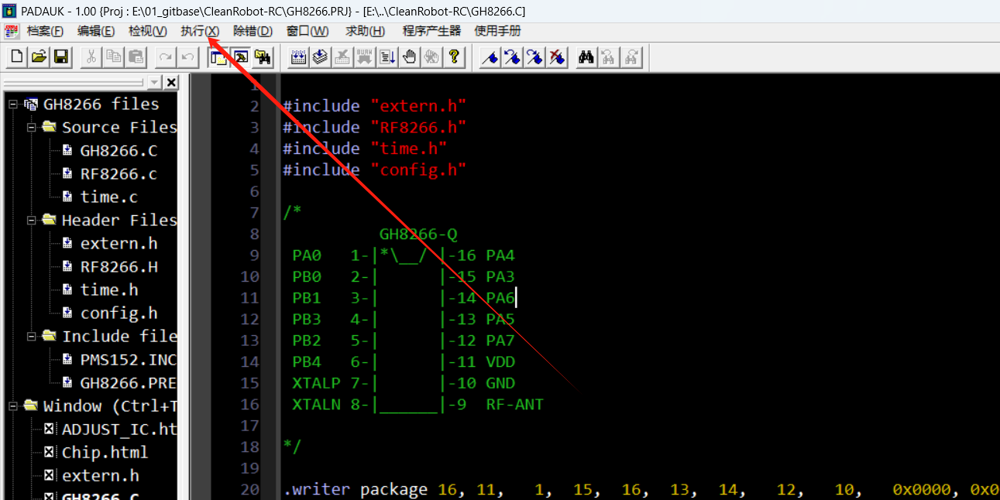
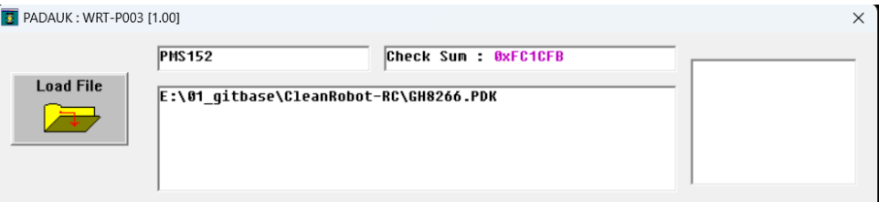
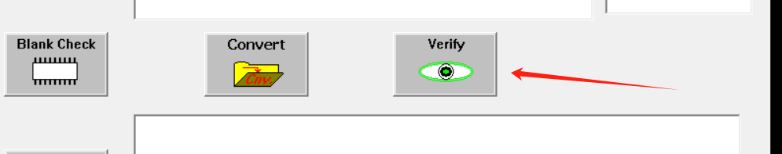
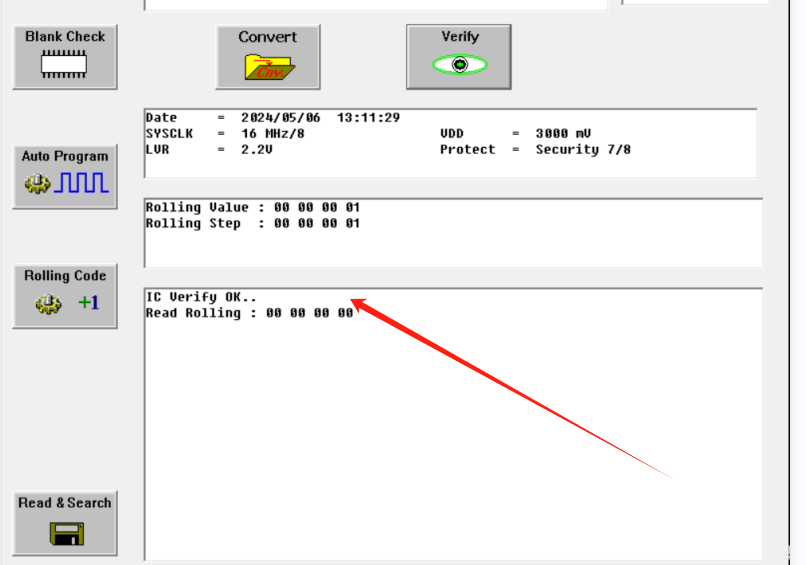
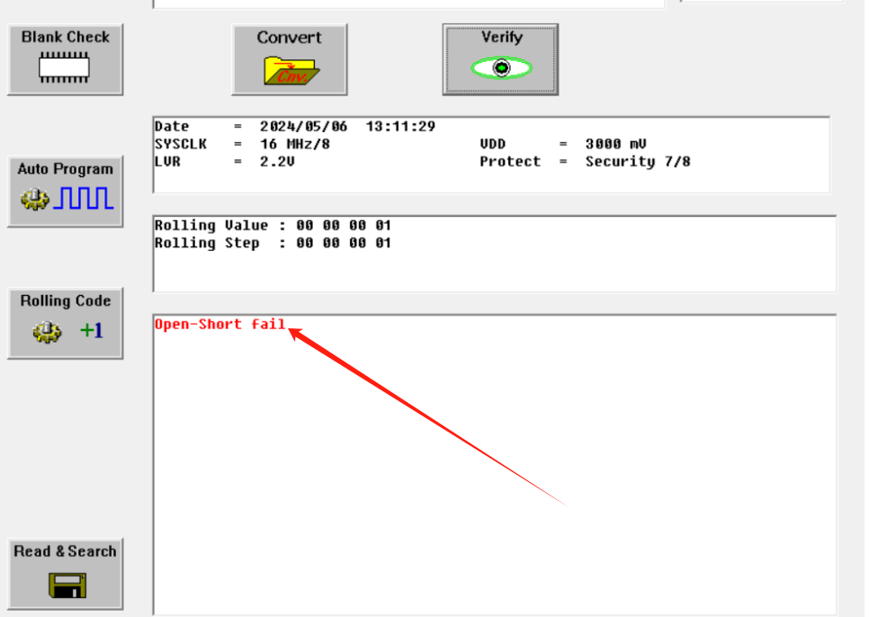

# 应广单片机芯片烧录固件验证方法

 @HYY

### 问题
由于应广单片机的芯片只能烧录一次，那么我们如何确认已经烧录的芯片内烧录的是哪一个固件呢？

### 解决方案

1.打开应广单片机IDE， 选择执行串口下的刻录器选项

2.点击load File选择需要验证的固件，如下图:

3.点击验证选项

4.如果芯片内的固件和所选择的固件一致，则如下图显示结果

5.如果芯片内的固件和所选择的固件不一致，则如下图显示结果

