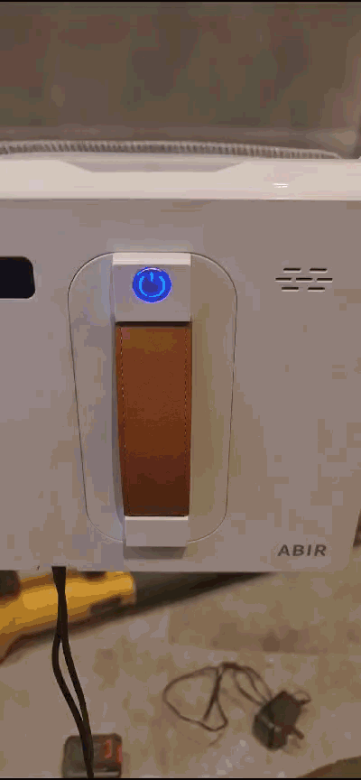

# 方形机常见问题

## 蓝灯常亮，红灯闪烁 @Justin

---

### 不良原因

悬空开关异常

### 确认方法

机器运行过程中出现蓝灯熄灭，过几秒后蓝灯常亮，红灯快速闪烁。

参考视频: \\\192.168.2.132\OvobotShare\FAQ\视频\方形机四个悬空开关问题确认方法.mp4

参考GIF:



### 可能原因以及排查方法：

> ***首先确定是否有悬空开关探测脚漏在无边玻璃外边或者被抬起，如出现这个问题机器无法恢复，则会报此错误；如不存在这个问题，则按下方步骤排查。***

#### 在未开机状态下把机器底部朝上，分别触发各个悬空开关，看红灯是否闪烁对应次数。

> *如下图为机器底部朝向面部，箭头方向为机器头部方向（向上或者向左的头部），四个角的数字代表触发对应悬空开关红灯闪烁的次数。*

```
2------------1
|     ^      |
|    / \     |
|     |      |
|     |      |
4------------3
```

#### 如发现某个悬空开关有异常，可按照下方进一步步骤排查原因：

**确定是否是悬空开关本身异常。** 把不良的悬空开关替换对比测试。如果恢复正常，则是这个悬空开关问题；否则换回之前悬空开关，进行下一步排查。

**确定是否是连接线异常。** 把不良的悬空开关连接线替换对比对比测试。如果恢复正常，则是这个连接线问题；否则换回之前连接线，进行下一步排查。

**确定是否是结构异常。** 

1. 查看悬空开关遮挡臂是否可以正常遮挡悬空开关的槽型光电对管，槽型光电对管两边分别有一个发射管和一个接收管，光电对管的胶件上会有开孔，需自行确定位置；
2. 在遮挡臂上裹一层不透光的黑色胶布，再看下是否能够正常触发，如果能正常触发，则是遮挡臂问题；
3. 使用其他不透光的薄片去遮挡悬空开关的槽型光电对管看是否能够正常触发，如果能触发，这确定是遮挡臂问题。

#### 如悬空开关有时好有时坏，需使用治具或者万用表测试，看电流和电压数据。

测试信号脚和接地脚的电压，在悬空开关中间无遮挡时电压应接近0V，有遮挡时应接近3.3V；否则悬空开关异常。

> *如何确定信号脚和接地脚？*
>
> *悬空开关一般有四个脚，其中两个连接在一起的是公共接地脚。另外两个一个是发射信号脚，一个是接收信号脚，我们这里需要测试接收信号脚。发射信号脚不管是否触发电压都不变，接收信号脚会有变化。*
