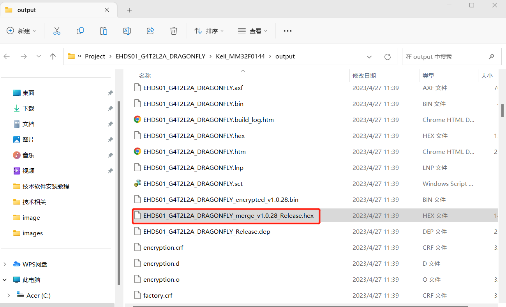
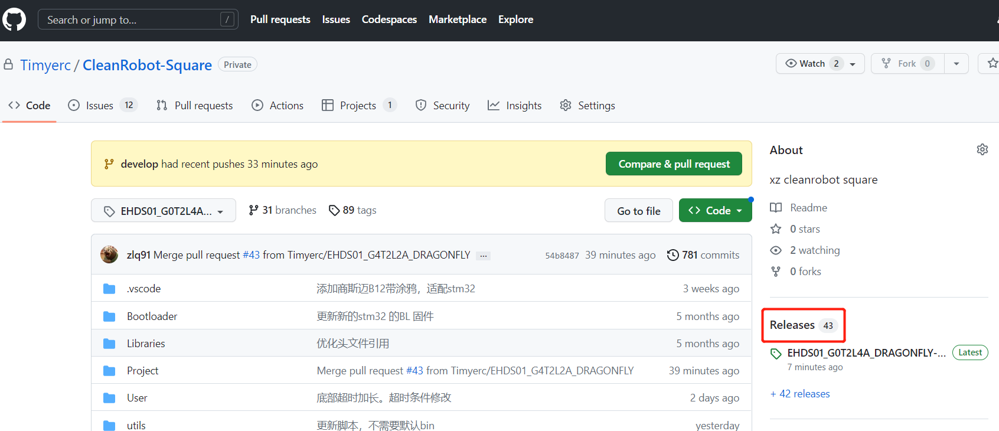
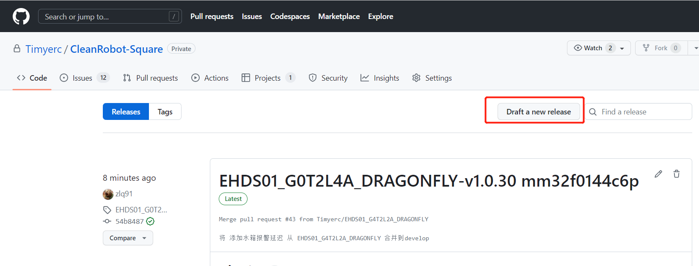
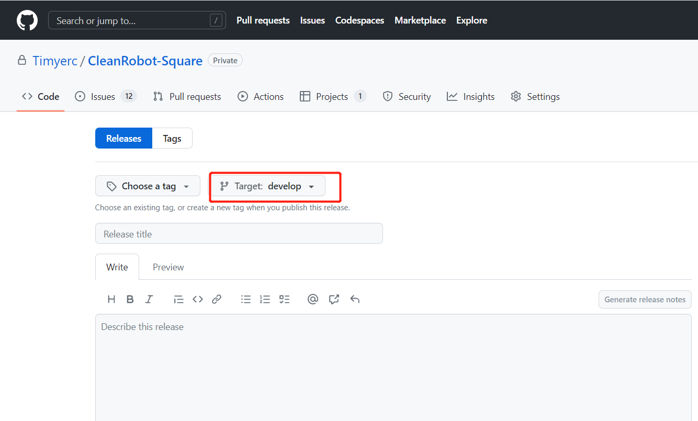
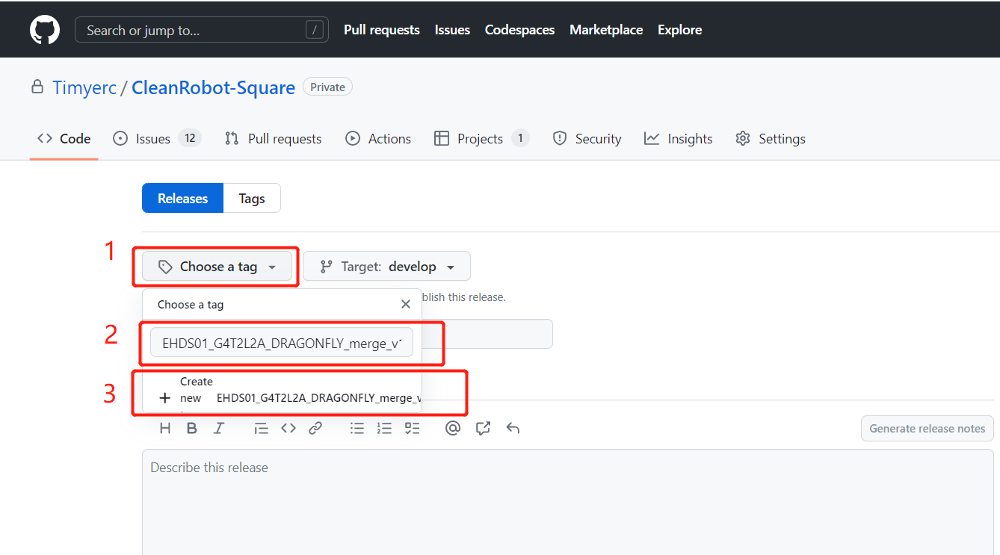
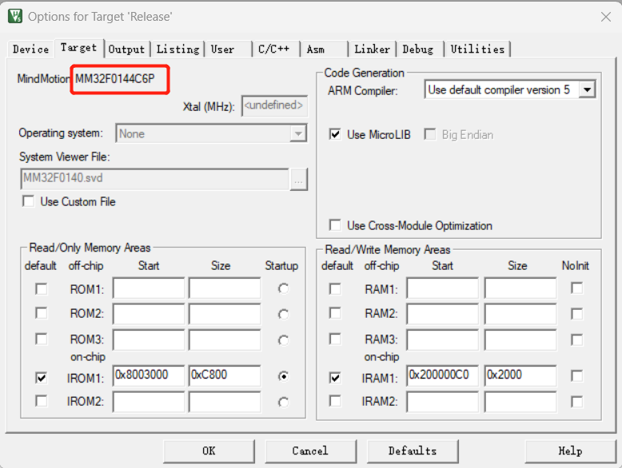
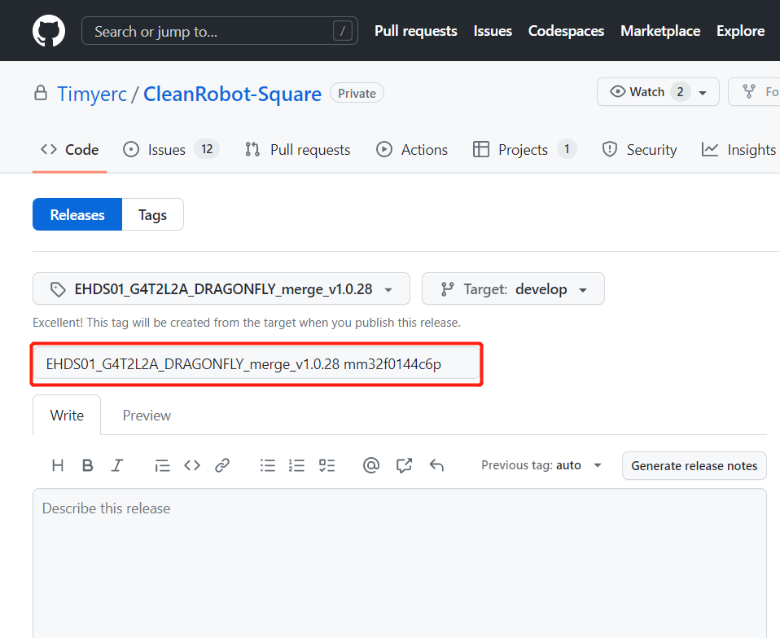
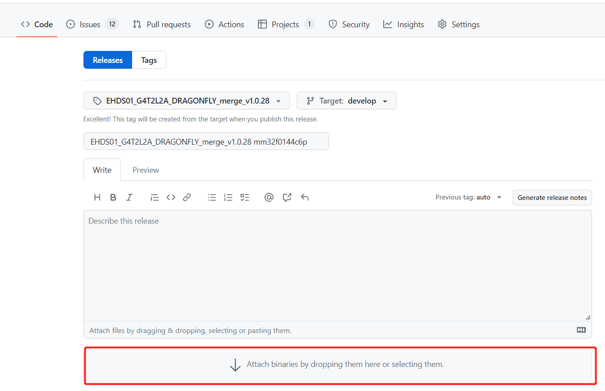
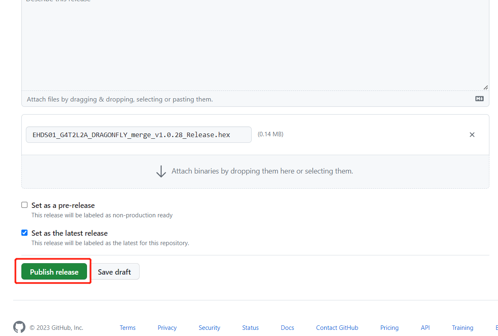
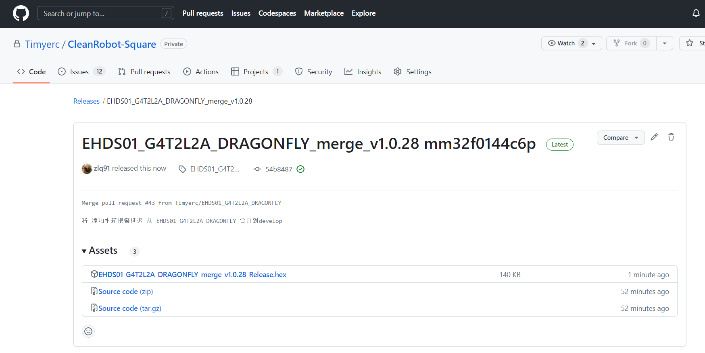

# Github上传Release步骤

## 一、编译项目

先用keil将项目编译一下，复制编译好的文件名的一部分（到版本号截止，版本号后面不用复制）

## 二、进入Release上传页面

登陆Github网页版，进入对应项目（CleanRobot或者CleanRobot-Square），然后点击下图中的Release。

再点击下图中的Draft a new release,进入上传页面

## 三、上传Release的一些参数填写

先将下图中Target的选择对应的github项目分支

然后先点击下图中1处，将步骤一中复制的名字在2处粘贴，最后点击3处创建这个Release

还需要在keil中拿到项目对应的芯片型号，如下图显示

将这个芯片型号，放在下图标示出来的末尾，记得空一格再放

## 四、上传Release

将步骤一种编译好的那个文件拖到下图中的位置处上传

然后点击下图中的Publish release按钮将Release推送到Github上

推送成功后显示如下

