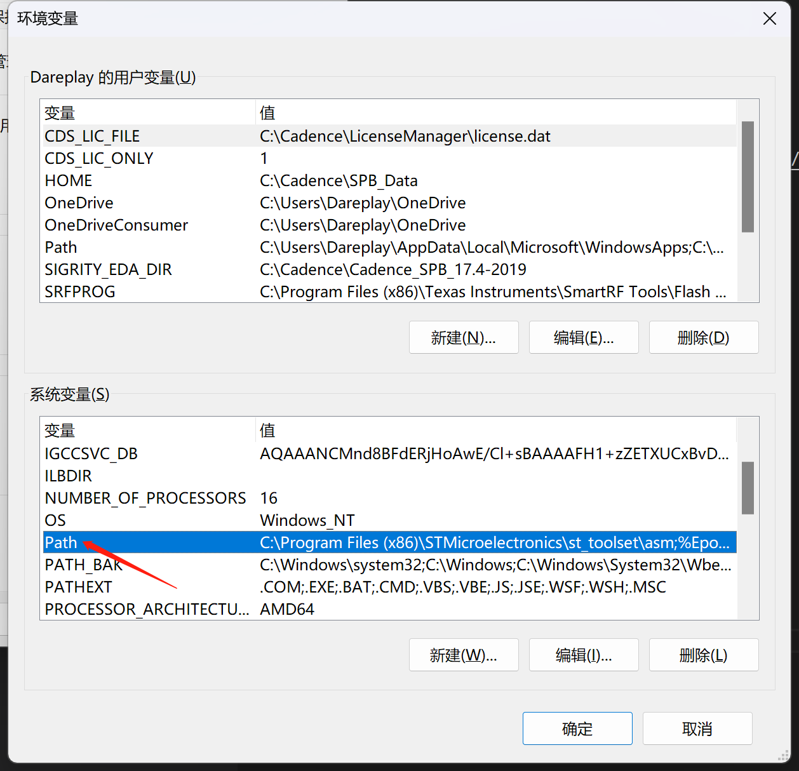
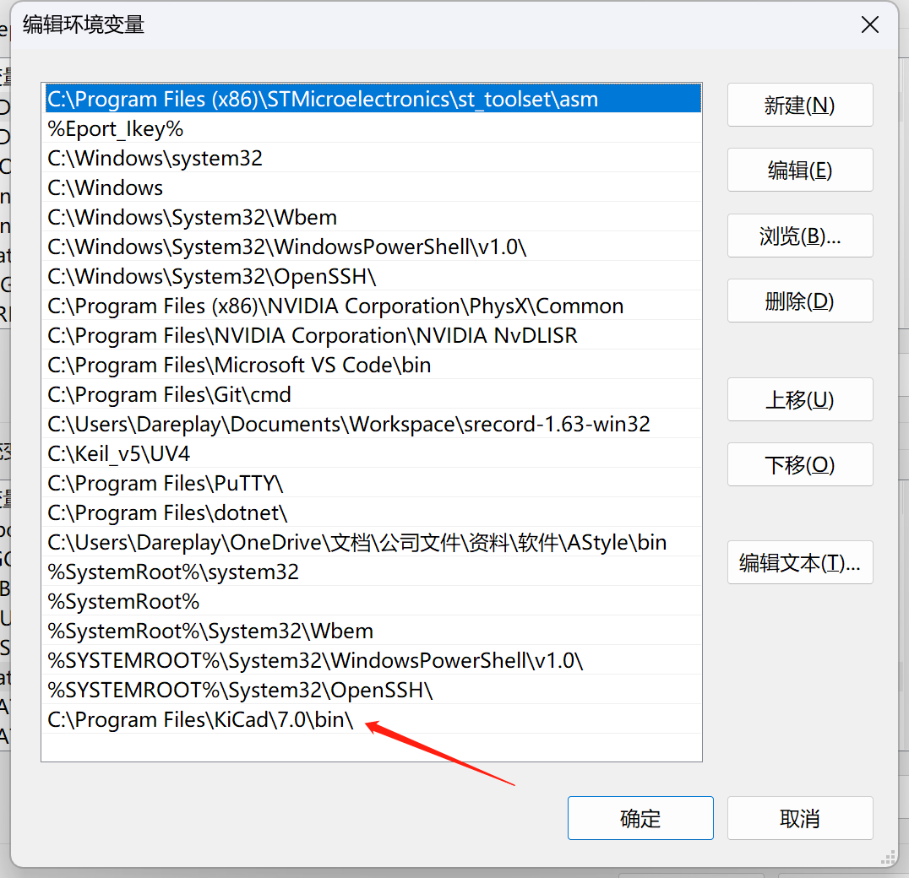
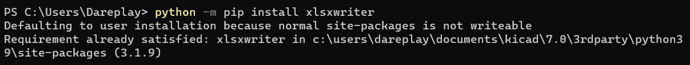
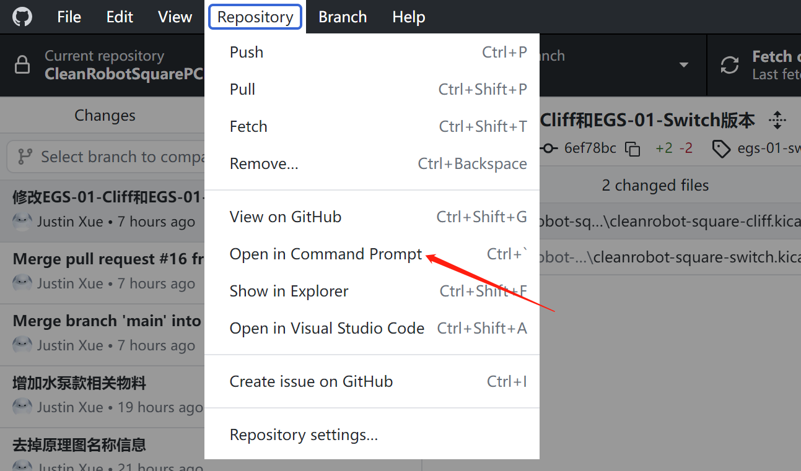
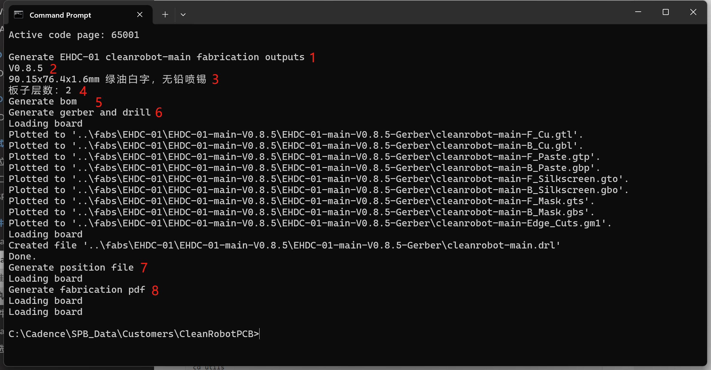

# Kicad使用脚本生成生产文件 @Justin

## 安装相关软件

### 安装[Kicad](https://www.kicad.org/)

添加Kicad安装目录下的bin文件夹路径到系统环境变量，如果安装了新的Kicad版本，需把环境变量改为新版本的安装目录。

*如下目录仅供参考，按照实际目录添加*

```
C:\Program Files\KiCad\版本\bin\
```




***环境变量设置好后需要重启电脑才会生效，切记重启后再执行下面步骤。***

### 安装[Python](https://www.python.org/)依赖库

打开Windows终端，输入如下命令并回车

```
python -m pip install xlsxwriter
```



## 执行脚本生成生产文件

打开Windows终端，进入工程仓库目录

建议通过Github Desktop进入终端，这样终端会默认进入仓库目录。



执行如下脚本：

```
utils\gen-fabs.bat 总的项目名称
utils\gen-fabs.bat 总的项目名称\具体的电路板

例子：
utils\gen-fabs.bat EGS-01
utils\gen-fabs.bat EGS-01\cleanrobot-square-main
```
如需生成嘉立创SMT下单文件，执行如下脚本：

```
utils\gen-fabs.bat 总的项目名称 jlc
utils\gen-fabs.bat 总的项目名称\具体的电路板 jlc

例子：
utils\gen-fabs.bat EGS-01 jlc
utils\gen-fabs.bat EGS-01\cleanrobot-square-main jlc
```

如果只指定总的项目名称（例：`EGS-01`），则会生成这个项目所有电路板的生产文件；如果指定了项目下的具体的电路板（例：`EGS-01\cleanrobot-square-main`），则只会生成这个电路板的生产文件。

查看log信息，确定是否有报错



1. 指示生成具体哪个板子
2. 板子版本
3. 板子尺寸和工艺信息
4. 板子层数
5. 指示生成BOM
6. 指示生成Gerber
7. 指示生成坐标文件
8. 指示生成贴片图
