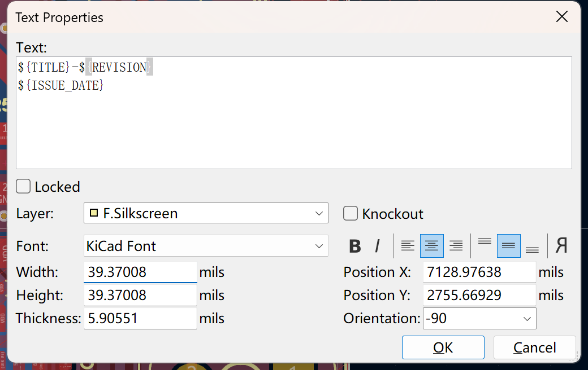
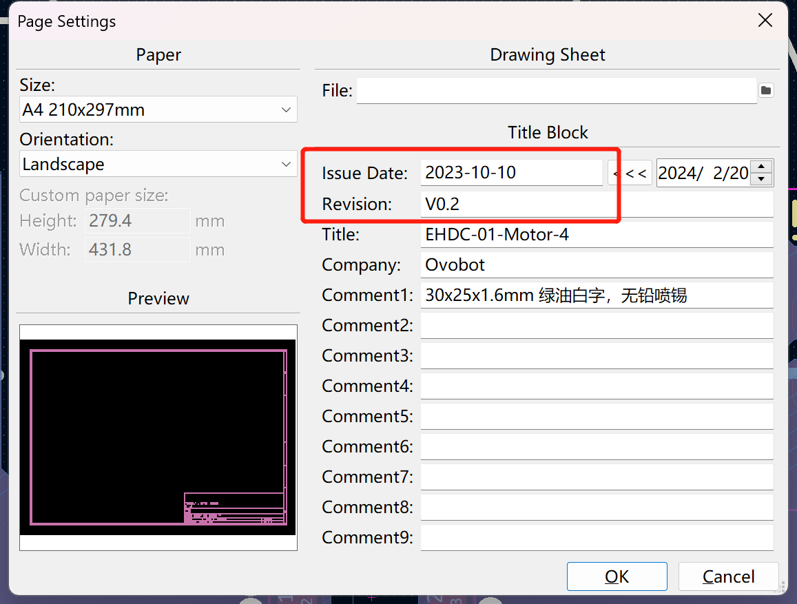
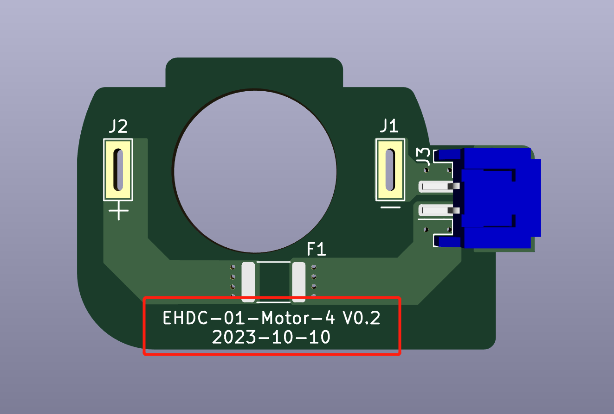
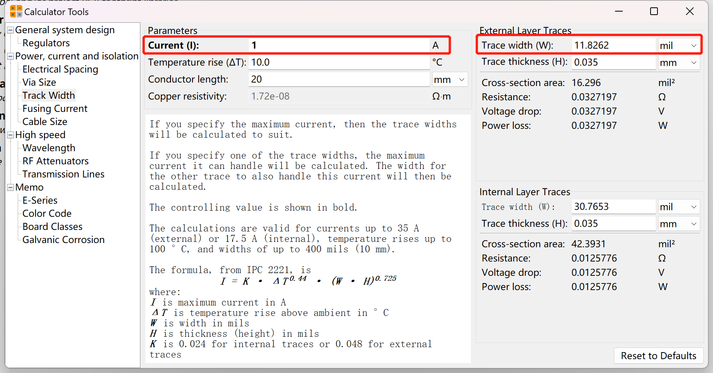
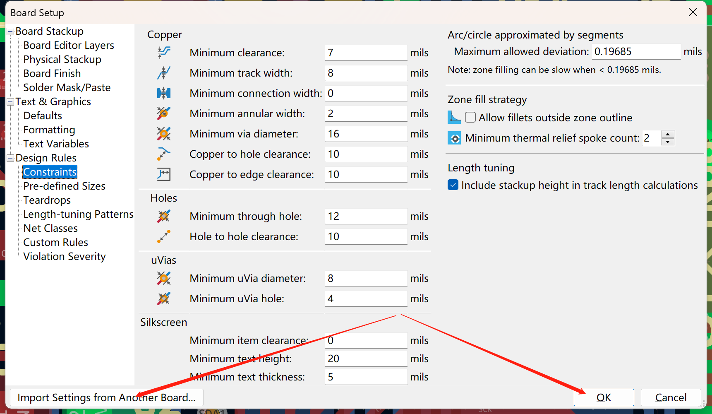
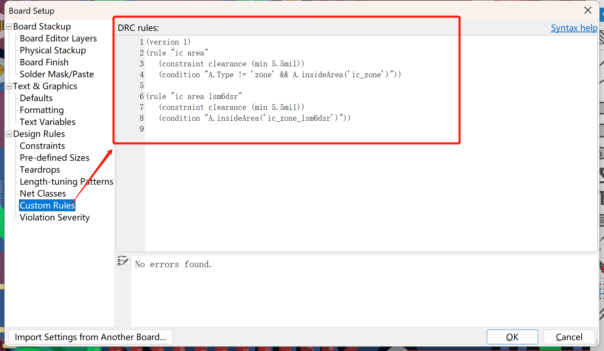
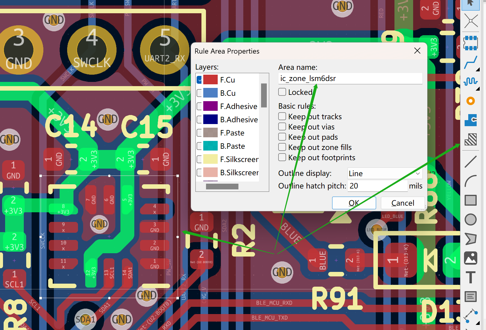

# Kicad设计规范

## PCB版本和日期丝印使用变量

板子标题名称：`${TITLE}`

版本的变量是：`${REVISION}`

日期的变量是：`${ISSUE_DATE}`

如PCB的丝印设置如下：



则对应变量会被实际的页面设置值替代：



显示的效果如下：



## 设计使用英制单位mil

常见的对应关系如下：

| 英制 | 公制 |
| ----------- | ----------- |
| 10mil | 0.254mm |
| 20mil | 0.508mm |
| 30mil | 0.762mm |
| 40mil | 1.016mm |
| 100mil | 2.54mm |

一般密度的板子信号线使用8mil，电源线根据走电流的大小设置，一般原则大于信号线的宽度。

可以使用如下Kicad的计算工具计算：



得到的结果向上取整，如上可以设置为15mil。一般取值是10mil、15mil、20mil等5的倍数。

过孔一般使用24/12mil，即外径24mil，内孔直径12mil。

## 约束规则

原则上设计新的PCB板时需要导入库里默认的工程配置。



两层板的默认配置工程目录如下：

```
Library\kicad_dr_2_m\kicad_dr_2_m.kicad_pcb
```

### 用户自定义规则

如下定义了两个自定义规则，一个是`ic area`，间距为5.5mil，约束条件是所有在`ic_zone`约束区域内的除了铜皮之外的所有对象；另外一个是`ic area lsm6dsr`，约束间距是5.5mil，约束条件是所有在`ic_zone_lsm6dsr`约束区域内的所有对象。

```
(version 1)
(rule "ic area"
   (constraint clearance (min 5.5mil))
   (condition "A.Type != 'zone' && A.insideArea('ic_zone')"))

(rule "ic area lsm6dsr"
   (constraint clearance (min 5.5mil))
   (condition "A.insideArea('ic_zone_lsm6dsr')"))
```



当有部分IC不适用当前默认规则时（如引脚间距小于默认规则），可以定义自定义规则，然后在IC区域画一个约束区域，并给约束区域设置一个名称，名称需要与自定义规则中区域名称对应。



## PCB封装设计规范

