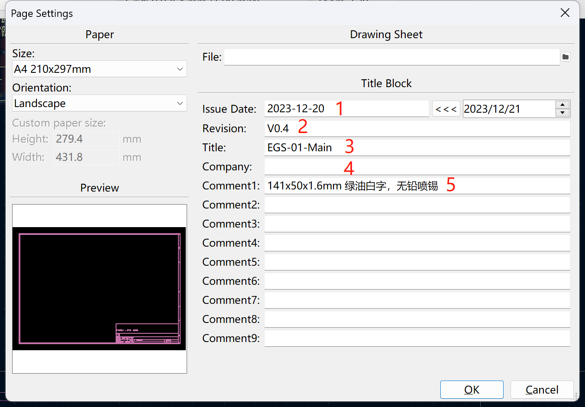
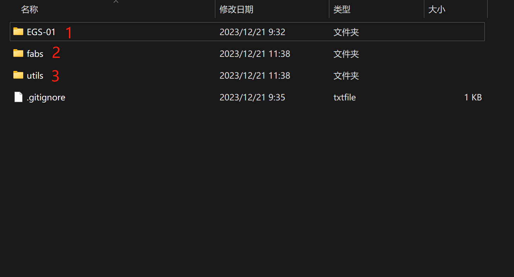
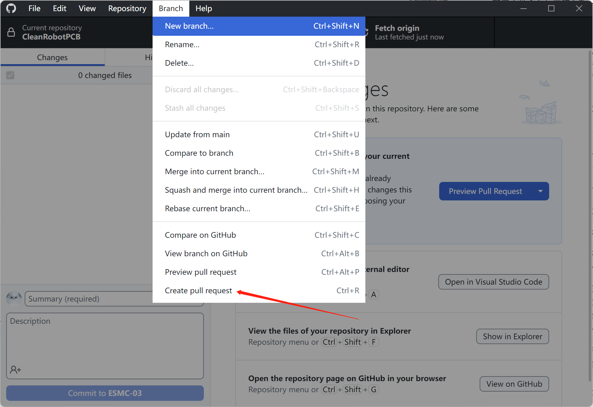
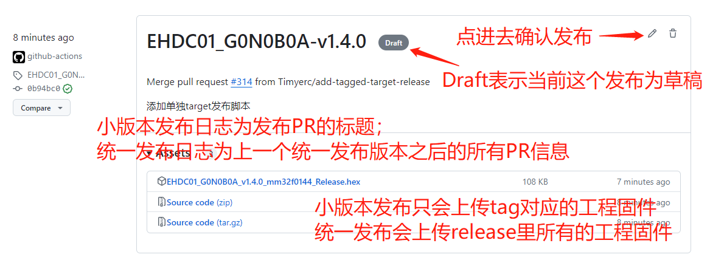
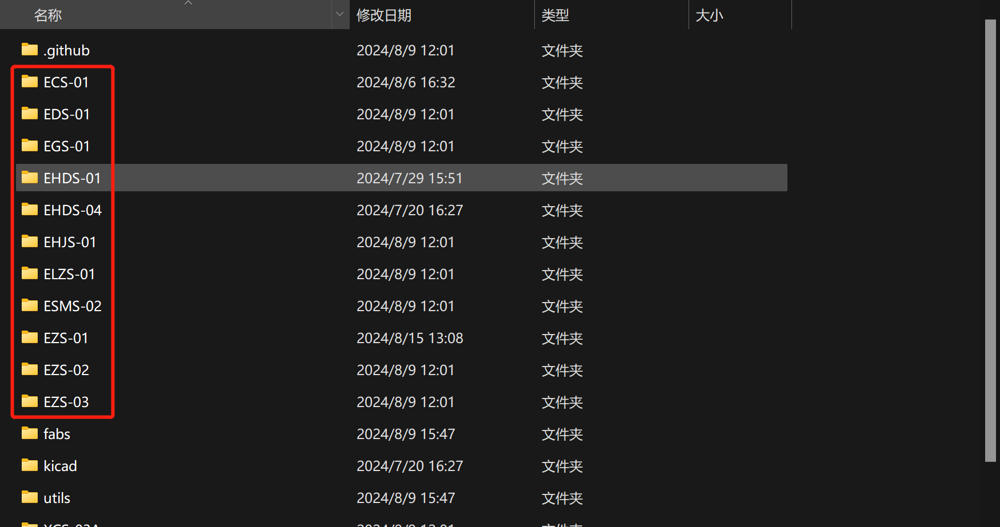
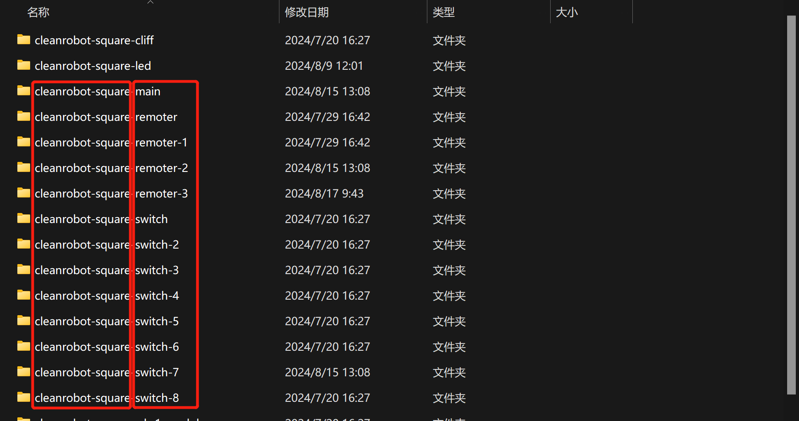

# 硬件开发流程

## 设置PCB文件信息



1. 日期
2. 版本，大写V + 版本
3. PCB名称
4. 公司名称
5. PCB尺寸和工艺信息

## 工程目录调整



1. 项目目录
2. fabs文件夹用于存放生产文件，为临时文件夹，由脚本自动生成，git不跟踪
3. 脚本目录
4. .gitignore为git系统文件不要删除

## PCB配置文件

*如果一个PCB有不同配置，需要在PCB工程目录下添加`json`配置文件*

配置文件参考如下：

```
{
    "refer": {
        "functions": {
            "batt-check-fun": {
                "comments": "电池温度检测与充电开关相关",
                "refs": "R9,R74,R64,C63,Q14",
                "nc": ""
            },
            "3colors-led-fun": {
                "comments": "三色灯相关",
                "refs": "R79,R80,R81,R82,R84,R85,R86,Q15",
                "nc": "R72,R73,R83,D9"
            },
            "btn-with-leds-fun": {
                "comments": "带灯按键板相关",
                "refs": "R55,R56,R57,R58,Q12,Q13,J11",
                "nc": ""
            },
            "voice-fun": {
                "comments": "语音相关",
                "refs": "R10,R11,R44,R59,C19,C23,C28,C29,C30,C50,U9,U11,J7",
                "nc": ""
            },
            "ir-fun": {
                "comments": "红外相关",
                "refs": "R43,C17,U5",
                "nc": ""
            },
            "2spray-fun": {
                "comments": "双喷水相关",
                "refs": "R22,R23,R47,R48,C52,C56,C57,C66,C67,F1,Q5,Q6,L8,L9,J8,J9",
                "nc": ""
            },
            "1spray-fun": {
                "comments": "单喷水相关",
                "refs": "R23,R48,C52,C57,C67,F1,Q6,L9,J9",
                "nc": ""
            },
            "water-det-fun": {
                "comments": "水量检测相关",
                "refs": "R61,R62,C60,Q2,J15",
                "nc": ""
            },
            "brush-fan-fun": {
                "comments": "有刷风机相关, 改J3为XH2.54MM/2AW",
                "refs": "R30,R49,D10,Q11",
                "nc": ""
            },
            "brushless-fan-fun": {
                "comments": "无刷风机相关",
                "refs": "R50,D8",
                "nc": ""
            },
            "redmond-fun": {
                "comments": "愚公模块相关",
                "refs": "R60,R6,R7,C9,C11,U3",
                "nc": ""
            },
            "tuya-fun": {
                "comments": "涂鸦模块相关",
                "refs": "R6,R7,C9,C11,U3",
                "nc": ""
            },
            "lsm6dsr-fun": {
                "comments": "LSM6DSR陀螺仪相关",
                "refs": "C51,C53,C54,U16",
                "nc": ""
            }
        }
    },
    "boards": [
        {
            "name": "EHDC01-G4T4L2X2-Main",
            "functions": [
                "tuya-fun",
                "2spray-fun",
                "water-det-fun",
                "brushless-fan-fun",
                "voice-fun",
                "btn-with-leds-fun"    
            ]
        },
        {
            "name": "EHDC01-G4T4L2C-Main",
            "functions": [
                "tuya-fun",
                "2spray-fun",
                "water-det-fun",
                "brushless-fan-fun",
                "voice-fun"  
            ]
        },
        {
            "name": "EHDC01-G8T4L0X0-Main",
            "functions": [
                "redmond-fun",
                "2spray-fun",
                "water-det-fun",
                "brushless-fan-fun",
                "voice-fun",
                "btn-with-leds-fun"   
            ],
            "modifies": [
                {
                    "ref": "U3",
                    "value": "319-WT32C3-S5  redmond愚公模块"
                }
            ]
        },
        {
            "name": "EHDC01-G0T4L0C-Main",
            "functions": [
                "2spray-fun",
                "water-det-fun",
                "brushless-fan-fun"
            ]
        },
        {
            "name": "EHDC01-G4T4L0X2-Main",
            "functions": [
                "tuya-fun",
                "2spray-fun",
                "water-det-fun",
                "brushless-fan-fun",
                "btn-with-leds-fun"
            ]
        },
        {
            "name": "EHDC01-G0S4B0A-Main",
            "functions": [
                "1spray-fun",
                "water-det-fun",
                "brush-fan-fun"
            ],
            "modifies": [
                {
                    "ref": "J3",
                    "value": "XHB2.54MM/2AW"
                }
            ]
        },
        {
            "name": "EHDC01-G0S4L0A-Main",
            "functions": [
                "1spray-fun",
                "water-det-fun",
                "brushless-fan-fun"
            ]
        },
        {
            "name": "EHDC01-G0N0B0A-Main",
            "functions": [
                "brush-fan-fun"
            ],
            "modifies": [
                {
                    "ref": "J3",
                    "value": "XHB2.54MM/2AW"
                }
            ]
        }
    ]
}
```

配置文件命名与工程名称一致，后缀为`.json`

配置文件key, value说明：

| key | value |
| ----------- | ----------- |
| refer | 参考功能点 |
| refer->functions->具体功能点->comments | 功能描述 |
| refer->functions->具体功能点->refs | 此功能对应的元器件标号 |
| refer->functions->具体功能点->nc | 此功能需要去掉的元器件标号 |
| boards | 不同板子型号对应的功能点 |
| boards[x]->name | 板子型号 |
| boards[x]->functions | 板子包含的功能点，为refer里具体功能点，使用，分割开 |
| boards[x]->modifies | 如果有元器件需要修改参数，则添加这个key，value为一个数组，数组中的一项代表一个需要修改的元器件 |
| boards[x]->modifies[x]->ref | 需要修改参数的元器件标号，只能有一个标号 |
| boards[x]->modifies[x]->value | 元器件的新参数 |

## 提交流程

目前所有独立分支的电路板（Kicad绘制）按照上方要求设置PCB文件信息，添加PCB配置文件，修改目录结构，确保本地运行脚本创建生产文件无问题，提交并创建PR合并到main分支。



## 发布流程

### 提交PR，合并分支到`main`分支

修改完成后提交PR到`main`分支，审核通过后合并到`main`分支。

### 在`main`分支打发布Tag，触发Github action自动发布

合并后在`main`分支上打版本`tag`，`tag`格式参考下方[Tag格式](#tag格式)

推送新的`tag`到远程仓库，检查自动发布action是否执行成功。


推送成功后Github action会自动创建新的发布，注意action创建的发布为草稿，需要自己手动修改publish。



### 确认发布

检查发布信息是否正确，以及发布日志是否需要修改。确定无误后点击Publish release按钮正式发布。


## Tag格式

[项目名称]-[PCB名称]-v[主版本号].[小版本号].[补丁号]

下方图片红框内是项目名称：



下方图片右侧红框内是PCB名称，左侧方形仓库为`cleanrobot-square`，圆形仓库为`cleanrobot`：



注：
- 实际没有方括号，这里只是为了区分；
- 所有字符小些；
- 项目名称和PCB名称需与实际完全一致；
- 版本号需与PCB实际版本号完全一致；
- 补丁号按实际版本确定是否需要；

例如：`ecs-01-main-v0.5`