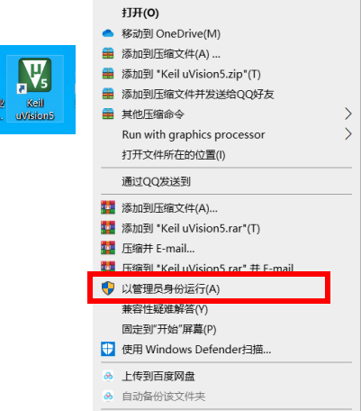
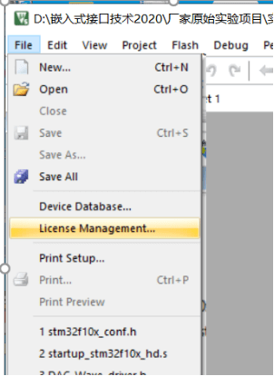
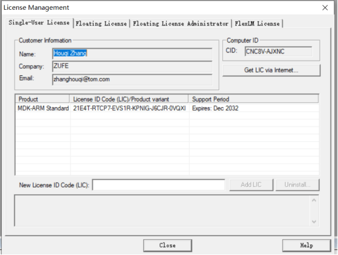
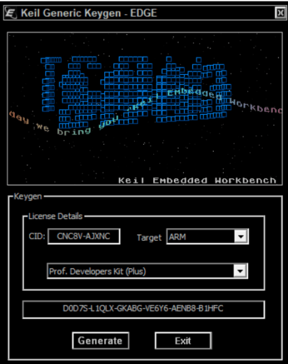
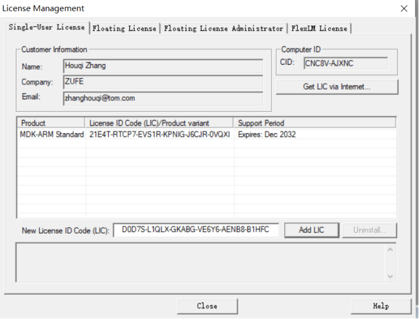

# Keil激活mdk教程

1、在桌面上右击keil图标，在弹出的选项卡中选择以管理员身份运行（很重要很重要！！！）

2、点击File，选择License Management，然后复制CID

3、在安装文件中点击keygen.exe文件（如果打不开，则按住shift键，然后重启电脑，选择安全模式）

粘贴复制的CID，选择Target为ARM，点击Generate，生成激活码（最下方的文本框就是激活码）

4、复制生成的激活码，粘贴在New License ID Code处，点击Add LIC，即可成功激活mdk，显示mdk的使用期限即为成功

