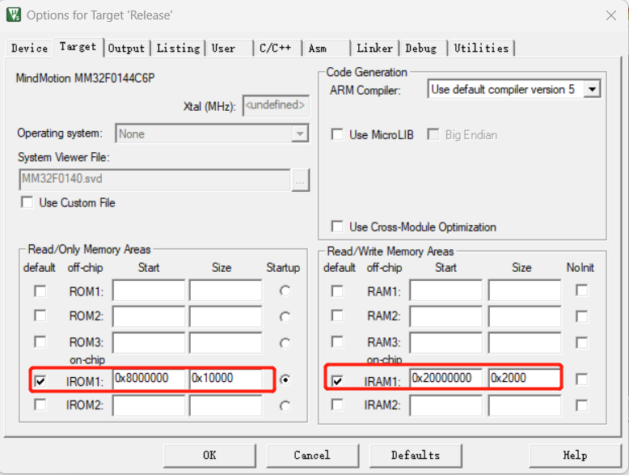
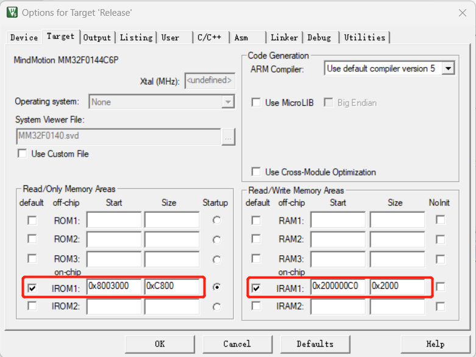
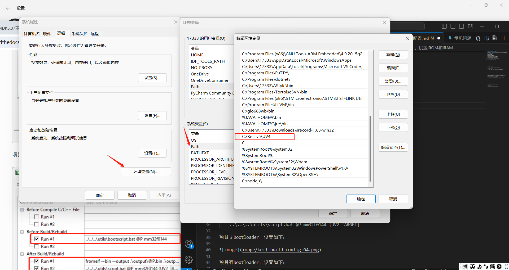
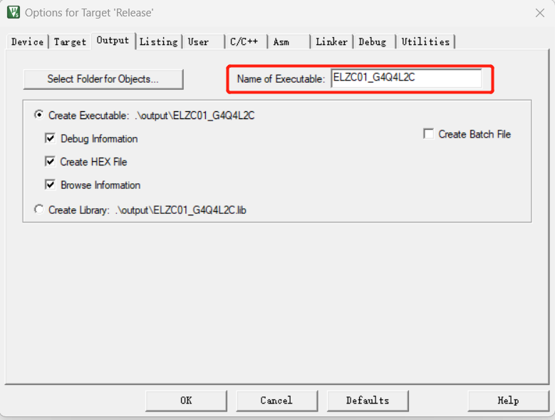
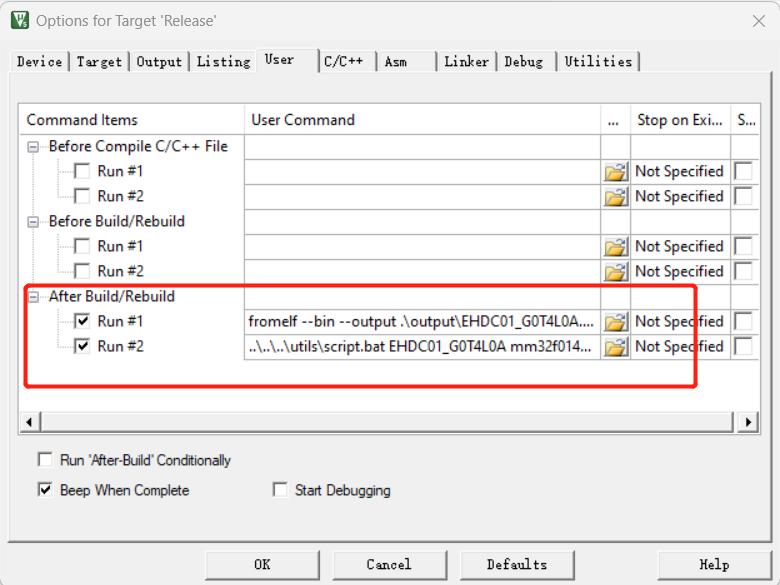
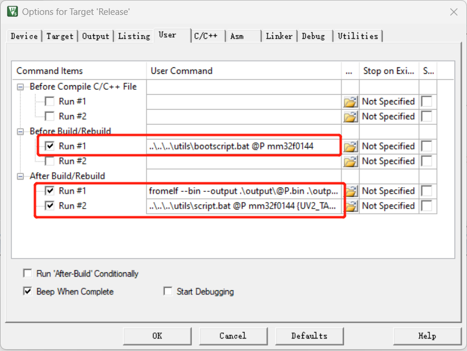
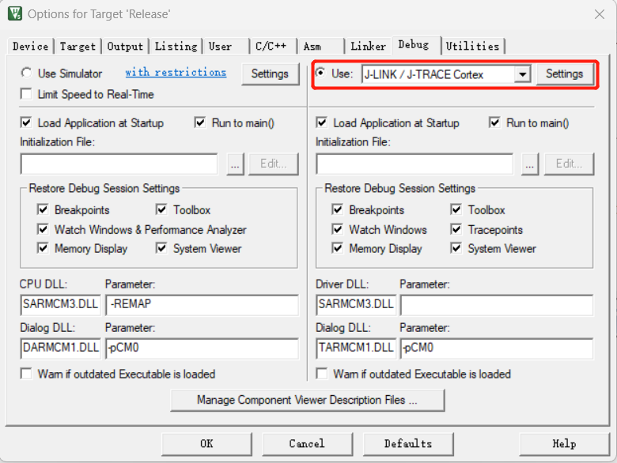
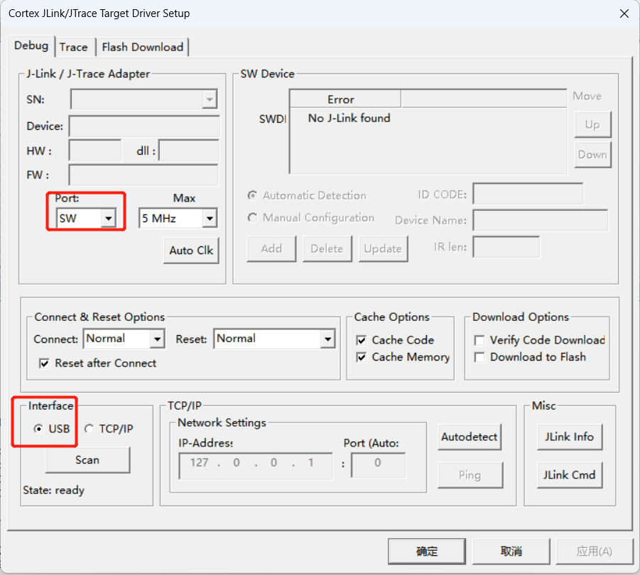
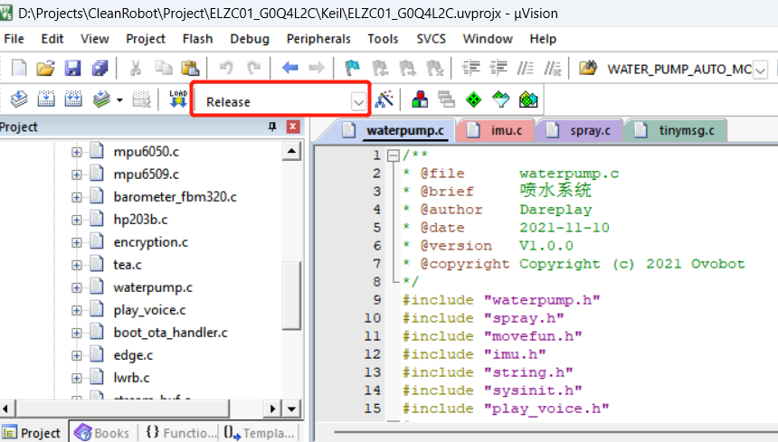
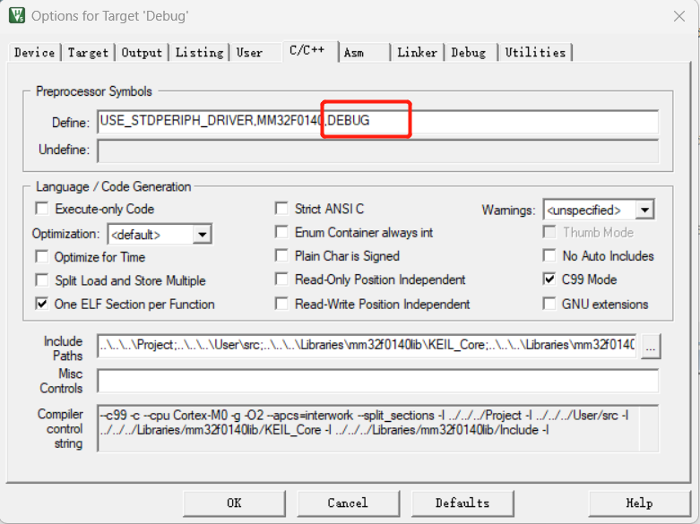

# Keil项目编译Options for Target配置

编译项目前，打开Options for Target，这里的类型可以选择Release、Debug等。

## 一、设置IROM和IRAM

切换到Target页面，

项目无bootloader设置如下：

1. 项目有bootloader则需要做如下图设置：

2. 配置keil环境变量，如下图设置
   

## 二、设置生成文件名

切换到Output页面，将项目名称填入Name of Executable。

## 三、设置Before Build和After Build 

切换到User界面

Before Build中内容：

    ..\..\..\utils\bootscript.bat @P mm32f0144

After Build中内容：

    fromelf --bin --output .\output\@P.bin .\output\@P.axf
    ..\..\..\utils\script.bat @P mm32f0144 {UV2_TARGET}

项目无bootloader，设置如下：

项目有bootloader，设置如下：

## 四、设置J-Link
切换到Debug界面，如下图所示选中User，并选择J-LINK/J-TRACE Cortex，

单击旁边的Settings，进入下面界面，如下图所示设置Port和Interface

## 五、根据情况设置Define

切换到C/C++界面，根据上图中keil红框中的选择设置如下图中的Define。

Release如下所示：

Debug如下所示：

