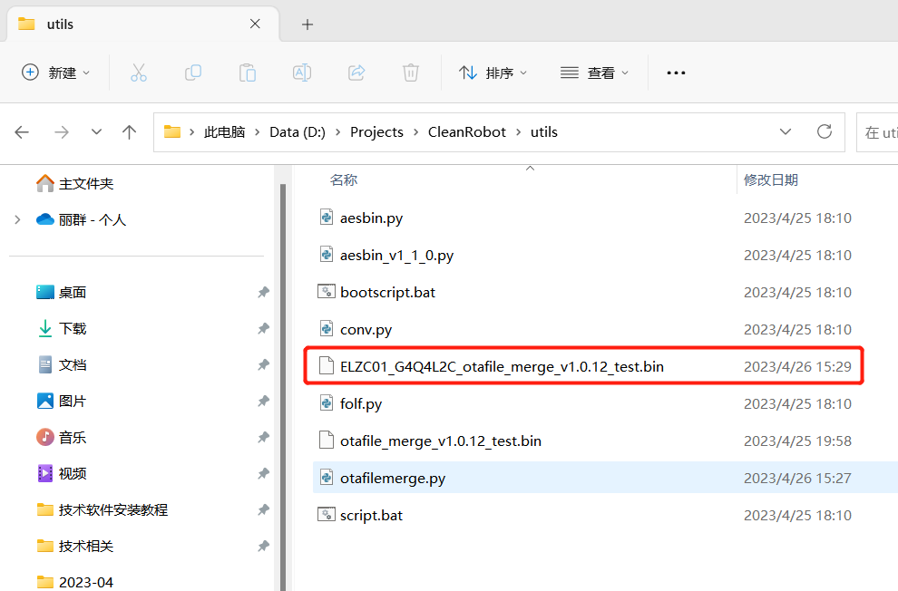

# OTA升级固件处理

1、先根据项目找到下图中1处的target.h文件，打开文件找到2处的MCU_VER和 MCU_APP_VER_NUM ，修改其版本号，两个值需要保持一致。

2、双击打开下图中的文件进行编译（bootloader）

3、根据下图中1处的路径双击打开图中2处的文件进行编译。

注意编译设置如下图：

4、编译后，在output文件里夹会生成一个xxx_merge_v版本号_Release.hex的文件，如下图：

5、然后进入项目下的utils目录打开终端执行如下图所示命令（test为内部测试用，正式发布用Release）。

其中ELZC01_G4Q4L2C为项目名称，紧跟在后面的是版本号

执行成功后显示如下：

6、然后打开项目下的utils文件夹，会发现生成如下图文件，将这个文件上传到涂鸦平台。

