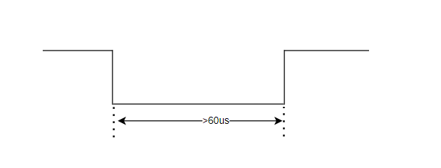
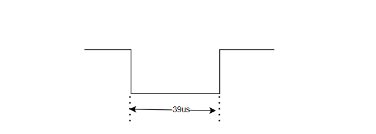

# TSD单总线同步通信协议

## 概述
    TSD接口采用单根信号线，既传输时钟信号又传输数据，且数据传输是双向的，具有接线简单、节省IO口、方便总线扩展等特点。该协议在一根线上定义了五种类型的信号：包括帧同步信号 SYNC，写 0、写 1、读 0 和读 1。总线主机发出所有信号的下降沿。

## 信号类型
    单总线通信时默认电平为高电平，数据的起始、发送、接收都是由主机发起，通过低电平持续时间的长短，判断通信的内容和信息。

1、起始信号

    低电平持续超过60us后转变成高电平，表示将要开始通信。

2、写时序

    低电平持续时间在39us左右转变为高电平，表示主机向从机发送数据1

    低电平时间持续时间在26us左右转变为高电平，表示主机向从机发送数据0

    在主机向从机发送数据的时候要注意低电平转换成高电平后，高电平的持续时间要合理，给予从机充分的程序执行时间，这里建议是将高电平的持续时间给到40us左右。
    从机在接收主机数据时的策略是等待高电平过去，检测低电平的持续时间，低电平的检测时间低于32us(检测时间在26us~39us之间即为合理)则接收到的数据时1，反之则为0。

3、读时序

    低电平持续时间为43us左右转变为高电平，则表示从机向主机发送的数据为1 
    (图中黑色线为主机控制，红色的线为从机控制)

    低电平持续时间为22us转变为高电平，则表示从机向主机发送的数据为0

    为保证数据传输过程的准确性，主机和从机进行通信时，主机每接收以为数据时，都要将总线拉低进行同步，同时也是给从机一个发送1bit数据的信号，而主机在接收数据时的策略是将总线拉低后，检测低电平的持续时间如果低于32us则接收到的数据为0，反之为1。

## TSD通信时序图

## TSD通信协议

写命令：

| SYNC | 11000000 | DATA1 | ... | DATAN |
| ---- | -------- | ----- | --- | ----- |

读命令：

| SYNC | 10100000 | DATA1 | ... | DATAN |
| ---- | -------- | ----- | --- | ----- |

数据包构成：

| 起始数据 | 读/写命令 | DATA1 | ... | DATAN |校验和|
| ------- | -------- | ----- | --- | ----- | ---- |

主机和从机按大端序进行数据的发送，校验和是date1+date2+.....daten的低八位数据。

