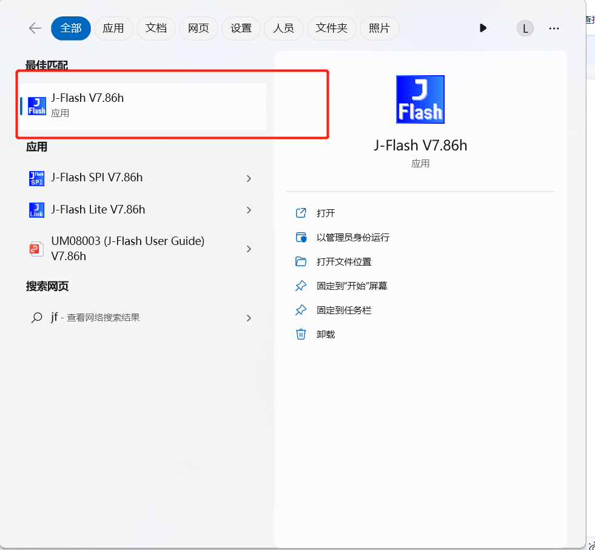
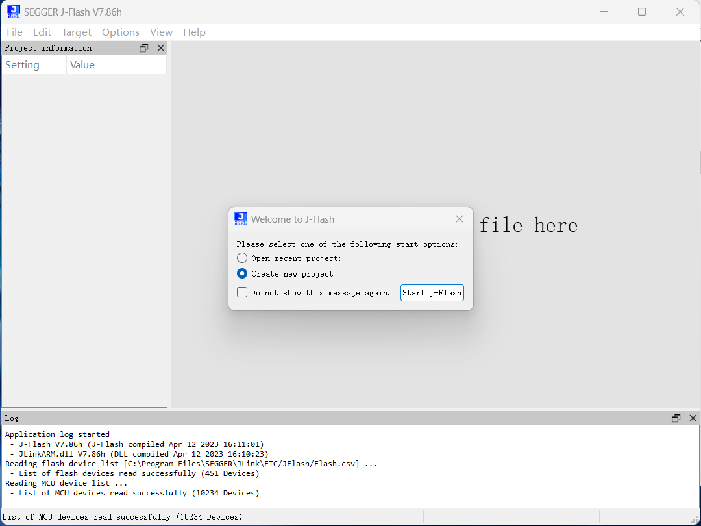
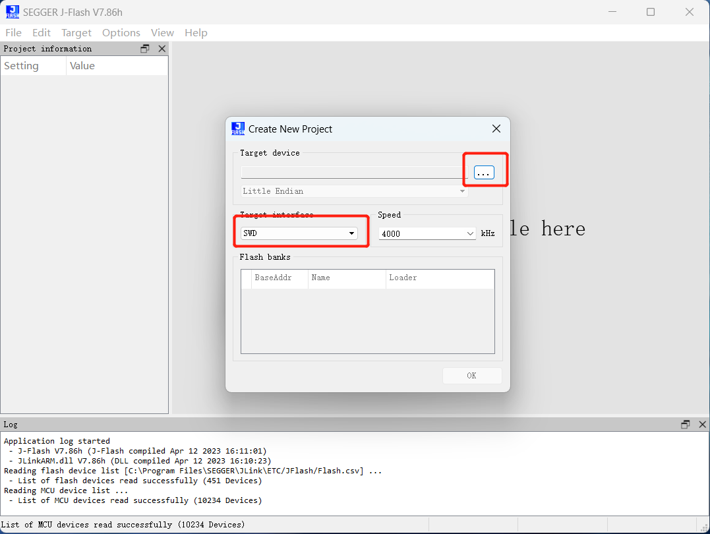
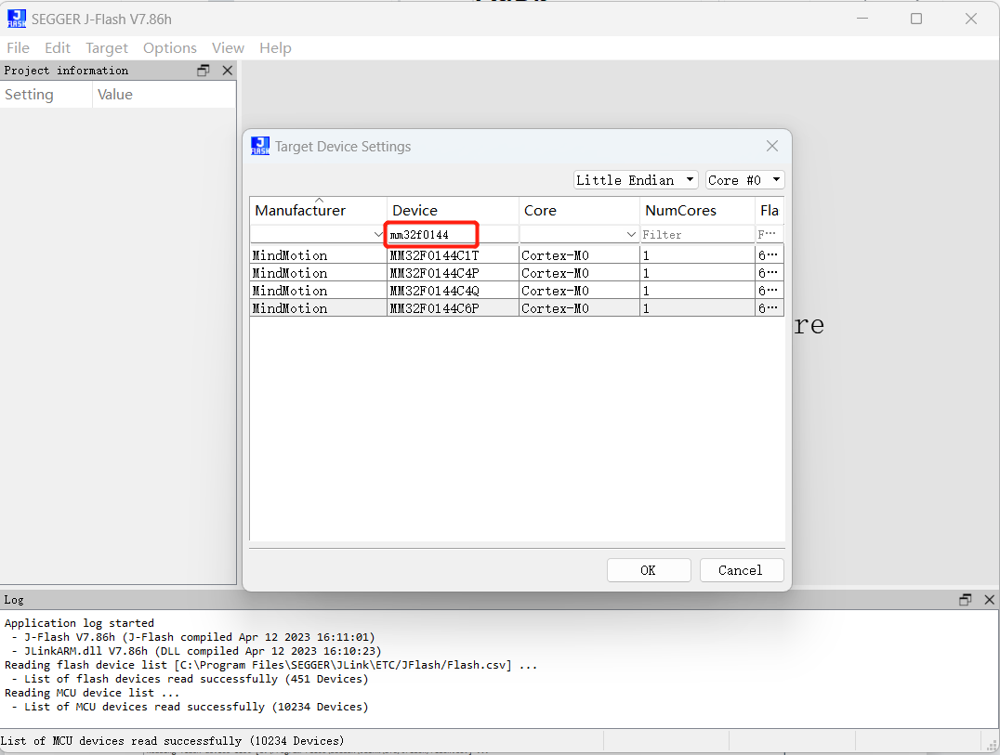
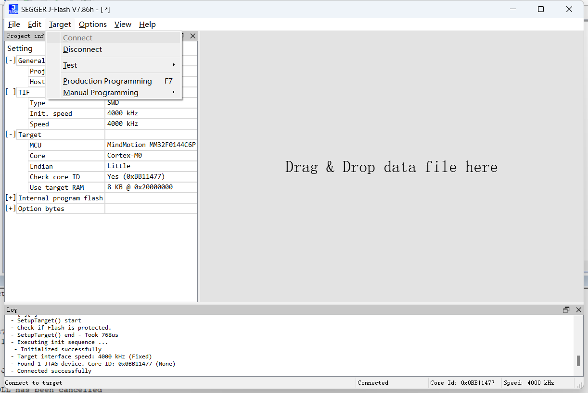
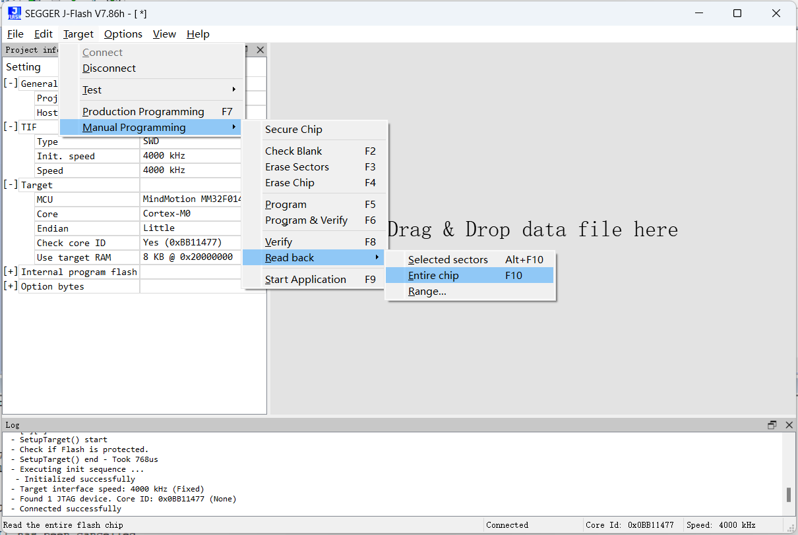
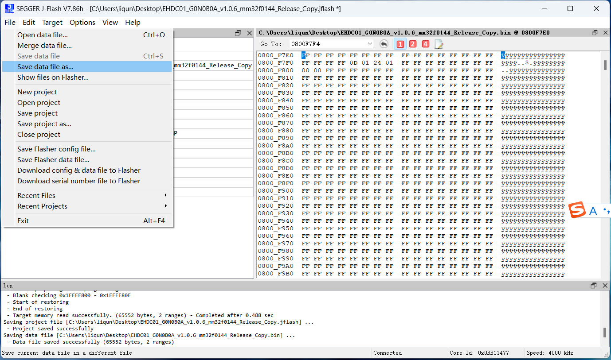
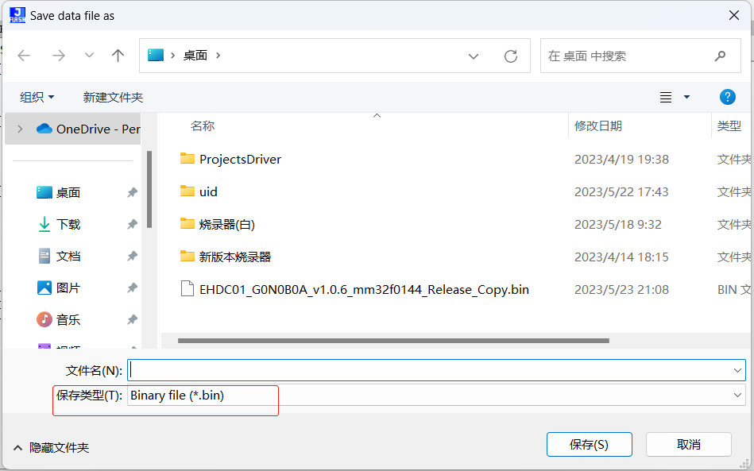
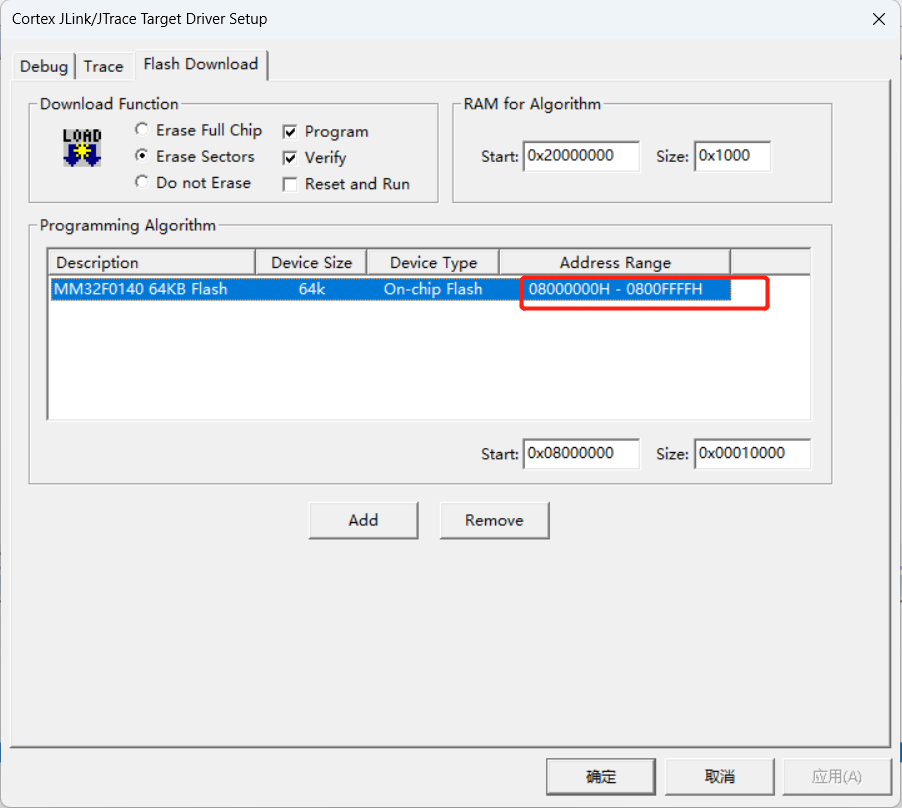
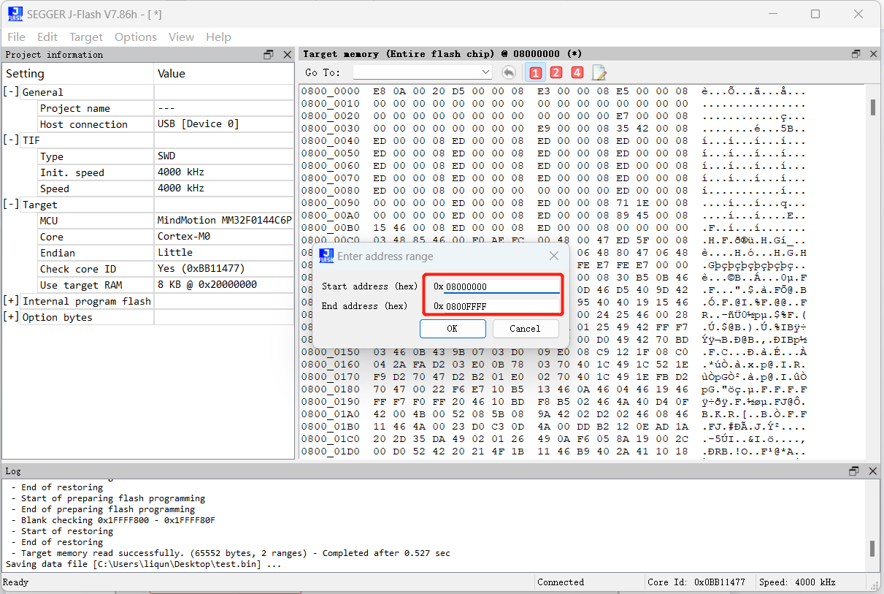

# J-Flash使用教程

注意：芯片里的程序不能加密写入，否则无法读取

## 一、J-Link连接好电脑和主板，主板供电

## 二、J-Flash软件读取程序

1、找到J-Flash V7.86软件，单击打开

2、选择Create new Project，点击Start J-Flash按钮

3、在弹出框中先单击右上方的省略号按钮，弹出Target Device Settings界面

4、在Device下方的一格输入芯片型号，然后根据删选出的数据选择对应的芯片，点击下方的ok键，进入主界面

5、在主界面中，依次点击工具栏中的Target -> Connect，连接芯片，界面下方的log窗口中出现Connected successfully则说明连接成功

6、继续在工具栏中依次点击Target -> Manual Programming ->Read Back -> Entire chip，会在右侧出现读取出来的数据窗口

## 三、将读取出来的程序保存

1、按照第二步读取出程序后，在工具栏中依次点击File -> Save data file as...

2、在弹出的窗口中填入文件名和文件类型(后缀为.bin)，点击保存，然后J-flash会出现一个填写flash地址的弹框

3、先在keil中查看Flash写入地址范围，然后将范围填入J-Flash的地址范围，最后点击ok

