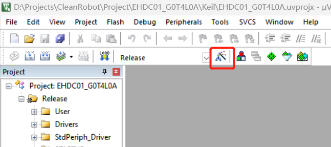
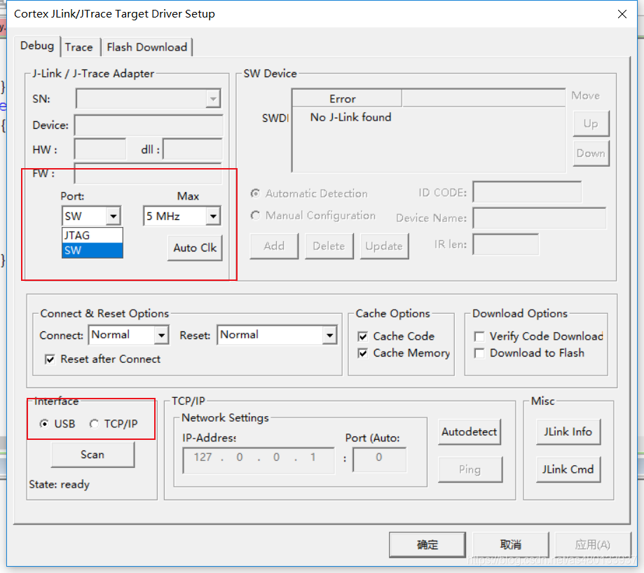
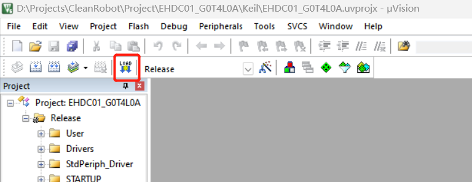
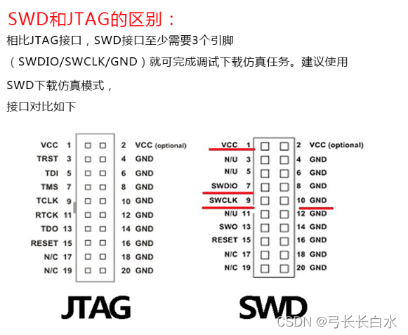

# J-LINK(SWD)项目下载教程

1、用keil打开项目并编译完成，然后点击Options for Target

2、选择下载方式J-LINK/J-TRACE Contex, 然后点击Settings

3、在弹框中将Port选择SW，注意下方接口为USB 模式，然后点击确认按钮

4、连接好电源、板子和J-link，然后点击keil中工具栏中的Download，下载完成即可

附：
    
J-LINK 接口图

