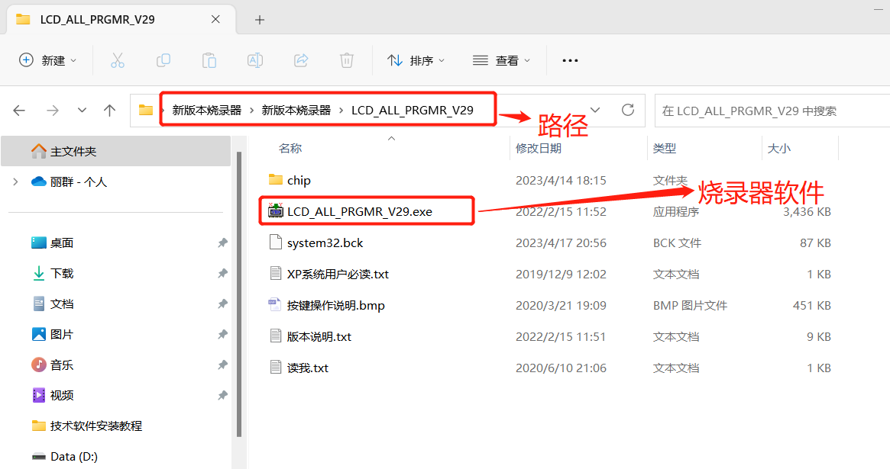
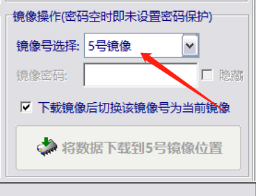
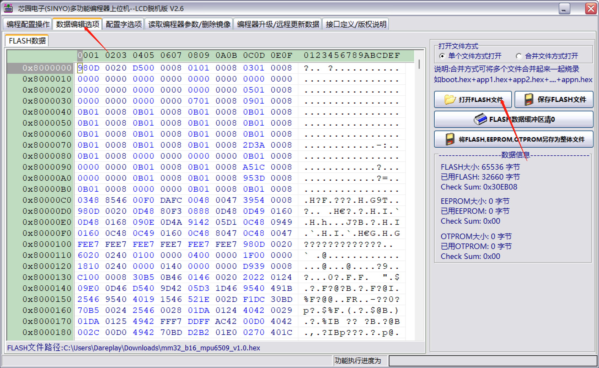
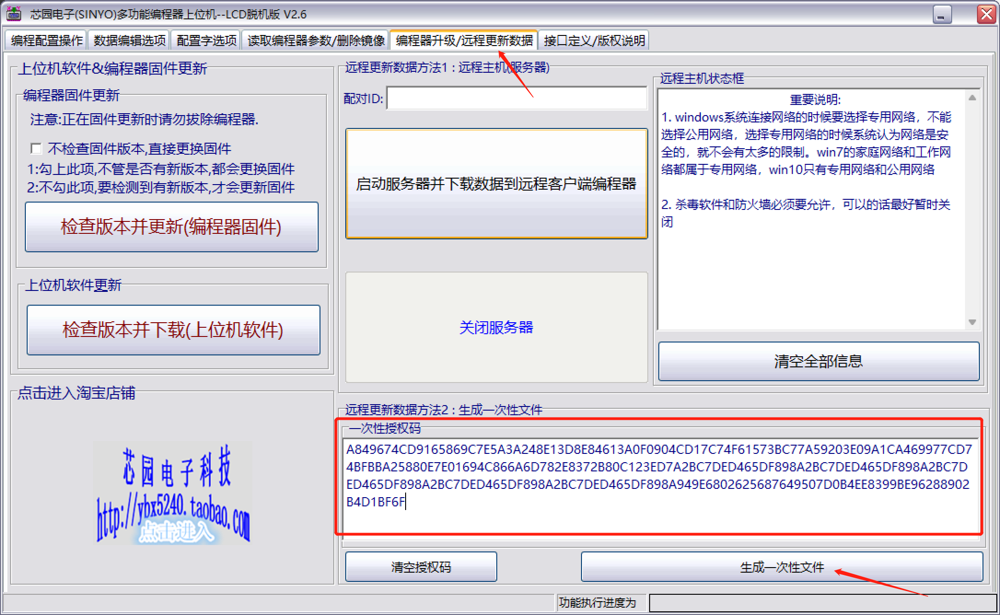

# PRGMR烧录器生成烧录文件(服务端)

## 一、解压软件

解压 新版本烧录器.zip 到自己的电脑中，然后以管理员权限打开下面目录中的软件。

## 二、设置参数

1、选择芯片系列

2、选择芯片型号

3、设置电压输出

4、仅使能通道A

5、去掉自动烧录功能

6、设置配置字，禁止读出

7、设置烧录的数量

8、导入程序数据

## 三、设置程序编号

根据客户需要选择镜像（如无要求可自行选择）

## 四、导入程序数据

## 五、生产烧录文件

打开编程器升级/远程更新数据选项卡，粘贴客户发过来的授权码，最后点击生成一次性文件按钮生成烧录文件(生成的文件后缀为.once)。将生成的文件发给客户或生产。

注意：文件名格式为：项目名-v版本号-数量-日期-当天第几次发
示例：ELZC01_G4Q4L2C-V1.0.11-25-230426-02

