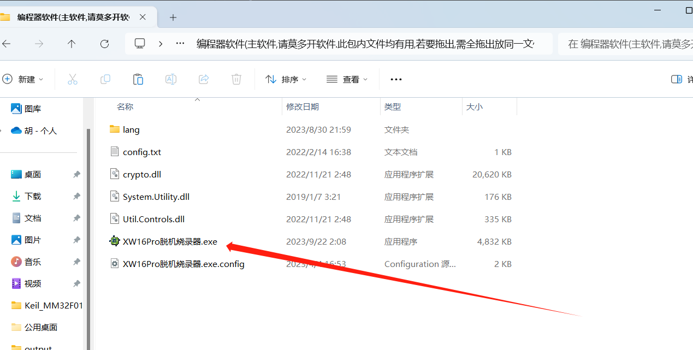
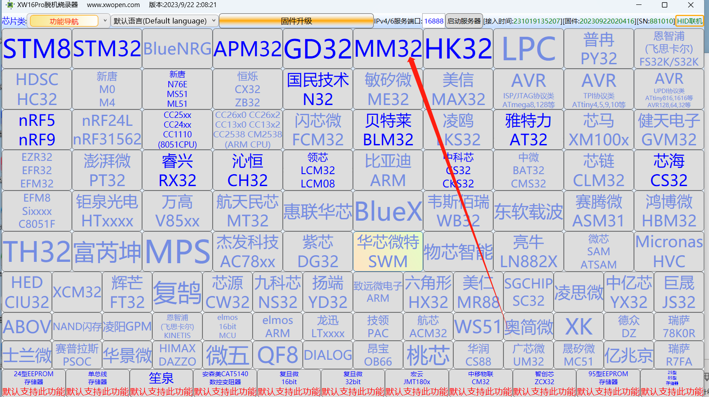
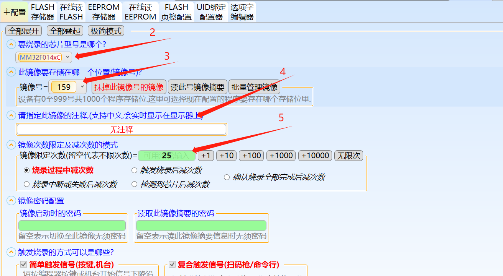
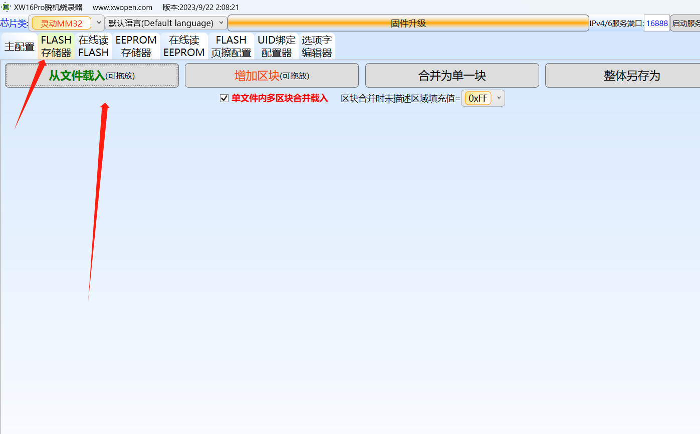
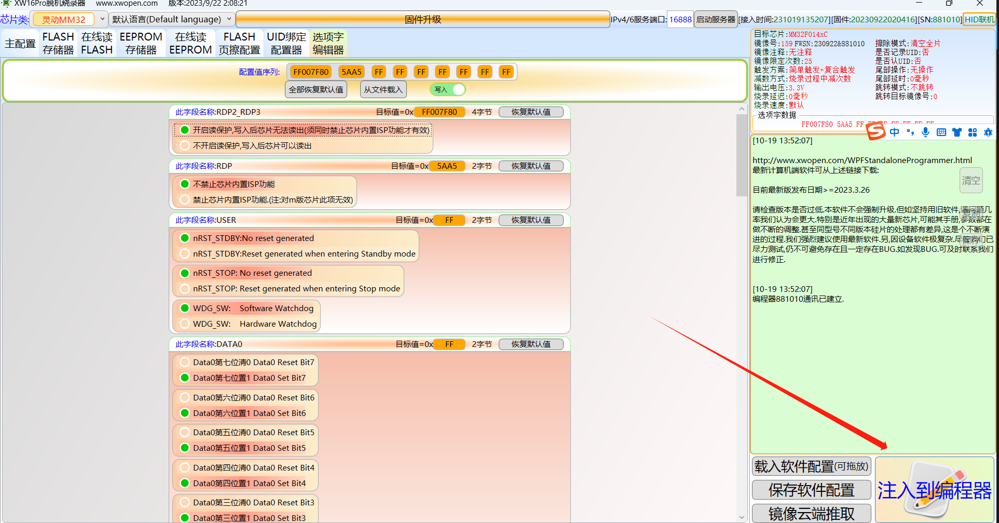
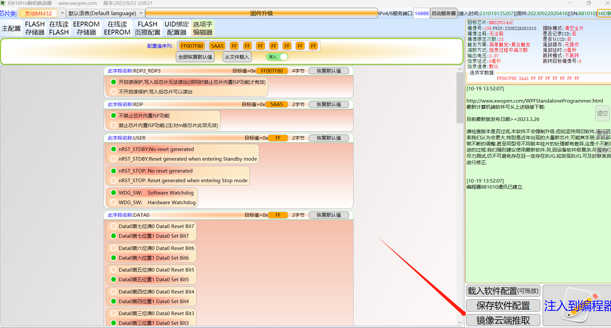
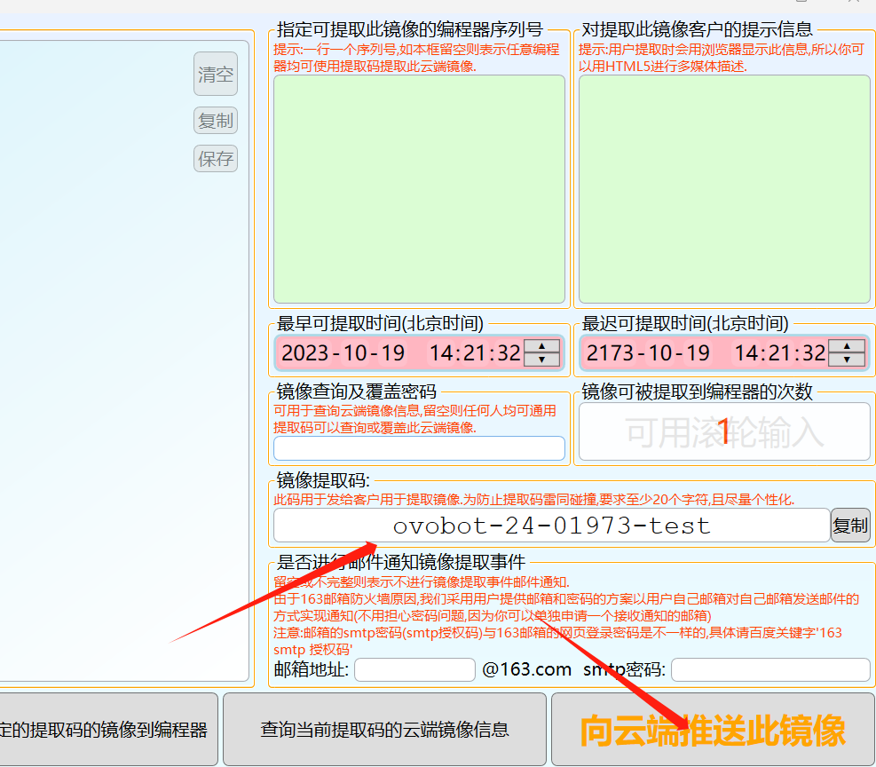

# XW16Pro烧录器生成烧录文件(客户或生产用)

## 一、解压软件

解压 新版本烧录器.zip 到自己的电脑中，然后打开下面目录中的软件。

## 二、设置参数

1、选择芯片系列

2、选择芯片型号

3、填写镜像号

4、填写中文注释

5、填写镜像次数限定，不能留空，留空代表不限次数！！！

6、设置配置字，禁止读出

7、导入程序数据

## 三、导入程序数据（将程序下载进烧录器）

## 四、生产烧录文件（镜像云端推取）

进入镜像云端推取界面，填写镜像提取码，毕竟镜像提取码发送给客户，客户可以自行使用镜像提取码，提取程序文件进行生产测试。

1、点击镜像云端推取按钮

2、按照公司要求填写镜像提取码，并推向云端

