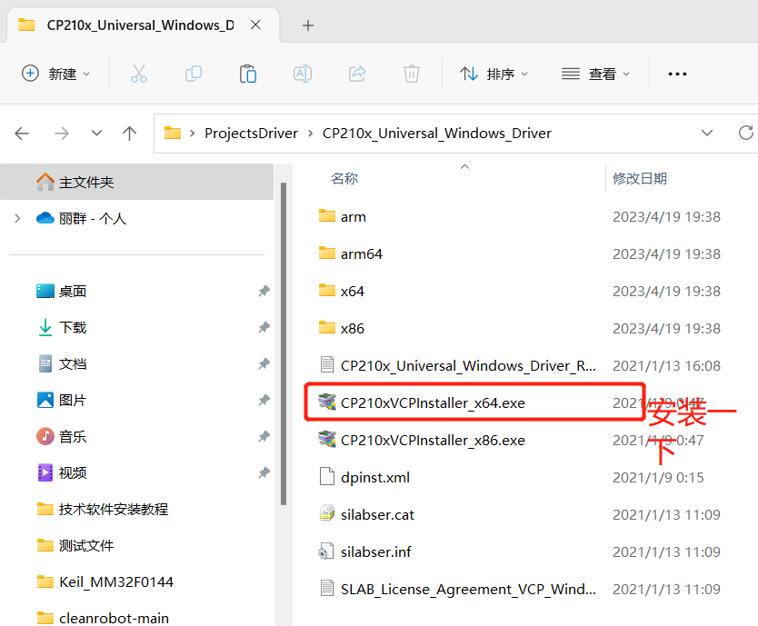
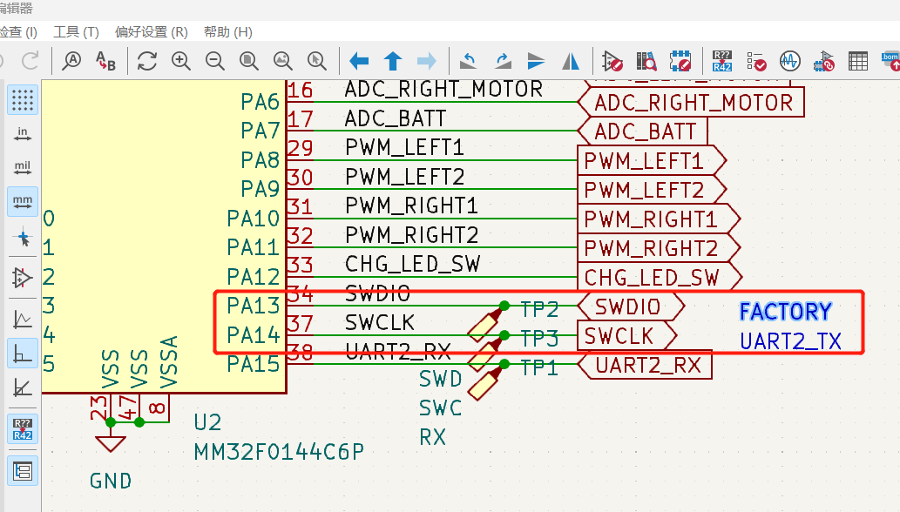
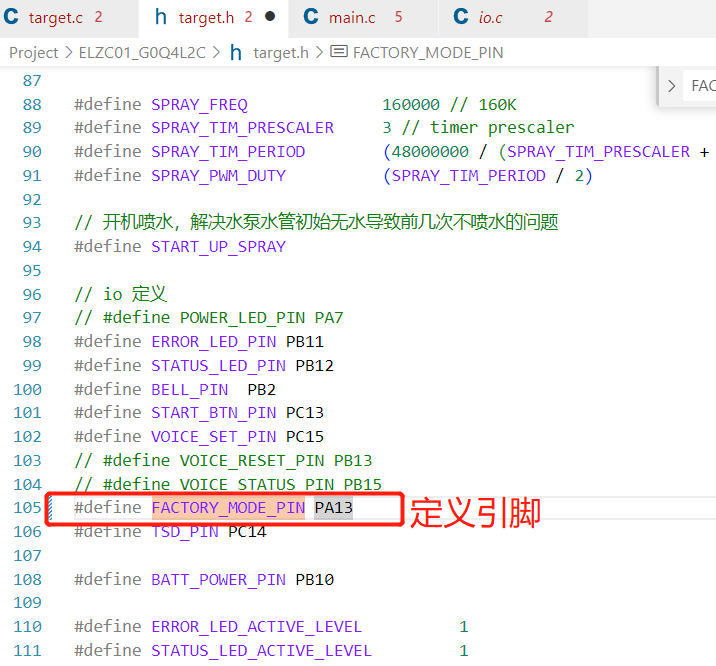
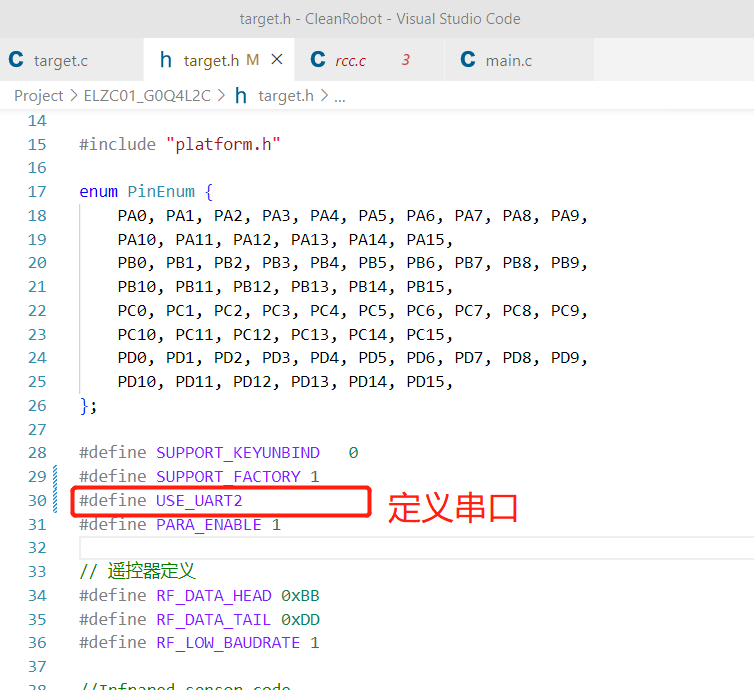
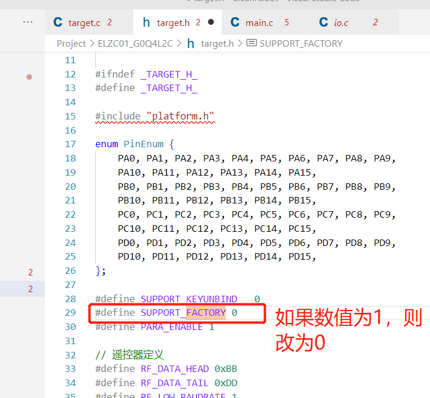
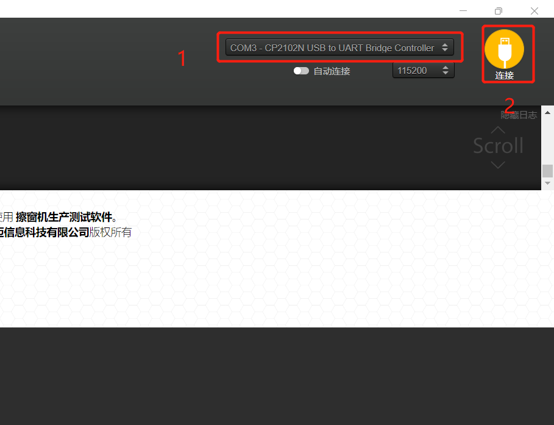
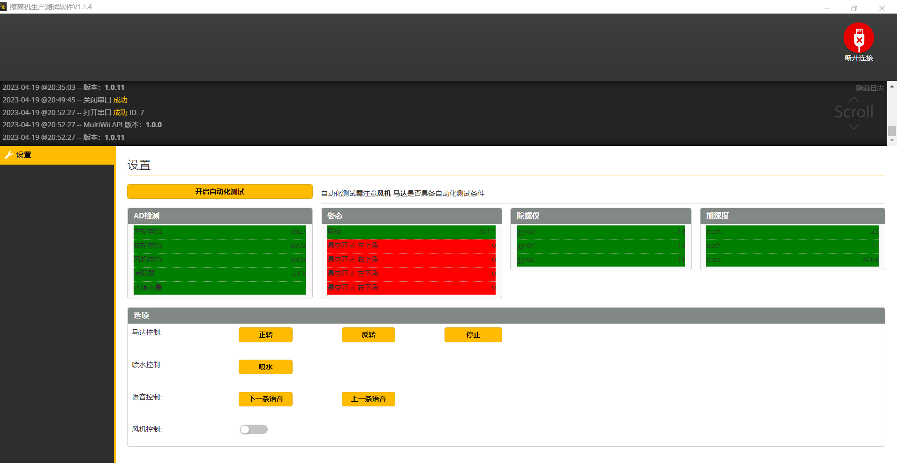

# 上位机测试

1、上位机测试软件下载
网址:https://github.com/Timyerc/betaflight-configurator/releases

**注意：一般用最新的版本。**

2、安装驱动

3、项目下target.h文件修改参数，修改完后编译项目，并下载到主板中。

修改参数步骤如下：

（1）根据对应项目中主板PCB的原理图找到FACTORY、UART2_TX以及其对应的引脚，如下图所示：

（2）在target.h中定义引脚、定义串口并且修改SUPPORT_FACTORY值为1 ，如下图所示：

4、然后USB连接主板后（机器要供电），打开上位机软件，可以看到下图1下拉框有值，图中2处单击连接。

5、连接成功出现如下界面，点击页面上的按钮开始测试

