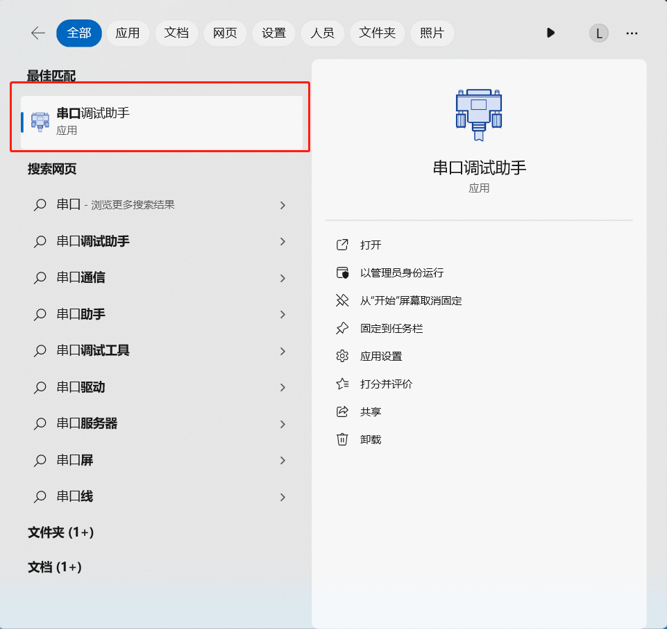
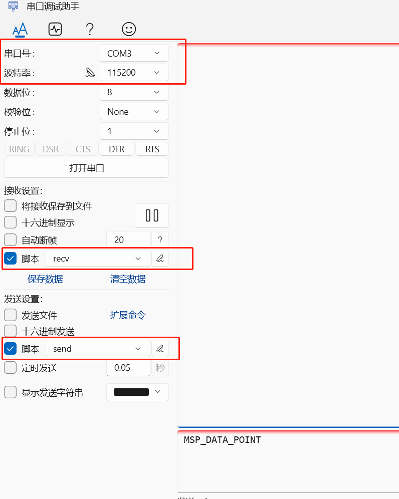
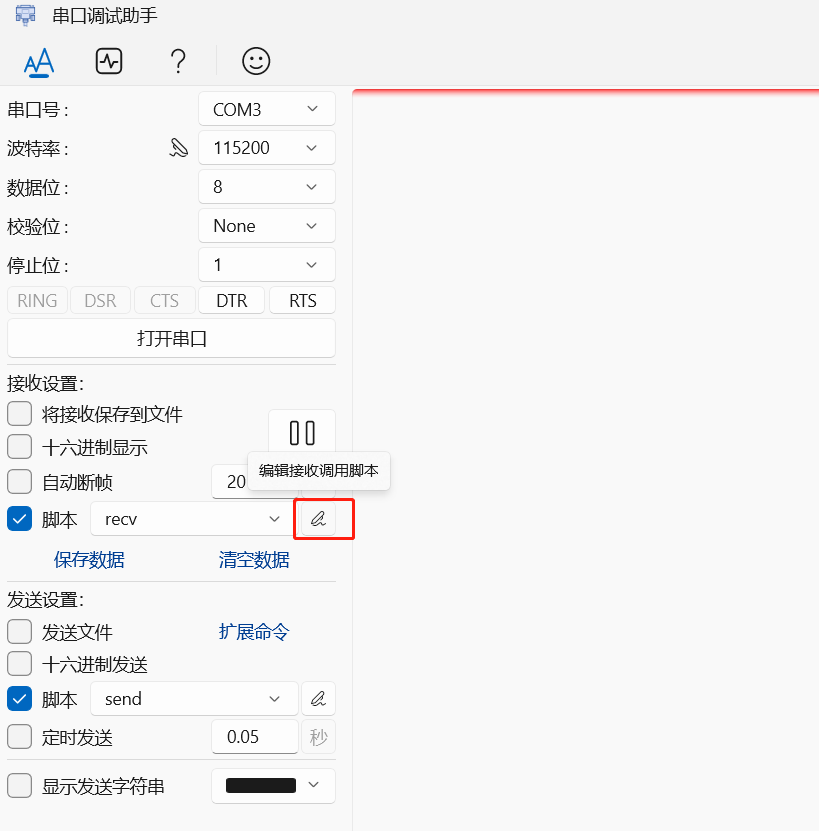
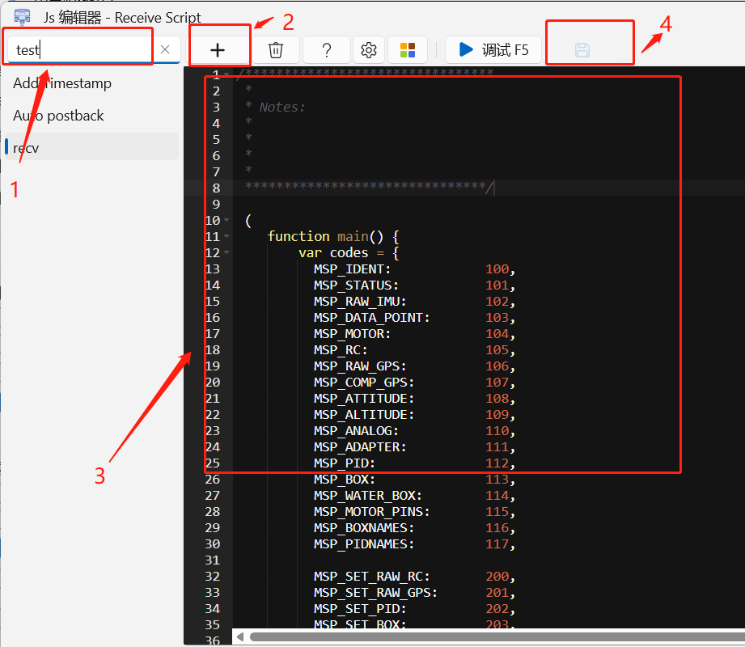
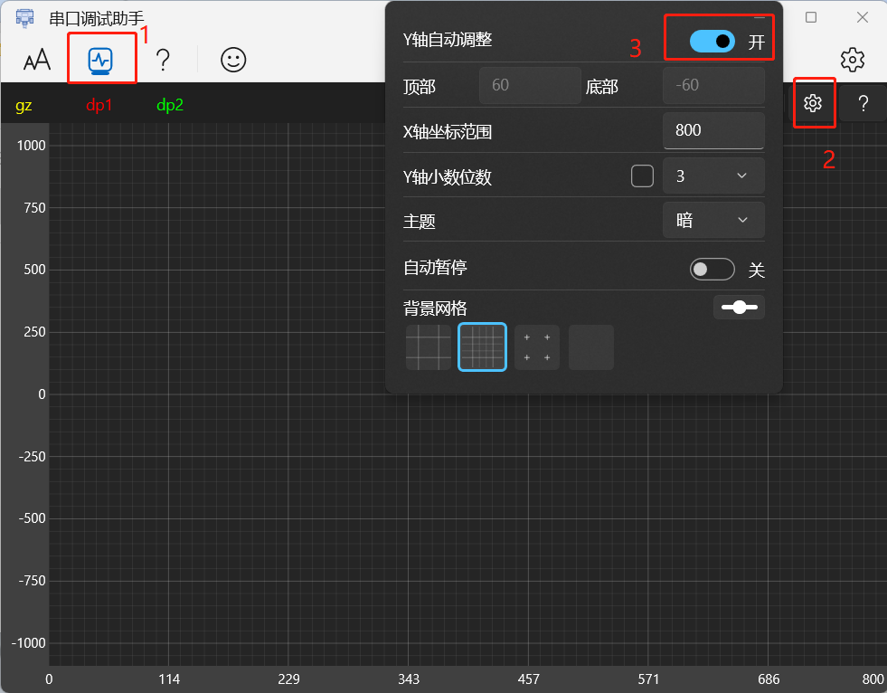
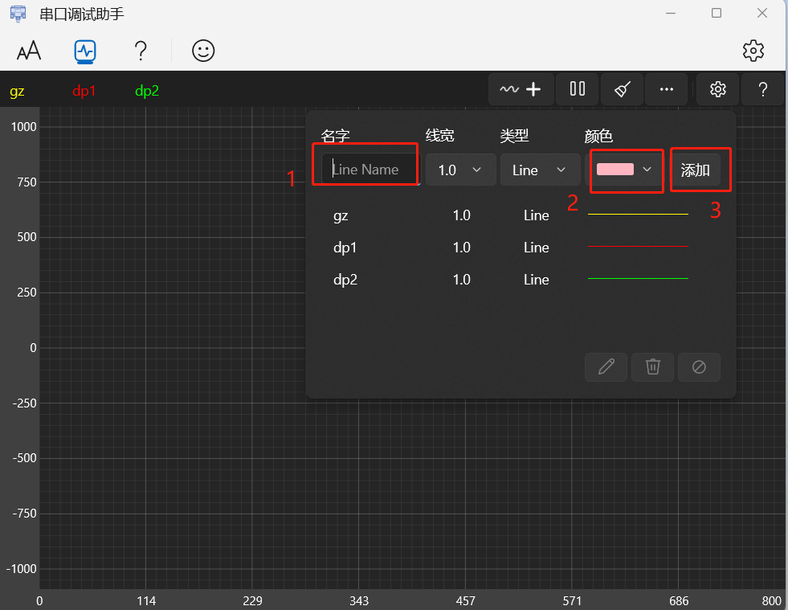
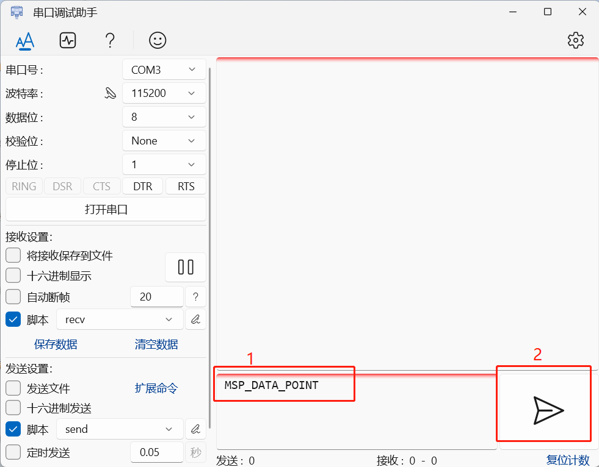

# 串口调试工具的使用

## 一、电脑插上设备，打开串口调试助手

## 二、配置好首页的串口参数和脚本

### 1、配置参数

选择下拉框中的**串口号**，波特率选择**115200**

 

### 2、配置脚本

**注意**：脚本所在地址：https://github.com/Timyerc/msp-protocol

（1）先勾选脚本，然后点击**接收设置**和**发送设置**中的**编辑**按钮，进入编辑页面。

 

（2）根据下图中的步骤：先填入脚本名称，再点击添加按钮，然后将拿到的对应脚本复制过来，最后点击保存即可。

 

## 三、配置好波形绘制的参数

### 1、配置X轴和Y轴

按下图步骤操作：先切换到波形界面，然后点击步骤2的设置，将Y抽设置为自动调整，X轴到时可根据波形需要设置。

 

### 2、配置波形线

按下图步骤设置需要显示的波形线的名称和颜色，设置好后可随意切换显示。

 

## 四、发送数据并接收数据

按下图中的步骤：

步骤1，确定需要的参数然后复制过来；

步骤2，点击发送按钮，此时机器在运行的话，可以接收到相关的数据，可切换到波形界面看波形状况。

 

