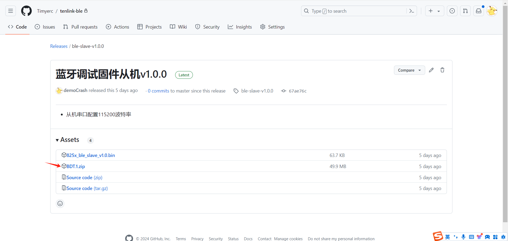
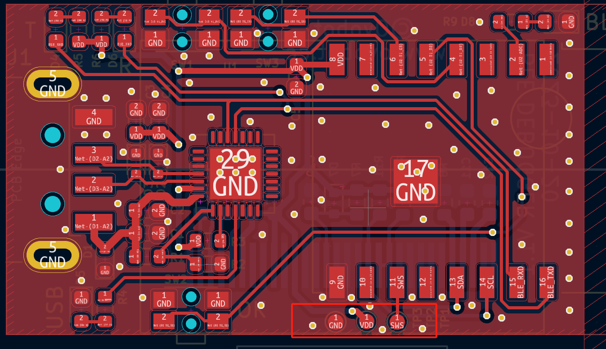
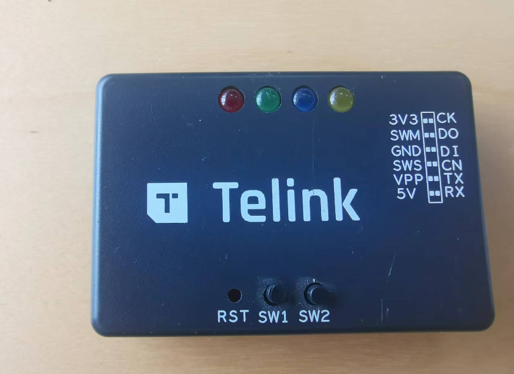
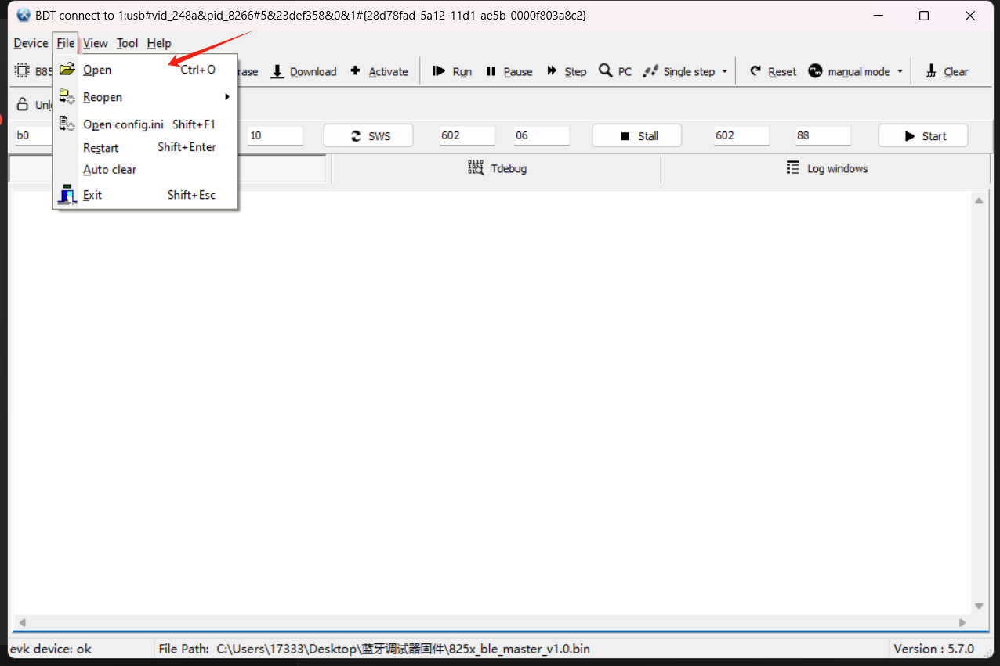
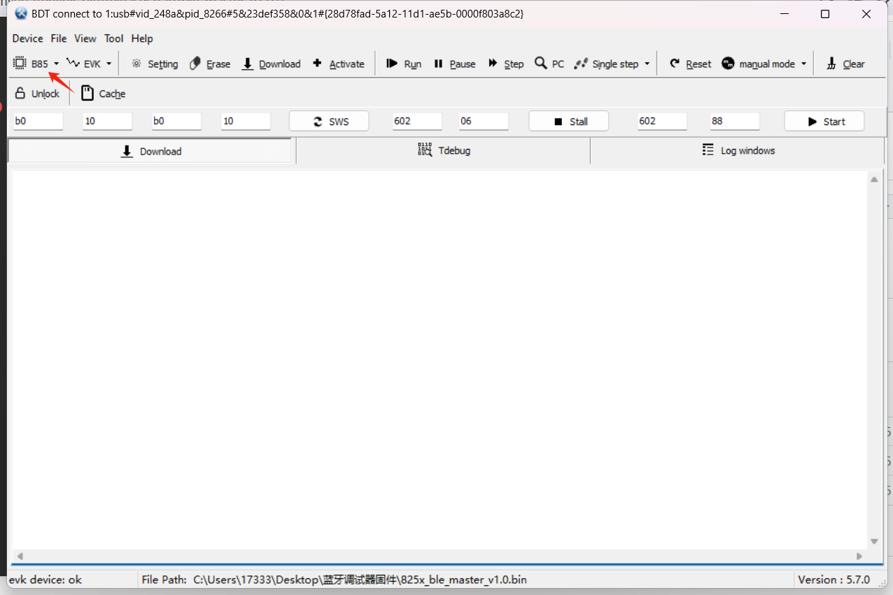
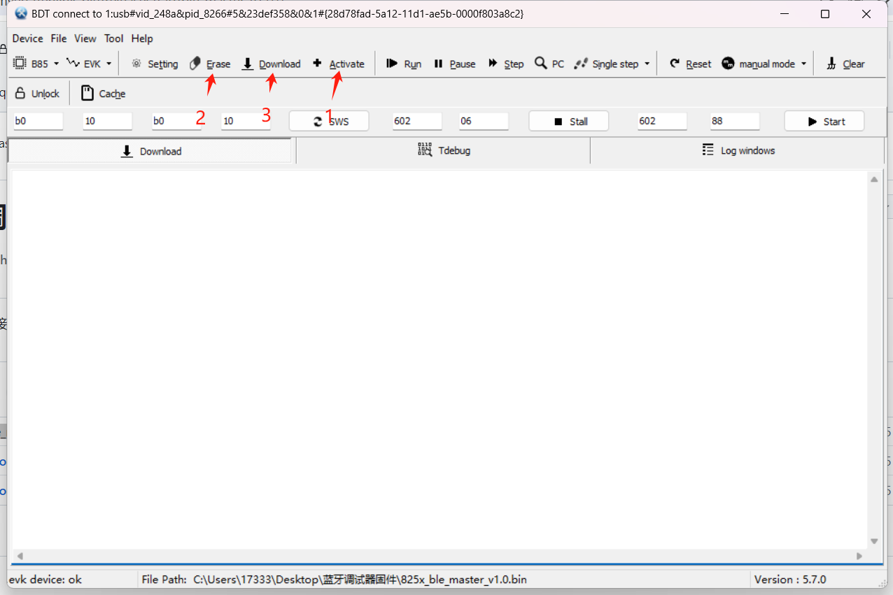
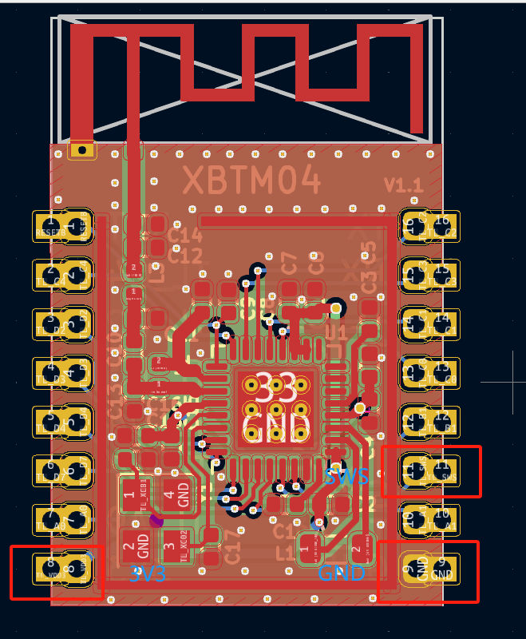

# 蓝牙调试工具固件下载

## 固件烧录软件下载地址：https://github.com/Timyerc/tenlink-ble/releases/tag/ble-slave-v1.0.0  选择BDT.1.1zip下载，如下图所示：

 
## 一、带USB和屏幕的蓝牙主设备固件下载
1. 固件下载地址链接：https://github.com/Timyerc/tenlink-ble/releases/tag/ble-master-v1.0.0

2. 焊接如下三个焊点，使用Telink烧录工具，连接对应下载口，3V3->3V3,GND->GND,SWS->SWM.主设备焊点图如下所示：
 

3. Telink烧录器工具如下图所示：
 

4. Telink 连接电脑，打开BDT烧录软件，选择烧录文件825x_ble_master_v1.0.bin，如下图所示：
 

5. 然后选择芯片，如下图所示：
 

6. 按照图中步骤，依次点击。
 

## 二、蓝牙从设备固件下载
1. 固件下载地址链接：https://github.com/Timyerc/tenlink-ble/releases/tag/ble-slave-v1.0.0

2. 焊出设备的三条线。分别是3V3,GND,SWS,如下图所示：
 

3. 连接对应下载口到Telink，3V3->3V3,GND->GND,SWS->SWM。

4. Telink 连接电脑，打开BDT烧录软件，选择烧录文件825x_ble_slave_v1.0.bin。

5. 然后选择芯片，如下图所示：
 

6. 按照图中步骤，依次点击。
 
