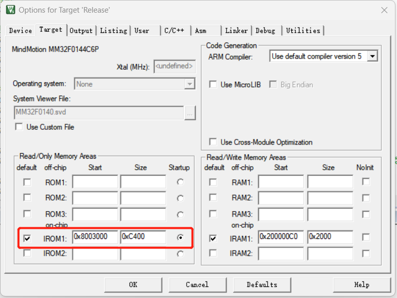
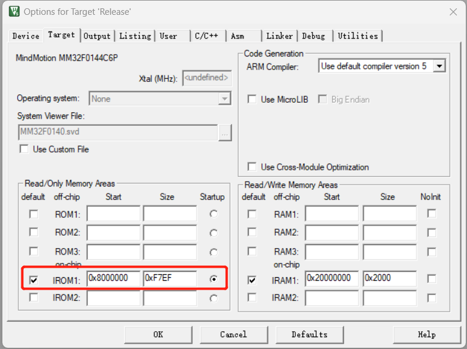
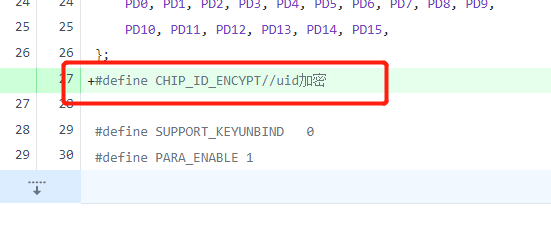
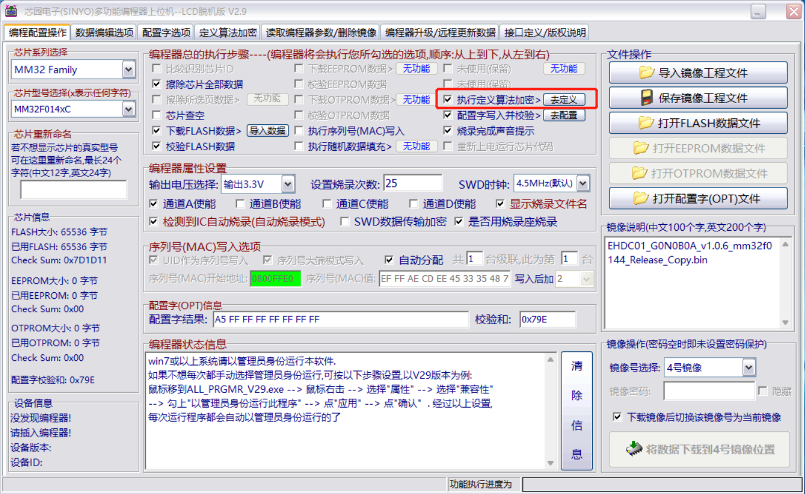
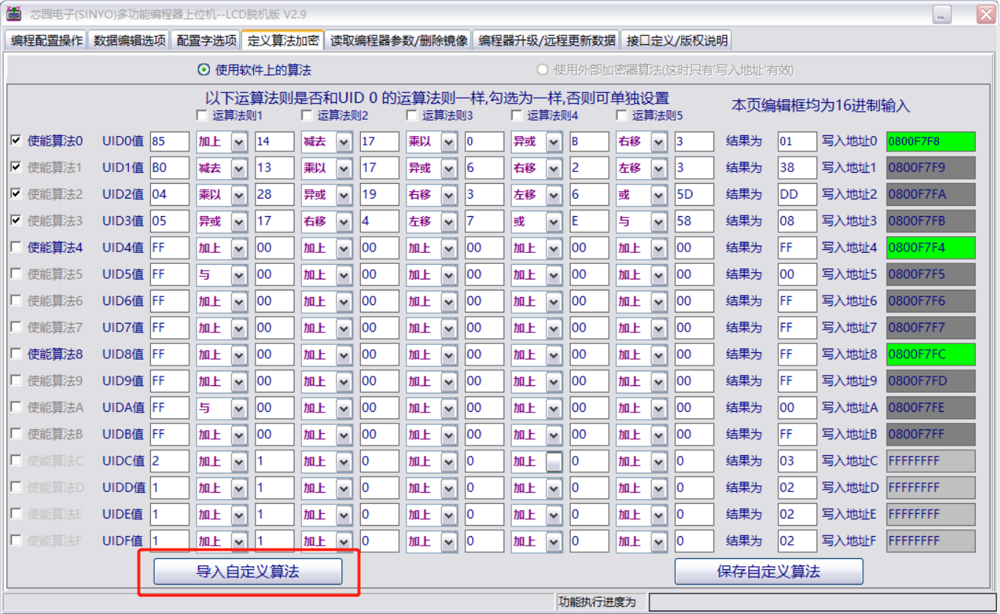
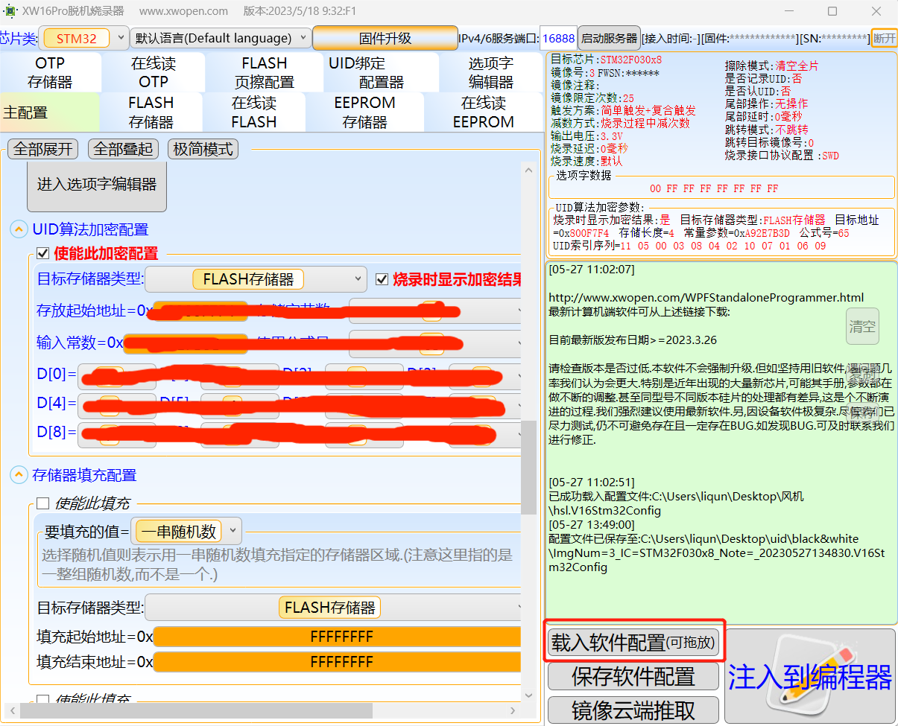

# UID加密-功能配置

编译项目前，打开Options for Target。

## 一、工程配置方法-设置IROM1

切换到Target页面，

项目**有bootloader**设置如下：

项目**无bootloader**则需要做如下图设置：

## 二、定义使用uid加密功能的宏

打开项目对应的target.h文件，定义宏 CHIP_ID_ENCYPT

## 三、烧录器配置方法 

### 黑色烧录器

1、如下如所示，勾选**执行定义算法加密**，然后点击**去定义**按钮进入定义算法加密页；

2、在定义算法加密页的下方点击导入自定义算法按钮，将算法文件导入即可。

**算法文件地址：公司内部微盘**

### 白色烧录器

打开烧录器，点击载入软件配置按钮，将配置文件导入

**算法文件地址：公司内部微盘，另外此配置文件只有uid加密的配置，烧录器的其他配置需要自己配**

