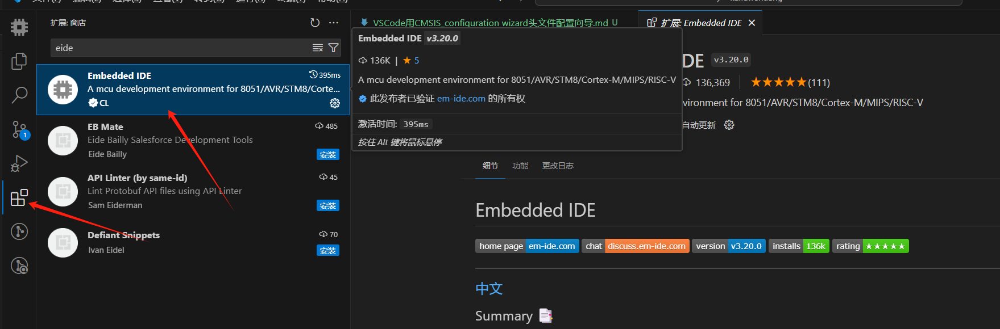
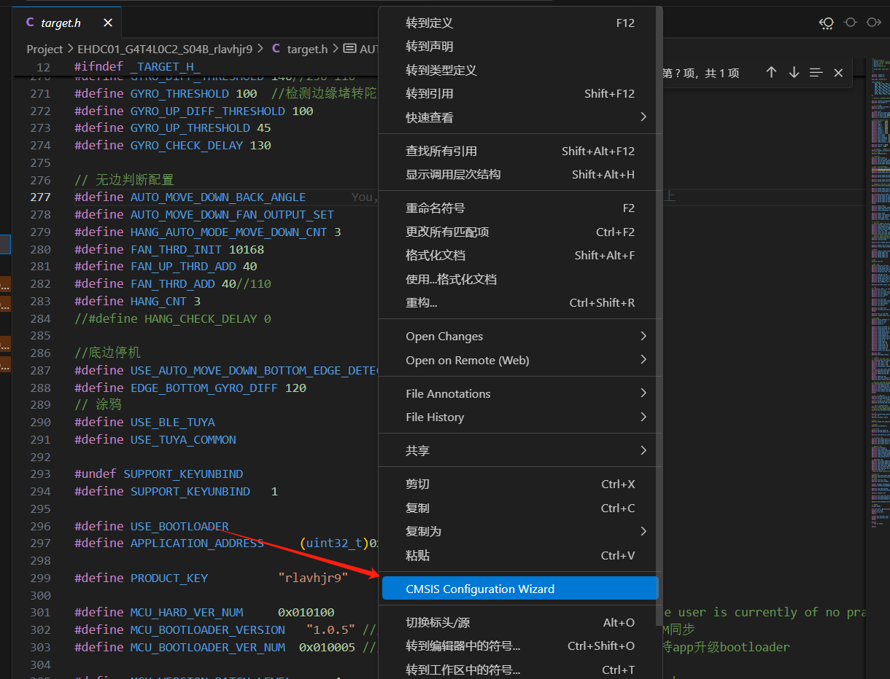
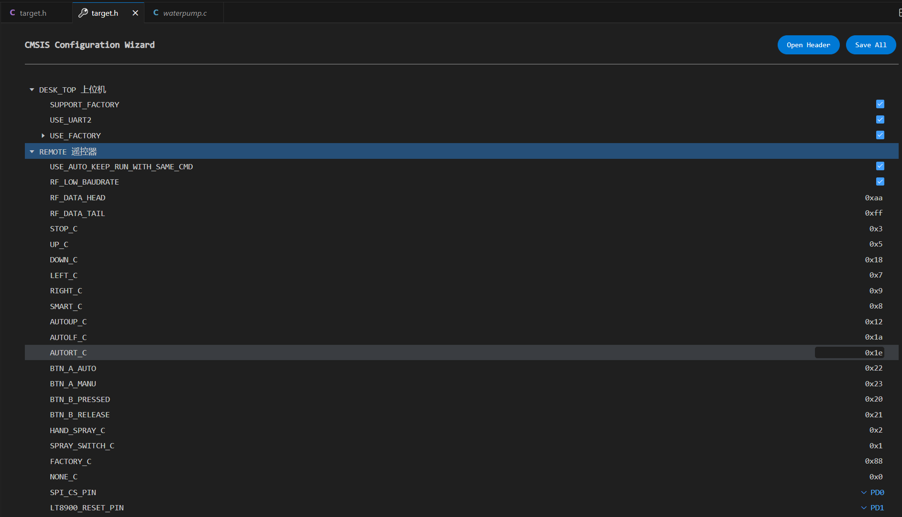

# VSCode用CMSIS_Configuration_Wizard头文件向导

### Configuration_Wizard使用规则
* 配置向导注释由注释项和注释修饰符组成。它们为配置文件在IDE中创建类似GUI的元素（参见工具特定的显示）。使用类似GUI的方式可以使用户更容易检查和调整配置文件以满足应用需求。以下规则适用：配置向导部分必须在代码的前100行内开始，并且必须以以下注释行开始和结束
~~~
    // <<< Use Configuration Wizard in Context Menu >>>
    // <<< end of configuration section >>>
~~~

* 注释以代码中的注释形式编写。每一行注释必须以双斜杠（//）开头
* 默认情况下，紧随注释之后的下一个代码符号将被修改
* 表中标有 * 的项目可以跟随一个跳过值。跳过值会忽略一定数量的代码符号（参见表中的跳过示例）。此规则覆盖前一条规则。
* 表中标有 + 的项目可以跟随一个标识符。当存在标识符时，紧随与标识符匹配的符号之后的下一个代码符号将被修改。参见表中的标识符示例。标识符不能与跳过值一起使用
* 可以为项目添加描述性文本。该文本将显示在屏幕上（参见表）
* 注释项或注释修饰符中的空白字符将被忽略（文本除外）
* 在配置向导行中，除非用于包含注释项，否则不能使用 < 或 > 符号
* 下表列出了配置向导的注释项目、修饰符及其对应的功能：

|    项目	|文本	|描述 |
| ---------|-------| ----- |
|  \<h> |	是	|标题。创建一个标题部分。所有被 \<h> 和 \</h> 包含的项目和选项属于一个组，可以展开。此条目不修改代码符号，只用于分组其他项目和修饰符。|
| \<e>*+ |	是|	启用的标题。创建一个带复选框的标题部分，复选框用于启用或禁用被 \<e> 和 \</e> 包含的所有项目和选项。|
| \<e.i>*+ |	是 |	启用特定位(i)的标题（例如：<e.4> - 更改值的第4位）。|
| \</h> , \</e>, 或 \</c> |	是	| 标题、启用或注释的结束标记。|
| \<n> |	是 |	显示的通知文本。|
| \<i> |	是 |	提示帮助信息，显示在悬停时。|
| \<d> |	是	| 为前一个项目设置默认值。|
| \<c>* | 是	| 启用代码：创建复选框，用于取消或注释代码。当复选框被禁用时，所有行都将用双斜杠（//）注释。|
| \<!c>*	| 是 |	禁用代码：创建复选框，用于注释或取消注释代码。|
| \<q>*+	| 是 |	位值选项，可通过复选框设置。|
| \<o>*+ |	是 |	带有选择或数字输入的选项。|
| \<o.i>*+ |	是 |	修改单个位（例如：\<e.4> - 修改第4位）。|
| \<o.x..y>*+ |	是 |	修改位范围（例如：\<o.4..5> - 修改第4到5位）。|
| \<y>+ |	是 |	输入符号或数字。|
| \<s>*+ |	是 |	带有ASCII字符串输入的选项。|
| \<s.i>*+ |	是 |	带有字符限制的ASCII字符串输入选项。|
| \<a.i>*+ |	是 |	数组输入选项，带有i个元素的大小。|
| \<0-31> |	否 |	（已弃用，见下方新的范围修饰符）为选项字段提供值范围。|
| \<value=> | 是 |	创建下拉列表并显示文本，值写入下一个项目。|
| \<#+1> <#-1> |	否 |	根据运算符（加、减、乘、除）修改输入或显示的值。|
| \<f.format-specifier>	| 否 |	整数值的图形显示格式说明符。

### 示例代码

~~~
enum PinEnum {
    PA0, PA1, PA2, PA3, PA4, PA5, PA6, PA7, PA8, PA9,
    PA10, PA11, PA12, PA13, PA14, PA15,
    PB0, PB1, PB2, PB3, PB4, PB5, PB6, PB7, PB8, PB9,
    PB10, PB11, PB12, PB13, PB14, PB15,
    PC0, PC1, PC2, PC3, PC4, PC5, PC6, PC7, PC8, PC9,
    PC10, PC11, PC12, PC13, PC14, PC15,
    PD0, PD1, PD2, PD3, PD4, PD5, PD6, PD7, PD8, PD9,
    PD10, PD11, PD12, PD13, PD14, PD15,
};

// <<< Use Configuration Wizard in Context Menu >>>

// <h>DESK_TOP 上位机
// <c> SUPPORT_FACTORY
#define SUPPORT_FACTORY 1
// </c>

// <c> USE_UART2
#define USE_UART2
// </c>

//<e> USE_FACTORY
#define USE_FACTORY 1
#if USE_FACTORY
// <o> FACTORY_MODE_PIN
// <0=> PA0 <1=> PA1 <2=> PA2 <3=> PA3 <4=> PA4 <5=> PA5 <6=> PA6 <7=> PA7 <8=> PA8 <9=> PA9 <10=> PA10 <11=> PA11 <12=> PA12 <13=> PA13 <14=> PA14 <15=> PA15
// <16=> PB0 <17=> PB1 <18=> PB2 <19=> PB3 <20=> PB4 <21=> PB5 <22=> PB6 <23=> PB7 <24=> PB8 <25=> PB9 <26=> PB10 <27=> PB11 <28=> PB12 <29=> PB13 <30=> PB14 <31=> PB15
// <32=> PC0 <33=> PC1 <34=> PC2 <35=> PC3 <36=> PC4 <37=> PC5 <38=> PC6 <39=> PC7 <40=> PC8 <41=> PC9 <42=> PC10 <43=> PC11 <44=> PC12 <45=> PC13 <46=> PC14 <47=> PC15
// <48=> PD0 <49=> PD1 <50=> PD2 <51=> PD3 <52=> PD4 <53=> PD5 <54=> PD6 <55=> PD7 <56=> PD8 <57=> PD9 <58=> PD10 <59=> PD11 <60=> PD12 <61=> PD13 <62=> PD14 <63=> PD15
#define FACTORY_MODE_PIN 13
#endif
//</e>
// </h>

// <h>REMOTE 遥控器
// <c> USE_AUTO_KEEP_RUN_WITH_SAME_CMD
#define USE_AUTO_KEEP_RUN_WITH_SAME_CMD
// </c>

// <c> RF_LOW_BAUDRATE
#define RF_LOW_BAUDRATE 1
// </c>

//<o> RF_DATA_HEAD <0x00-0xFF>
#define RF_DATA_HEAD 0xAA

//<o> RF_DATA_TAIL <0x00-0xFF>
#define RF_DATA_TAIL 0xFF

//<o> STOP_C <0x00-0xFF>
#define STOP_C    0x03

//<o> UP_C <0x00-0xFF>
#define UP_C      0x05

//<o> DOWN_C <0x00-0xFF>
#define DOWN_C    0x18

//<o> LEFT_C <0x00-0xFF>
#define LEFT_C    0x07

//<o> RIGHT_C <0x00-0xFF>
#define RIGHT_C   0x09

//<o> SMART_C <0x00-0xFF>
#define SMART_C   0x08

//<o> AUTOUP_C <0x00-0xFF>
#define AUTOUP_C  0x12

//<o> AUTOLF_C <0x00-0xFF>
#define AUTOLF_C  0x1A

//<o> AUTORT_C <0x00-0xFF>
#define AUTORT_C  0x1E

//<o> BTN_A_AUTO <0x00-0xFF>
#define BTN_A_AUTO     0x22

//<o> BTN_A_MANU <0x00-0xFF>
#define BTN_A_MANU     0x23

//<o> BTN_B_PRESSED <0x00-0xFF>
#define BTN_B_PRESSED  0x20

//<o> BTN_B_RELEASE <0x00-0xFF>
#define BTN_B_RELEASE  0x21

//<o> HAND_SPRAY_C <0x00-0xFF>
#define HAND_SPRAY_C   0x02

//<o> SPRAY_SWITCH_C <0x00-0xFF>
#define SPRAY_SWITCH_C 0x01

//<o> FACTORY_C <0x00-0xFF>
#define FACTORY_C 0x88

//<o> NONE_C <0x00-0xFF>
#define NONE_C  0x00

// <o> SPI_CS_PIN
// <0=> PA0 <1=> PA1 <2=> PA2 <3=> PA3 <4=> PA4 <5=> PA5 <6=> PA6 <7=> PA7 <8=> PA8 <9=> PA9 <10=> PA10 <11=> PA11 <12=> PA12 <13=> PA13 <14=> PA14 <15=> PA15
// <16=> PB0 <17=> PB1 <18=> PB2 <19=> PB3 <20=> PB4 <21=> PB5 <22=> PB6 <23=> PB7 <24=> PB8 <25=> PB9 <26=> PB10 <27=> PB11 <28=> PB12 <29=> PB13 <30=> PB14 <31=> PB15
// <32=> PC0 <33=> PC1 <34=> PC2 <35=> PC3 <36=> PC4 <37=> PC5 <38=> PC6 <39=> PC7 <40=> PC8 <41=> PC9 <42=> PC10 <43=> PC11 <44=> PC12 <45=> PC13 <46=> PC14 <47=> PC15
// <48=> PD0 <49=> PD1 <50=> PD2 <51=> PD3 <52=> PD4 <53=> PD5 <54=> PD6 <55=> PD7 <56=> PD8 <57=> PD9 <58=> PD10 <59=> PD11 <60=> PD12 <61=> PD13 <62=> PD14 <63=> PD15
#define SPI_CS_PIN 48

// <o> LT8900_RESET_PIN
// <0=> PA0 <1=> PA1 <2=> PA2 <3=> PA3 <4=> PA4 <5=> PA5 <6=> PA6 <7=> PA7 <8=> PA8 <9=> PA9 <10=> PA10 <11=> PA11 <12=> PA12 <13=> PA13 <14=> PA14 <15=> PA15
// <16=> PB0 <17=> PB1 <18=> PB2 <19=> PB3 <20=> PB4 <21=> PB5 <22=> PB6 <23=> PB7 <24=> PB8 <25=> PB9 <26=> PB10 <27=> PB11 <28=> PB12 <29=> PB13 <30=> PB14 <31=> PB15
// <32=> PC0 <33=> PC1 <34=> PC2 <35=> PC3 <36=> PC4 <37=> PC5 <38=> PC6 <39=> PC7 <40=> PC8 <41=> PC9 <42=> PC10 <43=> PC11 <44=> PC12 <45=> PC13 <46=> PC14 <47=> PC15
// <48=> PD0 <49=> PD1 <50=> PD2 <51=> PD3 <52=> PD4 <53=> PD5 <54=> PD6 <55=> PD7 <56=> PD8 <57=> PD9 <58=> PD10 <59=> PD11 <60=> PD12 <61=> PD13 <62=> PD14 <63=> PD15
#define LT8900_RESET_PIN 49
// </h>

//<e>WATER_PUMP 雾化片
#define WATER_PUMP 1

// <o> SPRAY_PWM_LEFT_PIN
// <0=> PA0 <1=> PA1 <2=> PA2 <3=> PA3 <4=> PA4 <5=> PA5 <6=> PA6 <7=> PA7 <8=> PA8 <9=> PA9 <10=> PA10 <11=> PA11 <12=> PA12 <13=> PA13 <14=> PA14 <15=> PA15
// <16=> PB0 <17=> PB1 <18=> PB2 <19=> PB3 <20=> PB4 <21=> PB5 <22=> PB6 <23=> PB7 <24=> PB8 <25=> PB9 <26=> PB10 <27=> PB11 <28=> PB12 <29=> PB13 <30=> PB14 <31=> PB15
// <32=> PC0 <33=> PC1 <34=> PC2 <35=> PC3 <36=> PC4 <37=> PC5 <38=> PC6 <39=> PC7 <40=> PC8 <41=> PC9 <42=> PC10 <43=> PC11 <44=> PC12 <45=> PC13 <46=> PC14 <47=> PC15
// <48=> PD0 <49=> PD1 <50=> PD2 <51=> PD3 <52=> PD4 <53=> PD5 <54=> PD6 <55=> PD7 <56=> PD8 <57=> PD9 <58=> PD10 <59=> PD11 <60=> PD12 <61=> PD13 <62=> PD14 <63=> PD15
#define SPRAY_PWM_LEFT_PIN 3

// <o> SPRAY_PWM_RIGHT_PIN
// <0=> PA0 <1=> PA1 <2=> PA2 <3=> PA3 <4=> PA4 <5=> PA5 <6=> PA6 <7=> PA7 <8=> PA8 <9=> PA9 <10=> PA10 <11=> PA11 <12=> PA12 <13=> PA13 <14=> PA14 <15=> PA15
// <16=> PB0 <17=> PB1 <18=> PB2 <19=> PB3 <20=> PB4 <21=> PB5 <22=> PB6 <23=> PB7 <24=> PB8 <25=> PB9 <26=> PB10 <27=> PB11 <28=> PB12 <29=> PB13 <30=> PB14 <31=> PB15
// <32=> PC0 <33=> PC1 <34=> PC2 <35=> PC3 <36=> PC4 <37=> PC5 <38=> PC6 <39=> PC7 <40=> PC8 <41=> PC9 <42=> PC10 <43=> PC11 <44=> PC12 <45=> PC13 <46=> PC14 <47=> PC15
// <48=> PD0 <49=> PD1 <50=> PD2 <51=> PD3 <52=> PD4 <53=> PD5 <54=> PD6 <55=> PD7 <56=> PD8 <57=> PD9 <58=> PD10 <59=> PD11 <60=> PD12 <61=> PD13 <62=> PD14 <63=> PD15
#define SPRAY_PWM_RIGHT_PIN 2

// <c>USE_LEFT_PUMP
//<i> 支持左雾化片喷水
#define USE_LEFT_PUMP
// </c>

// <e> USE_UP_PUMP_INDEPENDENT
#define USE_UP_PUMP_INDEPENDENT 0

//<o> WATER_PUMP_UP_START_ANGLE <0-30>
#define WATER_PUMP_UP_START_ANGLE 5

//<o> WATER_PUMP_UP_END_ANGLE <0-30>
#define WATER_PUMP_UP_END_ANGLE 20

//<o> WATER_PUMP_UP_MOVE_CNT <0-3>
#define WATER_PUMP_UP_MOVE_CNT 2

//<o> WATER_PUMP_UP_FIRST_DURATION <0-65535>
#define WATER_PUMP_UP_FIRST_DURATION 450

//<o> WATER_PUMP_UP_DURATION <0-65535>
#define WATER_PUMP_UP_DURATION 150

// </e>

//<o> WATER_PUMP_DURATION <0-65535>
#define WATER_PUMP_DURATION 150

//<o> WATER_PUMP_INTERVAL_GRADE <0-255>
#define WATER_PUMP_INTERVAL_GRADE 1

// <c> USE_AUTO_SPRAY_DEFAULT
// <i>默认开机自动喷水
#define USE_AUTO_SPRAY_DEFAULT     1
// </c>

// <o> WATER_PUMP_BUTTON_TYPE
//<i>A键切换喷水模式，自动和手动切换，B键按下手动喷水，松开停止喷水
//<1=> WATER_PUMP_BUTTON_TYPE_A
//<2=> WATER_PUMP_BUTTON_TYPE_B
#define WATER_PUMP_BUTTON_TYPE 1

//<c> WATER_PUMP_AUTO_MODE_COUNT
//<i>间隔一定时间喷水
#define WATER_PUMP_AUTO_MODE_COUNT 1
//</c>

//<c> WATER_PUMP_AUTO_MODE_2MOVE
//<i>向右移动两次喷一次
#define WATER_PUMP_AUTO_MODE_2MOVE 2
//</c>

//<c>WATER_PUMP_AUTO_MODE_2SPRAY
//<i>顺时针和逆时针都喷水
#define WATER_PUMP_AUTO_MODE_2SPRAY 3
//</c>

//<o> WATER_PUMP_AUTO_MODE
//<i> 喷水模式选择
//<1=> WATER_PUMP_AUTO_MODE_COUNT
//<2=> WATER_PUMP_AUTO_MODE_2MOVE
//<3=> WATER_PUMP_AUTO_MODE_2SPRAY
#define WATER_PUMP_AUTO_MODE 3

// <c> AUTO_SPRAY_BUZZER_SHORT_2
// <i>切换到自动喷水模式是蜂鸣器短响两声
#define AUTO_SPRAY_BUZZER_SHORT_2
// </c>
//<o> WATER_PUMP_START_ANGLE <0-30>
#define WATER_PUMP_START_ANGLE 5

//<o> WATER_PUMP_END_ANGLE <0-30>
#define WATER_PUMP_END_ANGLE 20

//<o> WATER_PUMP_MOVE_CNT <1-3>
#define WATER_PUMP_MOVE_CNT 2

//<o> SPRAY_PWM <0-1>
#define SPRAY_PWM 1

//<o> USABLE_SPRAY_CHANNEL_COUNT <0-4>
#define USABLE_SPRAY_CHANNEL_COUNT 2

// <c> USE_MANUAL_SPRAY_ALWAYS
#define USE_MANUAL_SPRAY_ALWAYS
// </c>

//<e> SPRAY_FREQ

//<o> SPRAY_FREQ <2-300000>
#define SPRAY_FREQ              160000 // 160K

//<o> SPRAY_TIM_PRESCALER <0-100>
#define SPRAY_TIM_PRESCALER     3 // timer prescaler

// <e> SPRAY_TIM_PERIOD
#define SPRAY_TIM_PERIOD        (48000000 / (SPRAY_TIM_PRESCALER + 1) / SPRAY_FREQ - 1) // timer period

// <c> SPRAY_PWM_DUTY
#define SPRAY_PWM_DUTY          (SPRAY_TIM_PERIOD / 2)
// </c>

// </e>

//</e>

//</e>

//<e>VOICE_SUPPORT 语音
#define VOICE_SUPPORT 0 // 

#if VOICE_SUPPORT
// <o> VOICE_SET_PIN
// <0=> PA0 <1=> PA1 <2=> PA2 <3=> PA3 <4=> PA4 <5=> PA5 <6=> PA6 <7=> PA7 <8=> PA8 <9=> PA9 <10=> PA10 <11=> PA11 <12=> PA12 <13=> PA13 <14=> PA14 <15=> PA15
// <16=> PB0 <17=> PB1 <18=> PB2 <19=> PB3 <20=> PB4 <21=> PB5 <22=> PB6 <23=> PB7 <24=> PB8 <25=> PB9 <26=> PB10 <27=> PB11 <28=> PB12 <29=> PB13 <30=> PB14 <31=> PB15
// <32=> PC0 <33=> PC1 <34=> PC2 <35=> PC3 <36=> PC4 <37=> PC5 <38=> PC6 <39=> PC7 <40=> PC8 <41=> PC9 <42=> PC10 <43=> PC11 <44=> PC12 <45=> PC13 <46=> PC14 <47=> PC15
// <48=> PD0 <49=> PD1 <50=> PD2 <51=> PD3 <52=> PD4 <53=> PD5 <54=> PD6 <55=> PD7 <56=> PD8 <57=> PD9 <58=> PD10 <59=> PD11 <60=> PD12 <61=> PD13 <62=> PD14 <63=> PD15
#define VOICE_SET_PIN 47
#endif

//<o> VOICE_SILENCE <0-100>
#define VOICE_SILENCE 0

//<o> VOICE_WELCOME <0-100>
#define VOICE_WELCOME 16

//<o> CLEAN_AUTO_UP <0-100>
#define CLEAN_AUTO_UP 1

//<o> CLEAN_AUTO_LEFT <0-100>
#define CLEAN_AUTO_LEFT 2

//<o> CLEAN_AUTO_RIGHT <0-100>
#define CLEAN_AUTO_RIGHT 3

//<o> CLEAN_FINISH <0-100>
#define CLEAN_FINISH 4

//<o> CLEAN_SPRAY_ON <0-100>
#define CLEAN_SPRAY_ON 5

//<o> CLEAN_SPRAY_OFF <0-100>
#define CLEAN_SPRAY_OFF 6

//<o> CLEAN_SPRAY_ADD <0-100>
#define CLEAN_SPRAY_ADD 7

//<o> CLEAN_UP <0-100>
#define CLEAN_UP 8

//<o> CLEAN_DOWN <0-100>
#define CLEAN_DOWN 9

//<o> CLEAN_LEFT <0-100>
#define CLEAN_LEFT 10

//<o> CLEAN_RIGHT <0-100>
#define CLEAN_RIGHT 11

//<o> CLEAN_START <0-100>
#define CLEAN_START 12

//<o> CLEAN_PAUSE <0-100>
#define CLEAN_PAUSE 13

//<o> CLEAN_STOP <0-100>
#define CLEAN_STOP 14

//<o> VOICE_LIST_NUM <0-100>
#define VOICE_LIST_NUM 37
//</e>

//<h>LED 指示灯
//<e> USE_POWER_LED
#define USE_POWER_LED 1
#if USE_POWER_LED
// <o> POWER_LED_PIN
// <0=> PA0 <1=> PA1 <2=> PA2 <3=> PA3 <4=> PA4 <5=> PA5 <6=> PA6 <7=> PA7 <8=> PA8 <9=> PA9 <10=> PA10 <11=> PA11 <12=> PA12 <13=> PA13 <14=> PA14 <15=> PA15
// <16=> PB0 <17=> PB1 <18=> PB2 <19=> PB3 <20=> PB4 <21=> PB5 <22=> PB6 <23=> PB7 <24=> PB8 <25=> PB9 <26=> PB10 <27=> PB11 <28=> PB12 <29=> PB13 <30=> PB14 <31=> PB15
// <32=> PC0 <33=> PC1 <34=> PC2 <35=> PC3 <36=> PC4 <37=> PC5 <38=> PC6 <39=> PC7 <40=> PC8 <41=> PC9 <42=> PC10 <43=> PC11 <44=> PC12 <45=> PC13 <46=> PC14 <47=> PC15
// <48=> PD0 <49=> PD1 <50=> PD2 <51=> PD3 <52=> PD4 <53=> PD5 <54=> PD6 <55=> PD7 <56=> PD8 <57=> PD9 <58=> PD10 <59=> PD11 <60=> PD12 <61=> PD13 <62=> PD14 <63=> PD15
#define POWER_LED_PIN 7
#endif
//</e>

//<e> USE_CHARGE_LED
#define USE_CHARGE_LED 1
#if USE_CHARGE_LED
// <o> CHARGE_LED_PIN
// <0=> PA0 <1=> PA1 <2=> PA2 <3=> PA3 <4=> PA4 <5=> PA5 <6=> PA6 <7=> PA7 <8=> PA8 <9=> PA9 <10=> PA10 <11=> PA11 <12=> PA12 <13=> PA13 <14=> PA14 <15=> PA15
// <16=> PB0 <17=> PB1 <18=> PB2 <19=> PB3 <20=> PB4 <21=> PB5 <22=> PB6 <23=> PB7 <24=> PB8 <25=> PB9 <26=> PB10 <27=> PB11 <28=> PB12 <29=> PB13 <30=> PB14 <31=> PB15
// <32=> PC0 <33=> PC1 <34=> PC2 <35=> PC3 <36=> PC4 <37=> PC5 <38=> PC6 <39=> PC7 <40=> PC8 <41=> PC9 <42=> PC10 <43=> PC11 <44=> PC12 <45=> PC13 <46=> PC14 <47=> PC15
// <48=> PD0 <49=> PD1 <50=> PD2 <51=> PD3 <52=> PD4 <53=> PD5 <54=> PD6 <55=> PD7 <56=> PD8 <57=> PD9 <58=> PD10 <59=> PD11 <60=> PD12 <61=> PD13 <62=> PD14 <63=> PD15
#define CHARGE_LED_PIN 29
#endif
//</e>

//<e> USE_ERROR_LED
#define USE_ERROR_LED 1
#if USE_ERROR_LED
// <o> ERROR_LED_PIN
// <0=> PA0 <1=> PA1 <2=> PA2 <3=> PA3 <4=> PA4 <5=> PA5 <6=> PA6 <7=> PA7 <8=> PA8 <9=> PA9 <10=> PA10 <11=> PA11 <12=> PA12 <13=> PA13 <14=> PA14 <15=> PA15
// <16=> PB0 <17=> PB1 <18=> PB2 <19=> PB3 <20=> PB4 <21=> PB5 <22=> PB6 <23=> PB7 <24=> PB8 <25=> PB9 <26=> PB10 <27=> PB11 <28=> PB12 <29=> PB13 <30=> PB14 <31=> PB15
// <32=> PC0 <33=> PC1 <34=> PC2 <35=> PC3 <36=> PC4 <37=> PC5 <38=> PC6 <39=> PC7 <40=> PC8 <41=> PC9 <42=> PC10 <43=> PC11 <44=> PC12 <45=> PC13 <46=> PC14 <47=> PC15
// <48=> PD0 <49=> PD1 <50=> PD2 <51=> PD3 <52=> PD4 <53=> PD5 <54=> PD6 <55=> PD7 <56=> PD8 <57=> PD9 <58=> PD10 <59=> PD11 <60=> PD12 <61=> PD13 <62=> PD14 <63=> PD15
#define ERROR_LED_PIN 27
#endif
//</e>

//<e> USE_STATUS_LED
#define USE_STATUS_LED 1
#if USE_STATUS_LED
// <o> STATUS_LED_PIN
// <0=> PA0 <1=> PA1 <2=> PA2 <3=> PA3 <4=> PA4 <5=> PA5 <6=> PA6 <7=> PA7 <8=> PA8 <9=> PA9 <10=> PA10 <11=> PA11 <12=> PA12 <13=> PA13 <14=> PA14 <15=> PA15
// <16=> PB0 <17=> PB1 <18=> PB2 <19=> PB3 <20=> PB4 <21=> PB5 <22=> PB6 <23=> PB7 <24=> PB8 <25=> PB9 <26=> PB10 <27=> PB11 <28=> PB12 <29=> PB13 <30=> PB14 <31=> PB15
// <32=> PC0 <33=> PC1 <34=> PC2 <35=> PC3 <36=> PC4 <37=> PC5 <38=> PC6 <39=> PC7 <40=> PC8 <41=> PC9 <42=> PC10 <43=> PC11 <44=> PC12 <45=> PC13 <46=> PC14 <47=> PC15
// <48=> PD0 <49=> PD1 <50=> PD2 <51=> PD3 <52=> PD4 <53=> PD5 <54=> PD6 <55=> PD7 <56=> PD8 <57=> PD9 <58=> PD10 <59=> PD11 <60=> PD12 <61=> PD13 <62=> PD14 <63=> PD15
#define STATUS_LED_PIN 28
#endif
//</e>

// <c> USE_CHARGE_LED_SOFT_LAUNCH_OFF
#define USE_CHARGE_LED_SOFT_LAUNCH_OFF
// </c>

// <o> ERROR_LED_ACTIVE_LEVEL <0-1>
#define ERROR_LED_ACTIVE_LEVEL 1

// <o> STATUS_LED_ACTIVE_LEVEL <0-1>
#define STATUS_LED_ACTIVE_LEVEL 1

//</h>

//<h>BELL 蜂鸣器

//<e> USE_BELL
#define USE_BELL 1
#if USE_BELL
// <o> BELL_PIN
// <0=> PA0 <1=> PA1 <2=> PA2 <3=> PA3 <4=> PA4 <5=> PA5 <6=> PA6 <7=> PA7 <8=> PA8 <9=> PA9 <10=> PA10 <11=> PA11 <12=> PA12 <13=> PA13 <14=> PA14 <15=> PA15
// <16=> PB0 <17=> PB1 <18=> PB2 <19=> PB3 <20=> PB4 <21=> PB5 <22=> PB6 <23=> PB7 <24=> PB8 <25=> PB9 <26=> PB10 <27=> PB11 <28=> PB12 <29=> PB13 <30=> PB14 <31=> PB15
// <32=> PC0 <33=> PC1 <34=> PC2 <35=> PC3 <36=> PC4 <37=> PC5 <38=> PC6 <39=> PC7 <40=> PC8 <41=> PC9 <42=> PC10 <43=> PC11 <44=> PC12 <45=> PC13 <46=> PC14 <47=> PC15
// <48=> PD0 <49=> PD1 <50=> PD2 <51=> PD3 <52=> PD4 <53=> PD5 <54=> PD6 <55=> PD7 <56=> PD8 <57=> PD9 <58=> PD10 <59=> PD11 <60=> PD12 <61=> PD13 <62=> PD14 <63=> PD15
#define BELL_PIN 18
//<c> USE_BEEPER
#define USE_BEEPER 0
//</c>
#endif
//</e>

//</h>

//<h>KEY 按键
//<e> USE_KEY
#define USE_KEY 1
#if USE_KEY
// <o> START_BTN_PIN
// <0=> PA0 <1=> PA1 <2=> PA2 <3=> PA3 <4=> PA4 <5=> PA5 <6=> PA6 <7=> PA7 <8=> PA8 <9=> PA9 <10=> PA10 <11=> PA11 <12=> PA12 <13=> PA13 <14=> PA14 <15=> PA15
// <16=> PB0 <17=> PB1 <18=> PB2 <19=> PB3 <20=> PB4 <21=> PB5 <22=> PB6 <23=> PB7 <24=> PB8 <25=> PB9 <26=> PB10 <27=> PB11 <28=> PB12 <29=> PB13 <30=> PB14 <31=> PB15
// <32=> PC0 <33=> PC1 <34=> PC2 <35=> PC3 <36=> PC4 <37=> PC5 <38=> PC6 <39=> PC7 <40=> PC8 <41=> PC9 <42=> PC10 <43=> PC11 <44=> PC12 <45=> PC13 <46=> PC14 <47=> PC15
// <48=> PD0 <49=> PD1 <50=> PD2 <51=> PD3 <52=> PD4 <53=> PD5 <54=> PD6 <55=> PD7 <56=> PD8 <57=> PD9 <58=> PD10 <59=> PD11 <60=> PD12 <61=> PD13 <62=> PD14 <63=> PD15
#define START_BTN_PIN 45
#endif
//</e>
//<o> START_BTN_ACTIVE_LEVEL <0-1>
//<i>一键启动按键有效电平
#define START_BTN_ACTIVE_LEVEL 0

// <c> SUPPORT_KEYUNBIND
#define SUPPORT_KEYUNBIND 1
// </c>

//</h>

//<h>TSD 加密
//<e> USE_TSD
#define USE_TSD 1
#if USE_TSD
// <o> TSD_PIN
// <0=> PA0 <1=> PA1 <2=> PA2 <3=> PA3 <4=> PA4 <5=> PA5 <6=> PA6 <7=> PA7 <8=> PA8 <9=> PA9 <10=> PA10 <11=> PA11 <12=> PA12 <13=> PA13 <14=> PA14 <15=> PA15
// <16=> PB0 <17=> PB1 <18=> PB2 <19=> PB3 <20=> PB4 <21=> PB5 <22=> PB6 <23=> PB7 <24=> PB8 <25=> PB9 <26=> PB10 <27=> PB11 <28=> PB12 <29=> PB13 <30=> PB14 <31=> PB15
// <32=> PC0 <33=> PC1 <34=> PC2 <35=> PC3 <36=> PC4 <37=> PC5 <38=> PC6 <39=> PC7 <40=> PC8 <41=> PC9 <42=> PC10 <43=> PC11 <44=> PC12 <45=> PC13 <46=> PC14 <47=> PC15
// <48=> PD0 <49=> PD1 <50=> PD2 <51=> PD3 <52=> PD4 <53=> PD5 <54=> PD6 <55=> PD7 <56=> PD8 <57=> PD9 <58=> PD10 <59=> PD11 <60=> PD12 <61=> PD13 <62=> PD14 <63=> PD15
#define TSD_PIN 46

//<o> ENCRYPTION_VERIFY <0-1>
#define ENCRYPTION_VERIFY 1

//<!c> SECURITY_CHECK
#define SECURITY_CHECK   0
//</c>

#endif
//</e>
//</h>

//<h>BATT 电池
//<e> USE_BATT
#define USE_BATT 1
#if USE_BATT
// <o> BATT_POWER_PIN
// <0=> PA0 <1=> PA1 <2=> PA2 <3=> PA3 <4=> PA4 <5=> PA5 <6=> PA6 <7=> PA7 <8=> PA8 <9=> PA9 <10=> PA10 <11=> PA11 <12=> PA12 <13=> PA13 <14=> PA14 <15=> PA15
// <16=> PB0 <17=> PB1 <18=> PB2 <19=> PB3 <20=> PB4 <21=> PB5 <22=> PB6 <23=> PB7 <24=> PB8 <25=> PB9 <26=> PB10 <27=> PB11 <28=> PB12 <29=> PB13 <30=> PB14 <31=> PB15
// <32=> PC0 <33=> PC1 <34=> PC2 <35=> PC3 <36=> PC4 <37=> PC5 <38=> PC6 <39=> PC7 <40=> PC8 <41=> PC9 <42=> PC10 <43=> PC11 <44=> PC12 <45=> PC13 <46=> PC14 <47=> PC15
// <48=> PD0 <49=> PD1 <50=> PD2 <51=> PD3 <52=> PD4 <53=> PD5 <54=> PD6 <55=> PD7 <56=> PD8 <57=> PD9 <58=> PD10 <59=> PD11 <60=> PD12 <61=> PD13 <62=> PD14 <63=> PD15
#define BATT_POWER_PIN 26
#endif
//</e>

//<c> USE_SOFTWARE_POWER_ON
//<i>机器插上适配器即供电，单片机启动工作，长按按键开机
#define USE_SOFTWARE_POWER_ON
//</c>

//<c> POWER_OFF_CHECK
#define POWER_OFF_CHECK 0
//</c>

//<o> BATTERY_SCALE <0-50>
#define BATTERY_SCALE 11

//</h>

//<h>PWM

// <o> MOTOR_PWM1_PIN
// <0=> PA0 <1=> PA1 <2=> PA2 <3=> PA3 <4=> PA4 <5=> PA5 <6=> PA6 <7=> PA7 <8=> PA8 <9=> PA9 <10=> PA10 <11=> PA11 <12=> PA12 <13=> PA13 <14=> PA14 <15=> PA15
// <16=> PB0 <17=> PB1 <18=> PB2 <19=> PB3 <20=> PB4 <21=> PB5 <22=> PB6 <23=> PB7 <24=> PB8 <25=> PB9 <26=> PB10 <27=> PB11 <28=> PB12 <29=> PB13 <30=> PB14 <31=> PB15
// <32=> PC0 <33=> PC1 <34=> PC2 <35=> PC3 <36=> PC4 <37=> PC5 <38=> PC6 <39=> PC7 <40=> PC8 <41=> PC9 <42=> PC10 <43=> PC11 <44=> PC12 <45=> PC13 <46=> PC14 <47=> PC15
// <48=> PD0 <49=> PD1 <50=> PD2 <51=> PD3 <52=> PD4 <53=> PD5 <54=> PD6 <55=> PD7 <56=> PD8 <57=> PD9 <58=> PD10 <59=> PD11 <60=> PD12 <61=> PD13 <62=> PD14 <63=> PD15
#define MOTOR_PWM1_PIN 8

// <o> MOTOR_PWM2_PIN
// <0=> PA0 <1=> PA1 <2=> PA2 <3=> PA3 <4=> PA4 <5=> PA5 <6=> PA6 <7=> PA7 <8=> PA8 <9=> PA9 <10=> PA10 <11=> PA11 <12=> PA12 <13=> PA13 <14=> PA14 <15=> PA15
// <16=> PB0 <17=> PB1 <18=> PB2 <19=> PB3 <20=> PB4 <21=> PB5 <22=> PB6 <23=> PB7 <24=> PB8 <25=> PB9 <26=> PB10 <27=> PB11 <28=> PB12 <29=> PB13 <30=> PB14 <31=> PB15
// <32=> PC0 <33=> PC1 <34=> PC2 <35=> PC3 <36=> PC4 <37=> PC5 <38=> PC6 <39=> PC7 <40=> PC8 <41=> PC9 <42=> PC10 <43=> PC11 <44=> PC12 <45=> PC13 <46=> PC14 <47=> PC15
// <48=> PD0 <49=> PD1 <50=> PD2 <51=> PD3 <52=> PD4 <53=> PD5 <54=> PD6 <55=> PD7 <56=> PD8 <57=> PD9 <58=> PD10 <59=> PD11 <60=> PD12 <61=> PD13 <62=> PD14 <63=> PD15
#define MOTOR_PWM2_PIN 9

// <o> MOTOR_PWM3_PIN
// <0=> PA0 <1=> PA1 <2=> PA2 <3=> PA3 <4=> PA4 <5=> PA5 <6=> PA6 <7=> PA7 <8=> PA8 <9=> PA9 <10=> PA10 <11=> PA11 <12=> PA12 <13=> PA13 <14=> PA14 <15=> PA15
// <16=> PB0 <17=> PB1 <18=> PB2 <19=> PB3 <20=> PB4 <21=> PB5 <22=> PB6 <23=> PB7 <24=> PB8 <25=> PB9 <26=> PB10 <27=> PB11 <28=> PB12 <29=> PB13 <30=> PB14 <31=> PB15
// <32=> PC0 <33=> PC1 <34=> PC2 <35=> PC3 <36=> PC4 <37=> PC5 <38=> PC6 <39=> PC7 <40=> PC8 <41=> PC9 <42=> PC10 <43=> PC11 <44=> PC12 <45=> PC13 <46=> PC14 <47=> PC15
// <48=> PD0 <49=> PD1 <50=> PD2 <51=> PD3 <52=> PD4 <53=> PD5 <54=> PD6 <55=> PD7 <56=> PD8 <57=> PD9 <58=> PD10 <59=> PD11 <60=> PD12 <61=> PD13 <62=> PD14 <63=> PD15
#define MOTOR_PWM3_PIN 10

// <o> MOTOR_PWM4_PIN
// <0=> PA0 <1=> PA1 <2=> PA2 <3=> PA3 <4=> PA4 <5=> PA5 <6=> PA6 <7=> PA7 <8=> PA8 <9=> PA9 <10=> PA10 <11=> PA11 <12=> PA12 <13=> PA13 <14=> PA14 <15=> PA15
// <16=> PB0 <17=> PB1 <18=> PB2 <19=> PB3 <20=> PB4 <21=> PB5 <22=> PB6 <23=> PB7 <24=> PB8 <25=> PB9 <26=> PB10 <27=> PB11 <28=> PB12 <29=> PB13 <30=> PB14 <31=> PB15
// <32=> PC0 <33=> PC1 <34=> PC2 <35=> PC3 <36=> PC4 <37=> PC5 <38=> PC6 <39=> PC7 <40=> PC8 <41=> PC9 <42=> PC10 <43=> PC11 <44=> PC12 <45=> PC13 <46=> PC14 <47=> PC15
// <48=> PD0 <49=> PD1 <50=> PD2 <51=> PD3 <52=> PD4 <53=> PD5 <54=> PD6 <55=> PD7 <56=> PD8 <57=> PD9 <58=> PD10 <59=> PD11 <60=> PD12 <61=> PD13 <62=> PD14 <63=> PD15
#define MOTOR_PWM4_PIN 11

// <o> FAN_PIN
// <0=> PA0 <1=> PA1 <2=> PA2 <3=> PA3 <4=> PA4 <5=> PA5 <6=> PA6 <7=> PA7 <8=> PA8 <9=> PA9 <10=> PA10 <11=> PA11 <12=> PA12 <13=> PA13 <14=> PA14 <15=> PA15
// <16=> PB0 <17=> PB1 <18=> PB2 <19=> PB3 <20=> PB4 <21=> PB5 <22=> PB6 <23=> PB7 <24=> PB8 <25=> PB9 <26=> PB10 <27=> PB11 <28=> PB12 <29=> PB13 <30=> PB14 <31=> PB15
// <32=> PC0 <33=> PC1 <34=> PC2 <35=> PC3 <36=> PC4 <37=> PC5 <38=> PC6 <39=> PC7 <40=> PC8 <41=> PC9 <42=> PC10 <43=> PC11 <44=> PC12 <45=> PC13 <46=> PC14 <47=> PC15
// <48=> PD0 <49=> PD1 <50=> PD2 <51=> PD3 <52=> PD4 <53=> PD5 <54=> PD6 <55=> PD7 <56=> PD8 <57=> PD9 <58=> PD10 <59=> PD11 <60=> PD12 <61=> PD13 <62=> PD14 <63=> PD15
#define FAN_PIN 4

//<o> USABLE_TIMER_CHANNEL_COUNT <0-10>
#define USABLE_TIMER_CHANNEL_COUNT 5

//</h>

//<h>ADC

//<e> FAN_ADC
#define FAN_ADC 1
#if FAN_ADC
// <o> FAN_ADC_PIN
// <0=> PA0 <1=> PA1 <2=> PA2 <3=> PA3 <4=> PA4 <5=> PA5 <6=> PA6 <7=> PA7 <8=> PA8 <9=> PA9 <10=> PA10 <11=> PA11 <12=> PA12 <13=> PA13 <14=> PA14 <15=> PA15
// <16=> PB0 <17=> PB1 <18=> PB2 <19=> PB3 <20=> PB4 <21=> PB5 <22=> PB6 <23=> PB7 <24=> PB8 <25=> PB9 <26=> PB10 <27=> PB11 <28=> PB12 <29=> PB13 <30=> PB14 <31=> PB15
// <32=> PC0 <33=> PC1 <34=> PC2 <35=> PC3 <36=> PC4 <37=> PC5 <38=> PC6 <39=> PC7 <40=> PC8 <41=> PC9 <42=> PC10 <43=> PC11 <44=> PC12 <45=> PC13 <46=> PC14 <47=> PC15
// <48=> PD0 <49=> PD1 <50=> PD2 <51=> PD3 <52=> PD4 <53=> PD5 <54=> PD6 <55=> PD7 <56=> PD8 <57=> PD9 <58=> PD10 <59=> PD11 <60=> PD12 <61=> PD13 <62=> PD14 <63=> PD15
#define FAN_ADC_PIN 1
#endif
//</e>

//<e> MOTOR_LEFT_ADC
#define MOTOR_LEFT_ADC 1
#if MOTOR_LEFT_ADC
// <o> MOTOR_LEFT_ADC_PIN
// <0=> PA0 <1=> PA1 <2=> PA2 <3=> PA3 <4=> PA4 <5=> PA5 <6=> PA6 <7=> PA7 <8=> PA8 <9=> PA9 <10=> PA10 <11=> PA11 <12=> PA12 <13=> PA13 <14=> PA14 <15=> PA15
// <16=> PB0 <17=> PB1 <18=> PB2 <19=> PB3 <20=> PB4 <21=> PB5 <22=> PB6 <23=> PB7 <24=> PB8 <25=> PB9 <26=> PB10 <27=> PB11 <28=> PB12 <29=> PB13 <30=> PB14 <31=> PB15
// <32=> PC0 <33=> PC1 <34=> PC2 <35=> PC3 <36=> PC4 <37=> PC5 <38=> PC6 <39=> PC7 <40=> PC8 <41=> PC9 <42=> PC10 <43=> PC11 <44=> PC12 <45=> PC13 <46=> PC14 <47=> PC15
// <48=> PD0 <49=> PD1 <50=> PD2 <51=> PD3 <52=> PD4 <53=> PD5 <54=> PD6 <55=> PD7 <56=> PD8 <57=> PD9 <58=> PD10 <59=> PD11 <60=> PD12 <61=> PD13 <62=> PD14 <63=> PD15
#define MOTOR_LEFT_ADC_PIN 5
#endif
//</e>

//<e> MOTOR_RIGHT_ADC
#define MOTOR_RIGHT_ADC 1
#if MOTOR_RIGHT_ADC
// <o> MOTOR_RIGHT_ADC_PIN
// <0=> PA0 <1=> PA1 <2=> PA2 <3=> PA3 <4=> PA4 <5=> PA5 <6=> PA6 <7=> PA7 <8=> PA8 <9=> PA9 <10=> PA10 <11=> PA11 <12=> PA12 <13=> PA13 <14=> PA14 <15=> PA15
// <16=> PB0 <17=> PB1 <18=> PB2 <19=> PB3 <20=> PB4 <21=> PB5 <22=> PB6 <23=> PB7 <24=> PB8 <25=> PB9 <26=> PB10 <27=> PB11 <28=> PB12 <29=> PB13 <30=> PB14 <31=> PB15
// <32=> PC0 <33=> PC1 <34=> PC2 <35=> PC3 <36=> PC4 <37=> PC5 <38=> PC6 <39=> PC7 <40=> PC8 <41=> PC9 <42=> PC10 <43=> PC11 <44=> PC12 <45=> PC13 <46=> PC14 <47=> PC15
// <48=> PD0 <49=> PD1 <50=> PD2 <51=> PD3 <52=> PD4 <53=> PD5 <54=> PD6 <55=> PD7 <56=> PD8 <57=> PD9 <58=> PD10 <59=> PD11 <60=> PD12 <61=> PD13 <62=> PD14 <63=> PD15
#define MOTOR_RIGHT_ADC_PIN 6
#endif
//</e>

//<e> BATTERY_ADC
#define BATTERY_ADC 1
#if BATTERY_ADC
// <o> BATTERY_ADC_PIN
// <0=> PA0 <1=> PA1 <2=> PA2 <3=> PA3 <4=> PA4 <5=> PA5 <6=> PA6 <7=> PA7 <8=> PA8 <9=> PA9 <10=> PA10 <11=> PA11 <12=> PA12 <13=> PA13 <14=> PA14 <15=> PA15
// <16=> PB0 <17=> PB1 <18=> PB2 <19=> PB3 <20=> PB4 <21=> PB5 <22=> PB6 <23=> PB7 <24=> PB8 <25=> PB9 <26=> PB10 <27=> PB11 <28=> PB12 <29=> PB13 <30=> PB14 <31=> PB15
// <32=> PC0 <33=> PC1 <34=> PC2 <35=> PC3 <36=> PC4 <37=> PC5 <38=> PC6 <39=> PC7 <40=> PC8 <41=> PC9 <42=> PC10 <43=> PC11 <44=> PC12 <45=> PC13 <46=> PC14 <47=> PC15
// <48=> PD0 <49=> PD1 <50=> PD2 <51=> PD3 <52=> PD4 <53=> PD5 <54=> PD6 <55=> PD7 <56=> PD8 <57=> PD9 <58=> PD10 <59=> PD11 <60=> PD12 <61=> PD13 <62=> PD14 <63=> PD15
#define BATTERY_ADC_PIN 7
#endif
//</e>

//<e> WATER_ADC
#define WATER_ADC 1
#if WATER_ADC
// <o> WATER_ADC_PIN
// <0=> PA0 <1=> PA1 <2=> PA2 <3=> PA3 <4=> PA4 <5=> PA5 <6=> PA6 <7=> PA7 <8=> PA8 <9=> PA9 <10=> PA10 <11=> PA11 <12=> PA12 <13=> PA13 <14=> PA14 <15=> PA15
// <16=> PB0 <17=> PB1 <18=> PB2 <19=> PB3 <20=> PB4 <21=> PB5 <22=> PB6 <23=> PB7 <24=> PB8 <25=> PB9 <26=> PB10 <27=> PB11 <28=> PB12 <29=> PB13 <30=> PB14 <31=> PB15
// <32=> PC0 <33=> PC1 <34=> PC2 <35=> PC3 <36=> PC4 <37=> PC5 <38=> PC6 <39=> PC7 <40=> PC8 <41=> PC9 <42=> PC10 <43=> PC11 <44=> PC12 <45=> PC13 <46=> PC14 <47=> PC15
// <48=> PD0 <49=> PD1 <50=> PD2 <51=> PD3 <52=> PD4 <53=> PD5 <54=> PD6 <55=> PD7 <56=> PD8 <57=> PD9 <58=> PD10 <59=> PD11 <60=> PD12 <61=> PD13 <62=> PD14 <63=> PD15
#define WATER_ADC_PIN 17
#endif
//</e>

//<o> FAN_ADC_IDX <0-10>
#define FAN_ADC_IDX 0

//<o> BATTERY_ADC_IDX <0-10>
#define BATTERY_ADC_IDX 3

//<o> MOTOR_LEFT_ADC_IDX <0-10>
#define MOTOR_LEFT_ADC_IDX 1

//<o> MOTOR_RIGHT_ADC_IDX <0-10>
#define MOTOR_RIGHT_ADC_IDX 2

//<o> WATER_ADC_IDX <0-10>
#define WATER_ADC_IDX 4

//<o> ADC_CHANNEL_CNT <0-10>
#define ADC_CHANNEL_CNT 5

//</h>

//<h>FAN 风机
//<c> USE_FAN_LEVEL
//#define USE_FAN_LEVEL
//</c>
#if USE_FAN_LEVEL

//<o> FAN_LEVEL_1 <0-100>
#define FAN_LEVEL_1 85

//<o> FAN_LEVEL_2 <0-100>
#define FAN_LEVEL_2 92

//<o> FAN_LEVEL_3 <0-100>
#define FAN_LEVEL_3 95

//<o> FAN_DEFAULT_INDEX <0-2>
#define FAN_DEFAULT_INDEX 2
#endif

//<e> USE_FAN_LEVEL_DYNAMIC_COMP
#define USE_FAN_LEVEL_DYNAMIC_COMP 0
#if USE_FAN_LEVEL_DYNAMIC_COMP
//<o> PWMVALUE_MAX <0-100>
#define PWMVALUE_MAX 90

//<o> PWMVALUE_MIN <0-100>
#define PWMVALUE_MIN 81
#endif
//</e>

//<e> USE_FAN_OUTPUT_PID
#define USE_FAN_OUTPUT_PID 1
#if USE_FAN_OUTPUT_PID

//<o> FAN_PWMVALUE_MIN <0-100>
#define FAN_PWMVALUE_MIN 77

//<o> FAN_PWMVALUE_MAX <0-100>
#define FAN_PWMVALUE_MAX 100

//<o> DEFAULT_TARGET_FAN_PWMVALUE <0-1000>
#define DEFAULT_TARGET_FAN_PWMVALUE 275

//<o> MAX_TARGET_FAN_PWMVALUE <0-1000>
#define MAX_TARGET_FAN_PWMVALUE 300

//<o> MIN_TARGET_FAN_PWMVALUE <0-1000>
#define MIN_TARGET_FAN_PWMVALUE 250
#endif
//</e>

//<o> PWMVALUE <0-100>
#define PWMVALUE 85

//<o> PWMVALUE <0-100>
#define FAN_PWMVALUE_AT_IDLE 85

//<c>USE_SOFT_LAUNCH_FAN
#define USE_SOFT_LAUNCH_FAN
//</c>

//<o> SOFT_LAUNCH_FAN_DELAY <0-200>
#define SOFT_LAUNCH_FAN_DELAY 20

//</h>

//<h>MOTOR 电机
//<o> MIN_PWM_VALUE <0-100>
//<i>边轮马达最小输出
#define MIN_PWM_VALUE 75

//<o> UP_MIN_PWM_VALUE <0-100>
//<i> 边轮马达辅助轮启动时先有个大的输出，防止马达堵死，但可能会引入打滑问题
#define UP_MIN_PWM_VALUE 75

//<o> MOTOR_START_UP <0-1>
#define MOTOR_START_UP 0

//<c>USE_MOTOR_PWM_INVERT
#define USE_MOTOR_PWM_INVERT
//</c>
//</h>

//<h>BARO 气压
//<c> USE_BARO
#define BARO
//</c>

//<c> USE_BARO_HP203B
#define USE_BARO_HP203B
//</c>
//</h>

//<h>MPU 陀螺仪

//<c> USE_MPU6887
#define USE_MPU6887
//</c>

//<c> USE_ICM42670N
#define USE_ICM42670N
//</c>

//<o> GYRO_DIFF_THRESHOLD <0-500>
//<i> 检测边缘陀螺仪变化值阈值
#define GYRO_DIFF_THRESHOLD 140

//<o> GYRO_THRESHOLD <0-500>
//<i> 检测边缘堵转陀螺仪阈值
#define GYRO_THRESHOLD 100

//<o> GYRO_UP_DIFF_THRESHOLD <0-500>
#define GYRO_UP_DIFF_THRESHOLD 100

//<o> GYRO_UP_THRESHOLD <0-100>
#define GYRO_UP_THRESHOLD 45

//<o> GYRO_CHECK_DELAY <0-200>
#define GYRO_CHECK_DELAY 130

// <o> PARA_ENABLE <0-1>
#define PARA_ENABLE 1

//</h>

//<h>AUTO_MODE 自动模式配置
//<o> AUTO_MODE_BACK_ANGLE <0-30>
#define AUTO_MODE_BACK_ANGLE 20
//<o> AUTO_MODE_MOVE_DOWN_NUM <0-5>
#define AUTO_MODE_MOVE_DOWN_NUM 3

//<o> AUTO_MODE_DETECT_STOP_NUM <0-10>
#define AUTO_MODE_DETECT_STOP_NUM 4

//<c> AUTO_MODE_DETECT_STOP_LEFT
//<i>自动模式只在左下角停止
#define AUTO_MODE_DETECT_STOP_LEFT 1
//</c>

//<e> BOTTOM_SMART
#define BOTTOM_SMART 0

//<o> BOTTOM_EDGE_DIFF <0-300>
#define BOTTOM_EDGE_DIFF 30
//</e>

//<c>USE_OBSTACLE_DETECT
#define USE_OBSTACLE_DETECT
//</c>

// <c> CLEANTOP_ANGLE
//#define CLEANTOP_ANGLE -65
// </c>

//<e> USE_AUTO_MOVE_DOWN_BOTTOM_EDGE_DETECT
#define USE_AUTO_MOVE_DOWN_BOTTOM_EDGE_DETECT 1
//<o> EDGE_BOTTOM_GYRO_DIFF <0-300>
#define EDGE_BOTTOM_GYRO_DIFF 120
//</e>
//</h>

//<h>HANG_BOTTOM //无边配置
//<c> AUTO_MOVE_DOWN_BACK_ANGLE
#define AUTO_MOVE_DOWN_BACK_ANGLE
//</c>

//<c> AUTO_MOVE_DOWN_FAN_OUTPUT_SET
#define AUTO_MOVE_DOWN_FAN_OUTPUT_SET
//</c>

//<o> HANG_AUTO_MODE_MOVE_DOWN_CNT <0-10>
#define HANG_AUTO_MODE_MOVE_DOWN_CNT 3

//<o> FAN_THRD_INIT <10000-13000>
#define FAN_THRD_INIT 10168

//<o> FAN_UP_THRD_ADD <0-500>
#define FAN_UP_THRD_ADD 40

//<o> FAN_THRD_ADD <0-500>
#define FAN_THRD_ADD 40//110

//<o> FAN_THRD_ADD <0-500>
#define FAN_THRD_ADD 40//110

//<o> HANG_CNT <0-5>
#define HANG_CNT 3

//<o> HANG_CHECK_DELAY <0-500>
#define HANG_CHECK_DELAY 0
//</h>

//<e>USE_BLE_TUYA 涂鸦
#define USE_BLE_TUYA 1

//<c> USE_TUYA_COMMON
#define USE_TUYA_COMMON
//</c>

//<c> USE_BOOTLOADER
#define USE_BOOTLOADER
//</c>

//<o> FAN_THRD_ADD <0x00-0xFFFFFFFF>
#define APPLICATION_ADDRESS     (uint32_t)0x08003000

//<s> PRODUCT_KEY
#define PRODUCT_KEY          "rlavhjr9"

//<o> MCU_HARD_VER_NUM <0x00-0xFFFFFF>
#define MCU_HARD_VER_NUM     0x010100

//<s> MCU_BOOTLOADER_VERSION
#define MCU_BOOTLOADER_VERSION   "1.0.5"

//<o> MCU_BOOTLOADER_VER_NUM <0x00-0xFFFFFF>
#define MCU_BOOTLOADER_VER_NUM  0x010005 //用来管理bootloader版本 从1.0.2版本开始，支持app升级bootloader
//</e>

//<e>MCU_VERSION_PATCH_LEVEL 版本号
//<o> MCU_VERSION_PATCH_LEVEL <0-9>
#define MCU_VERSION_PATCH_LEVEL      4      // 范围为0-9 increment when a bug is fixed
//</e>

#if defined (MM32) || defined (MM32F0140)

//<h>IIC 硬件IIC通信
//<c> I2C_SCL_PIN
#define I2C_SCL_PIN                  GPIO_Pin_8
//</c>

//<c> I2C_SCL_GPIO_PORT
#define I2C_SCL_GPIO_PORT            GPIOB
//</c>

//<c> I2C_SCL_GPIO_CLK
#define I2C_SCL_GPIO_CLK             RCC_AHBENR_GPIOB
//</c>

//<c> I2C_SCL_SOURCE
#define I2C_SCL_SOURCE               GPIO_PinSource8
//</c>

//<c> I2C_SCL_AF
#define I2C_SCL_AF                   GPIO_AF_1
//</c>

//<c> I2C_SDA_PIN
#define I2C_SDA_PIN                  GPIO_Pin_9
//</c>

//<c> I2C_SDA_GPIO_PORT
#define I2C_SDA_GPIO_PORT            GPIOB
//</c>

//<c> I2C_SDA_GPIO_CLK
#define I2C_SDA_GPIO_CLK             RCC_AHBENR_GPIOB
//</c>

//<c> I2C_SDA_SOURCE
#define I2C_SDA_SOURCE               GPIO_PinSource9
//</c>

//<c> I2C_SDA_AF
#define I2C_SDA_AF                   GPIO_AF_1
//</c>

//<c> I2C_NUM
#define I2C_NUM                     I2C1
//</c>

//<c> I2C_NUM_CLK
#define I2C_NUM_CLK                 RCC_APB1Periph_I2C1
//</c>
//</h>

#endif

// <<< end of configuration section >>>
~~~

### VSCode 安装 EIDE插件

* 安装 EIDE插件

* 点开target.h鼠标右键选择 CMSIS Configuration Wizard 选项

* 使用图像化向导配置target.h

