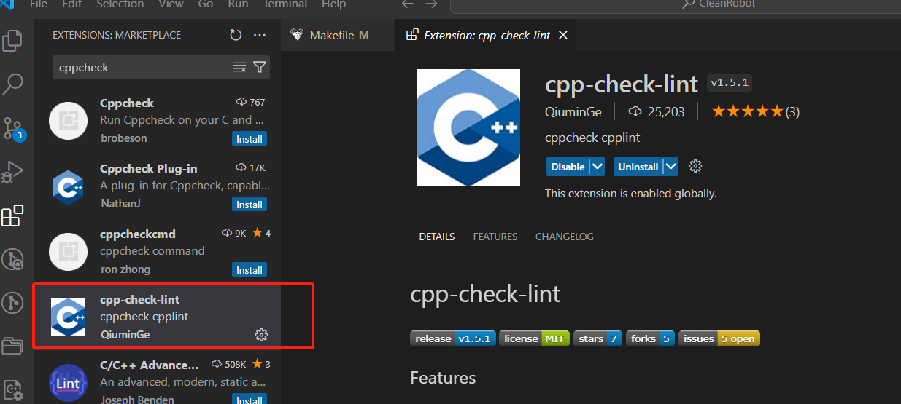
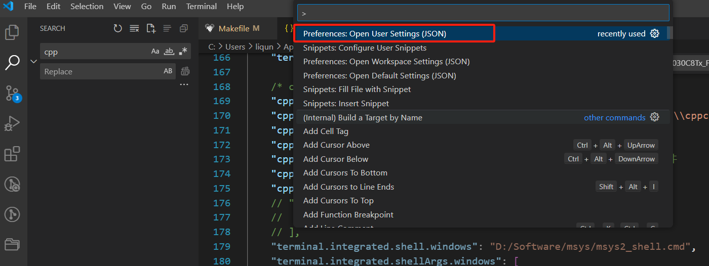
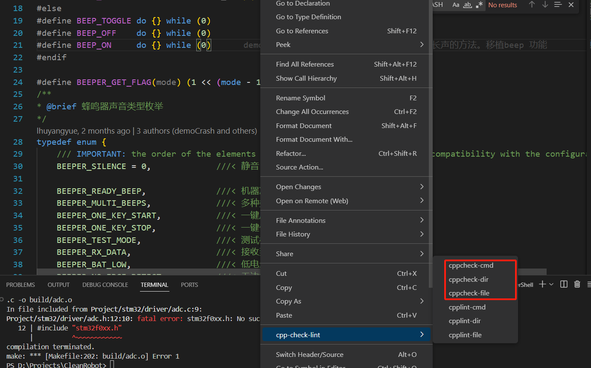

# VSCode用CPPCheck静态代码审查工具

## 一、安装Doxygen插件

## 二、配置
组合键ctrl+shift+p打开命令，输入settings搜索，打开用户setting.json文件，如下图所示：

将下面的配置放入文件中保存即可

        /* cppcheck配置 */
        "cpp-check-lint.--enable": true, //启用插件
        "cpp-check-lint.cppcheck.--executable": "C:\\Program Files\\Cppcheck\\cppcheck.exe", //cppcheck路径
        "cpp-check-lint.cppcheck.--inline-suppr": false, //取消内联
        "cpp-check-lint.cppcheck.--language=": "c", //使用c语言进行检查
        "cpp-check-lint.cppcheck.--onsave": false, //在文件保存时立刻检查该文件
        "cpp-check-lint.cppcheck.--quick_fix": false,
        "cpp-check-lint.cpplint.--enable": false, //关闭无用的cpplint
        // "cpp-check-lint.cppcheck.--addon=": [  //暂时不开启插件
        //     "misra.py"
        // ],

## 三、项目中使用

任意项目文件右击->选择cppcheck-file，就可以检查当前文档（cppcheck-dir是检查当前目录下的文档）

## 四、关于CPPCheck的一些介绍
### 检查范围：

(1)、未定义行为：包括死指针、零除、整数溢出、无效的位移操作数、无效的转换、STL的无效使用、内存管理、空指针解引用、越界检查、未初始化的变量、写入const数据等。

(2)、安全性：Cppcheck 可以检测到一些常见的安全漏洞，如缓冲区错误、不当的访问控制、信息泄露等。

(3)、编码标准：Cppcheck 支持多种编码标准，包括 Misra C 2012、Misra C++ 2008、Cert C、Cert C++ 等。

(4)、其他检查：Cppcheck 还有许多其他的检查，具体可以参考 这个链接 https://sourceforge.net/p/cppcheck/wiki/ListOfChecks/。

### 主要选项：

(1)、错误（error）：这是最严重的问题，Cppcheck 100%确定这是错误。例如，数组越界，空指针解引用等。

(2)、警告（warning）：Cppcheck认为代码看起来有问题，但它并不确定这是否真的是错误。例如，有可能发生整数溢出，有可能发生除以零的情况等。

(3)、样式（style）：这些是关于代码风格的问题，例如未使用的函数、多余的代码等。

(4)、可移植性（portability）：当代码在不同的平台上运行时可能会出现问题。例如，使用了不可移植的函数，或者依赖于编译器特定的行为。

(5)、性能（performance）：Cppcheck会发出警告，如果代码可以优化以提高性能。

(6)、信息（information）：这些是一些有趣的，非关键的信息，通常可以忽略。

