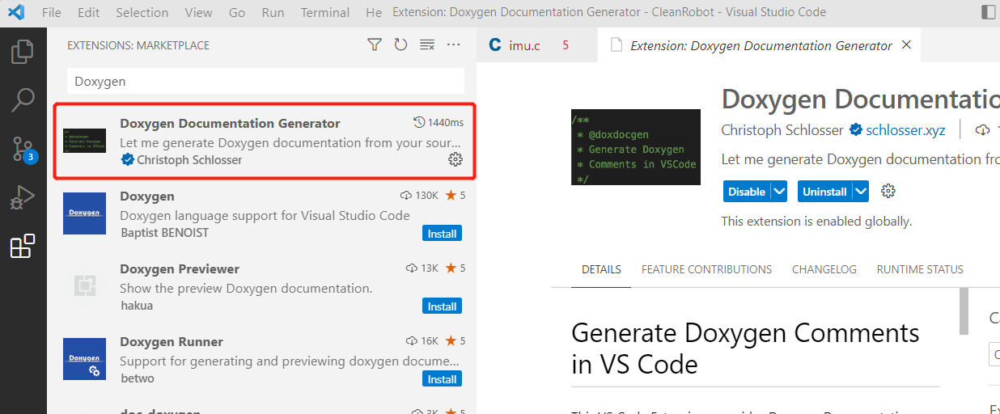
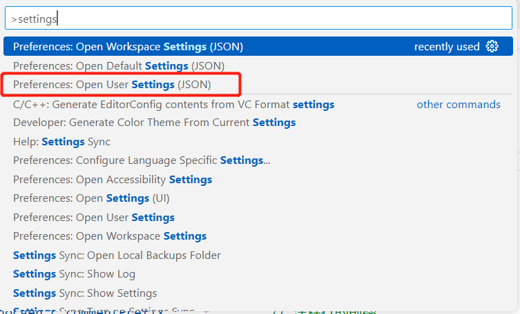
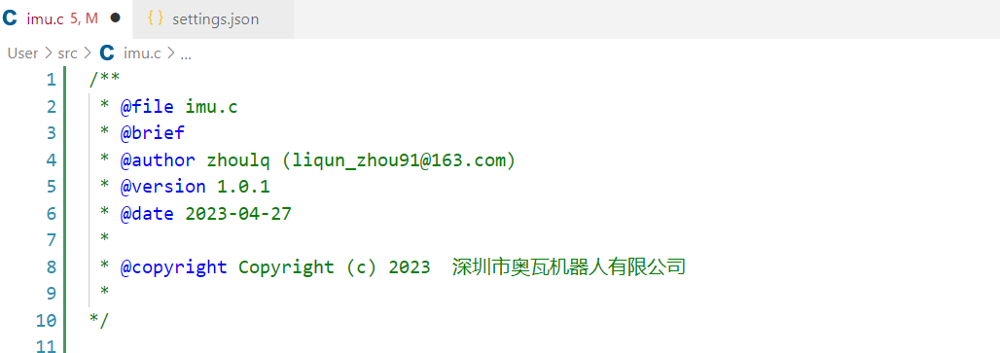
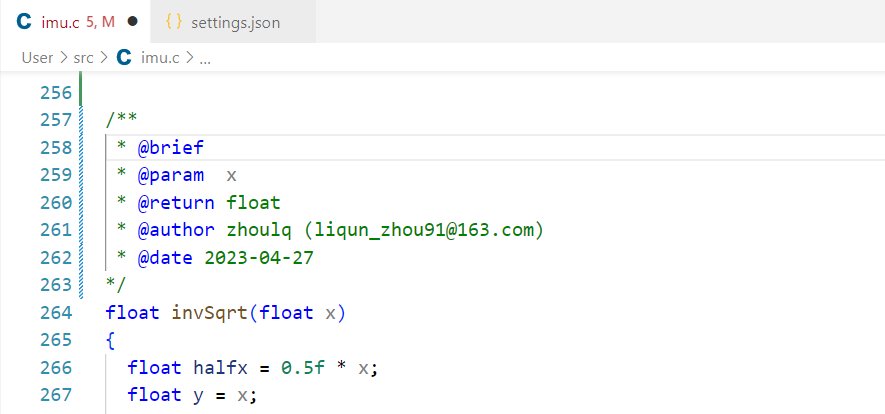

# VSCode用Doxygen自定义代码注释配置

## 一、安装Doxygen插件

## 二、设置注释格式
组合键ctrl+shift+p打开命令，输入settings搜索，打开用户setting.json文件，如下图所示：

将下面的配置放入文件中保存即可

        // Doxygen documentation generator set
        "doxdocgen.c.triggerSequence": "/",   // 触发自动注释的生成
        "doxdocgen.c.commentPrefix": " * ",     // 注释行的前缀
        "doxdocgen.c.firstLine": "/**",         // 注释行的首行
        "doxdocgen.c.lastLine": "*/",          // 注释行的尾行

        // Smart text snippet for factory methods/functions.
        "doxdocgen.c.factoryMethodText": "Create a {name} object",
        // Smart text snippet for getters.
        "doxdocgen.c.getterText": "Get the {name} object",
        // Smart text snippet for setters.
        "doxdocgen.c.setterText": "Set the {name} object",
         // Smart text snippet for constructors.
         "doxdocgen.cpp.ctorText": "Construct a new {name} object",
          // Smart text snippet for destructors.
        "doxdocgen.cpp.dtorText": "Destroy the {name} object",
        // The template of the template parameter Doxygen line(s) that are generated. If empty it won't get generated at all.
        "doxdocgen.cpp.tparamTemplate": "@tparam {param} ",

        // 文件注释：版权信息模板
        "doxdocgen.file.copyrightTag": [
            "@copyright Copyright (c) {year}  深圳市奥瓦机器人有限公司"
        ],
        // 文件注释：自定义模块，这里我添加一个修改日志
        // "doxdocgen.file.customTag": [
        //     "@par 修改日志:",
        //     "<table>",
        //     "<tr><th>Date       <th>Version <th>Author  <th>Description",
        //     "<tr><td>{date} <td>1.0.1     <td>zhoulq     <td>内容",
        //     "</table>",
        // ],
        // 文件注释的组成及其排序
        "doxdocgen.file.fileOrder": [
            "file",     // @file
            "brief",    // @brief 简介
            "author",   // 作者
            "version",  // 版本
            "date",     // 日期
            "empty",    // 空行
            "copyright",// 版权
            "empty",
            "custom"    // 自定义
        ],
        // 下面时设置上面标签tag的具体信息
        "doxdocgen.file.fileTemplate": "@file {name}",
        "doxdocgen.file.versionTag": "@version 1.0.1",
        "doxdocgen.generic.authorEmail": "liqun_zhou91@163.com",
        "doxdocgen.generic.authorName": "zhoulq",
        "doxdocgen.generic.authorTag": "@author {author} ({email})",
        // 日期格式与模板
        "doxdocgen.generic.dateFormat": "YYYY-MM-DD",
        "doxdocgen.generic.dateTemplate": "@date {date}",
        
        // 根据自动生成的注释模板（目前主要体现在函数注释上）
        "doxdocgen.generic.order": [
            "brief",
            "tparam",
            "param",
            "return",
            "author",
            "date"
        ],
        "doxdocgen.generic.paramTemplate": "@param{indent:8}{param}{indent:8}",
        "doxdocgen.generic.returnTemplate": "@return {type} ",
        "doxdocgen.generic.splitCasingSmartText": true,

        "doxdocgen.generic.includeTypeAtReturn": true,      // return 中包含类型信息
        "doxdocgen.generic.boolReturnsTrueFalse": false,    // bool 返回值拆分成 true 和 false 两种情况
        "doxdocgen.generic.linesToGet": 20,                  // 回车后最多向下多少行去找函数声明
        "doxdocgen.generic.useGitUserName": false,          // {author} 是都根据 git config --get user.name 替换
        "doxdocgen.generic.useGitUserEmail": false,
        //declarations or definitions anymore.

注意需要修改作者和邮箱：

## 三、验证效果

在开发文件中的头部输入/然后回车，效果如下图：

函数上面同样输入/然后回车，效果如下图：

