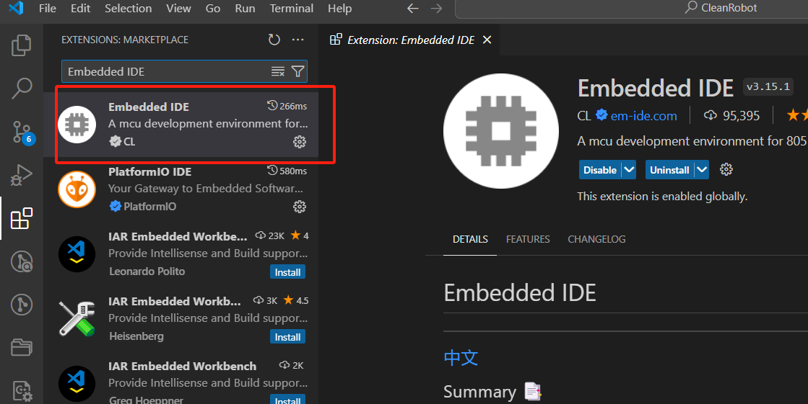

# VSCode用EIDE编译项目

## 一、安装软件以及VSCode插件

### 需要在电脑上安装的软件

JLINK

GNU Arm Embedded Toolchain

### VSCode安装的插件

EIDE安装

Cortex-Debug安装

## 二、VSCode中EIDE和Cortex-Debug中的一些设置

### 打开settings.json,将以下配置写入（注意根据自己安装路径修改）

        "EIDE.ARM.Option.AxfToElf": true,
        "EIDE.JLink.InstallDirectory": "C:/Program Files/SEGGER/JLink_V796b",
        "cortex-debug.armToolchainPath": "C:\\Program Files (x86)\\GNU Arm Embedded Toolchain\\10 2021.10\\bin",
        "cortex-debug.JLinkGDBServerPath": "C:/Program Files/SEGGER/JLink_V796b/JLinkGDBServerCL.exe",

## 三、打开已有的EIDE项目

根据自己的项目路径打开EIDE项目工作空间

