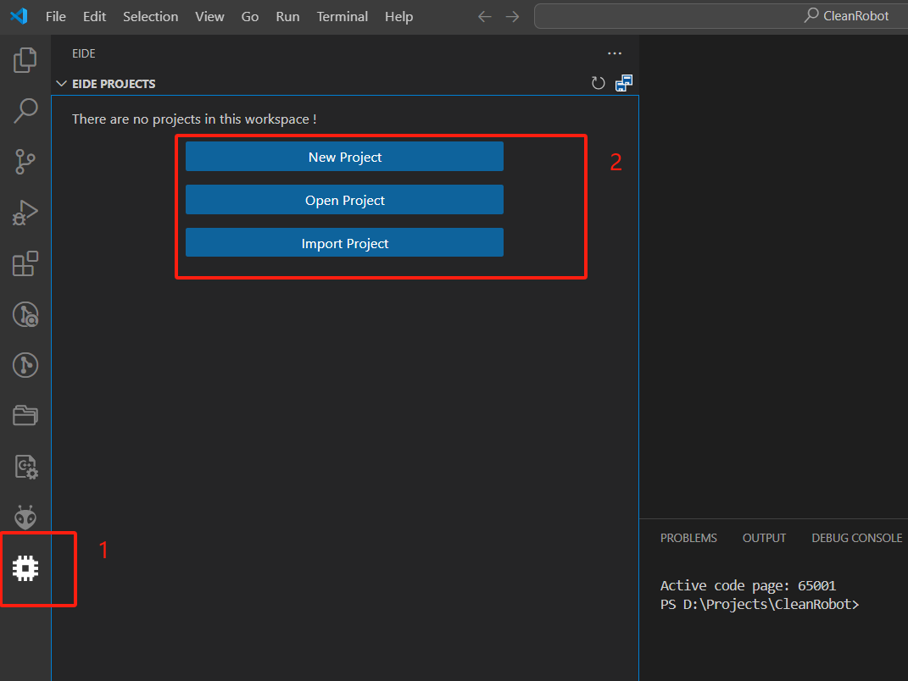
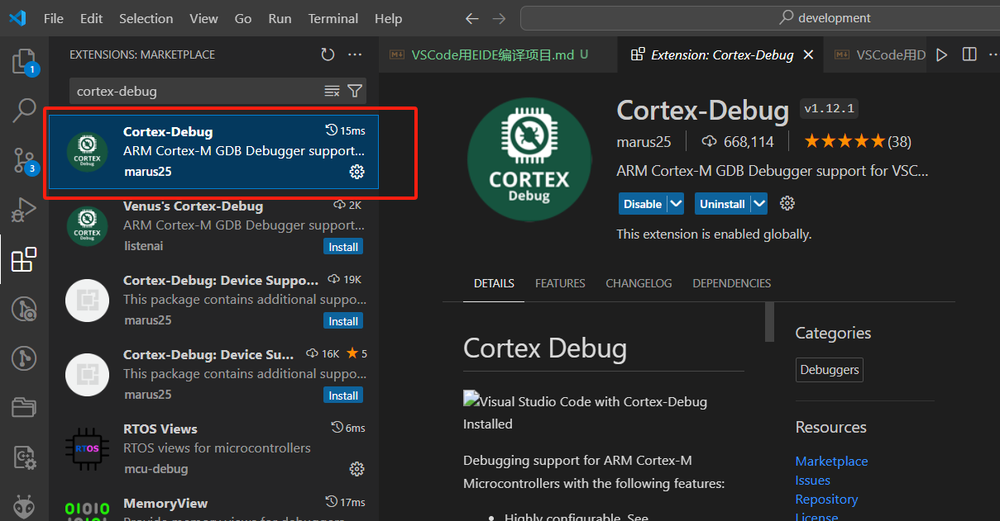
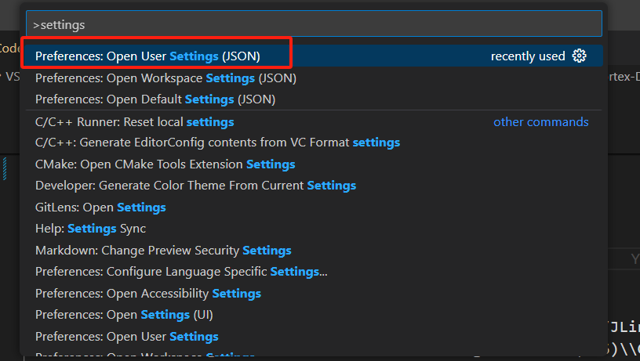
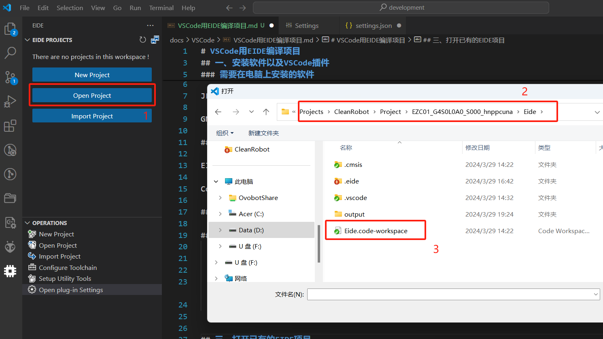
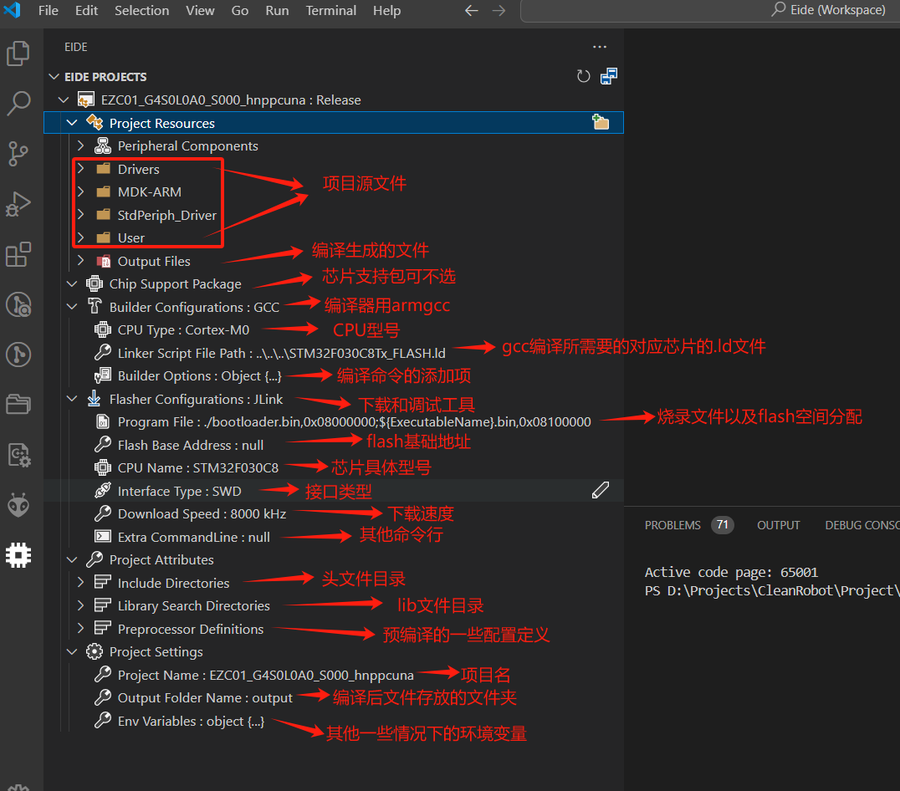
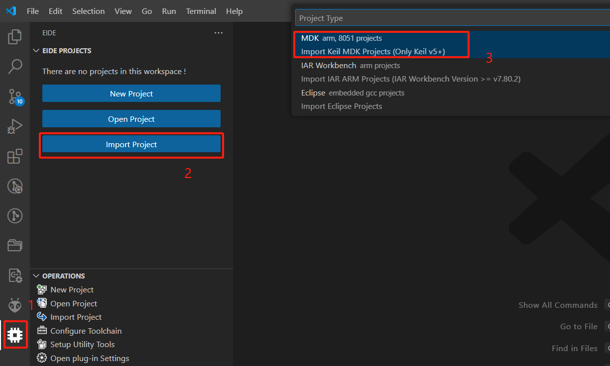
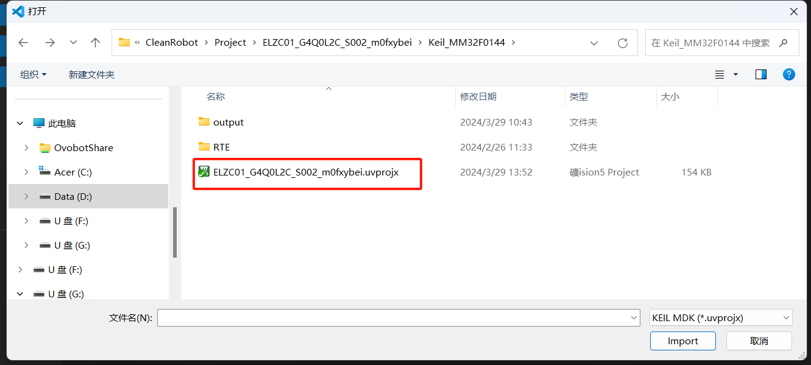
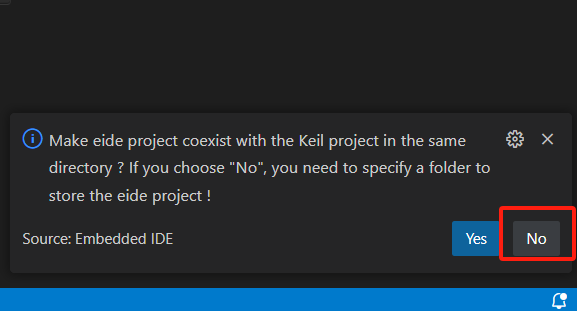
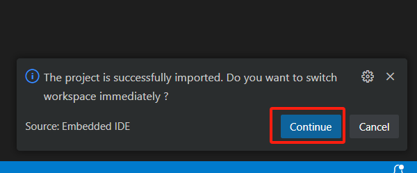

# VSCode用EIDE编译项目

## 一、安装软件以及VSCode插件

### 需要在电脑上安装的软件

JLINK

GNU Arm Embedded Toolchain

### VSCode安装的插件

EIDE安装

安装完成后VScode左侧工具栏会出现EIDE的标识（下图1处），现在我们可以在下图中2处新建、打开或者导入其他keil平台的项目（后面会提到打开以及导入功能）

Cortex-Debug安装

## 二、VSCode中EIDE和Cortex-Debug中的一些设置

### 打开settings.json,将以下配置写入（注意根据自己安装路径修改）

同时按Ctrl+Shift+P，在弹框中输入settings，点击打开下图中的文件

        "EIDE.ARM.Option.AxfToElf": true,
        "EIDE.JLink.InstallDirectory": "C:/Program Files/SEGGER/JLink_V796b",
        "cortex-debug.armToolchainPath": "C:\\Program Files (x86)\\GNU Arm Embedded Toolchain\\10 2021.10\\bin",
        "cortex-debug.JLinkGDBServerPath": "C:/Program Files/SEGGER/JLink_V796b/JLinkGDBServerCL.exe",

## 三、打开已有的EIDE项目

如果已经存在EIDE项目，根据自己的项目路径打开EIDE项目工作空间，如下图所示：

项目的一些属性介绍，如下图所示：

## 四、导入一个已有的Keil工程成为EIDE工程文件

### 根据下图中的步骤导入Keil工程：

1、选择原工程文件类型：

2、然后选择后缀为.uvprojx的文件

### 接下来在右下角弹出的提示框中选择NO，如下图所示：

### 然后在项目中与Keil_XXX文件夹平行的目录下新建一个EIDE的目录，用于存放EIDE工程，如下图所示：

选中EIDE文件夹，VSCode右下角会弹出提示框，选择continue即可：

## 五、功能使用介绍

