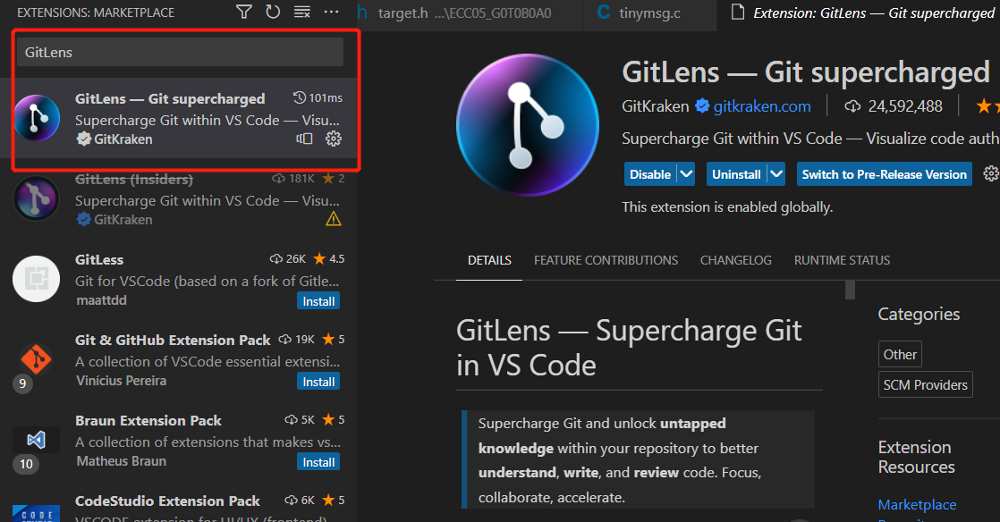
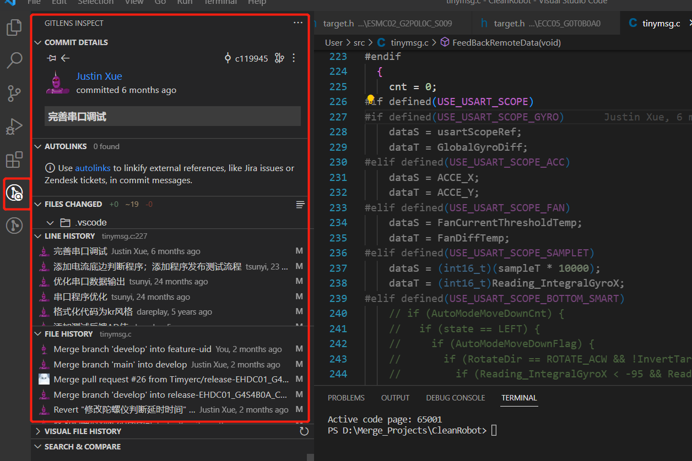

# VSCode常用插件介绍

## Git Graph

功能简介

查看仓库的Git图形化结构，并且可以在图形化结构中执行Git操作。

使用方法

打开VSCode Source Control栏，点击对应仓库的View Git Graph按钮即可打开Git图形化结构图。

## GitLens

**功能简介**

查看文件、具体代码历史提交信息。

**插件安装**

**使用方法**

1、点击具体代码行既可以看到这行代码最新的一次提交修改信息

2、如果需要其他详细信息，可以点击VSCode最左侧的GitLens Inspect查看

